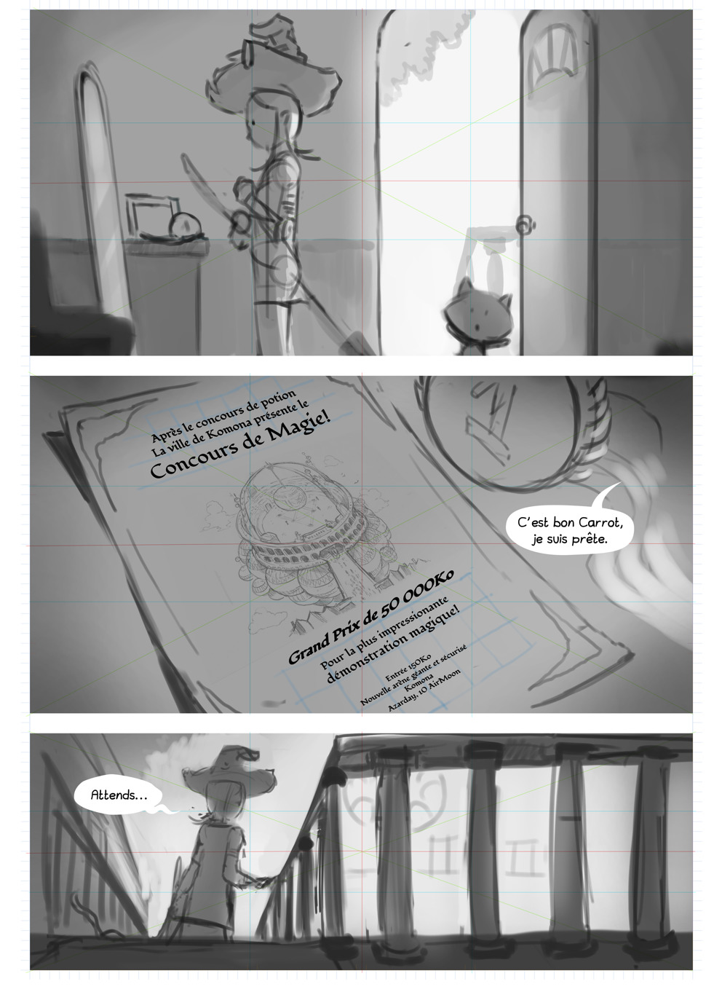
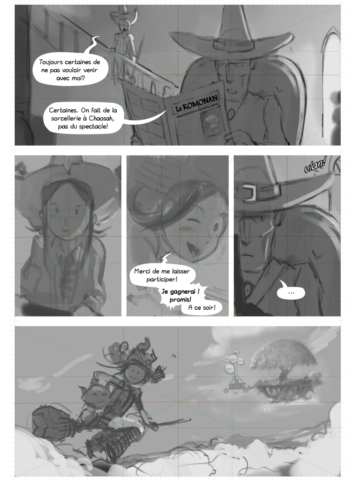
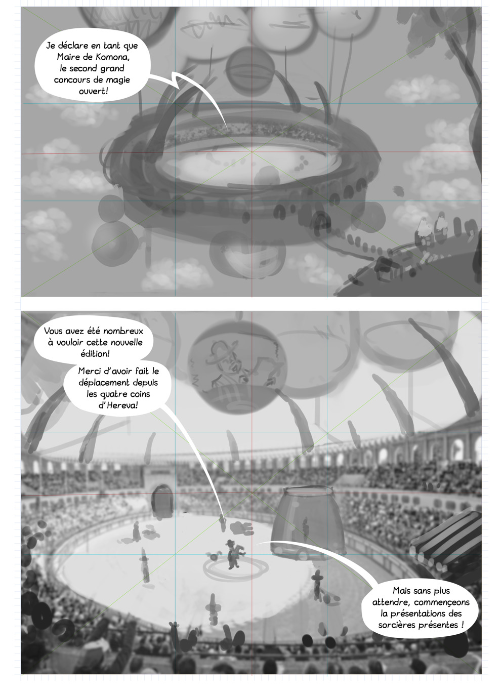
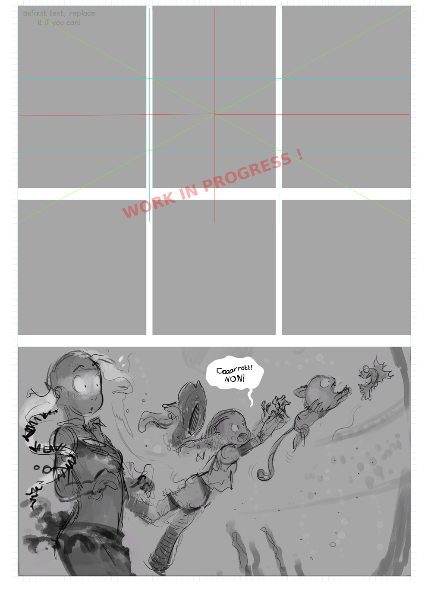
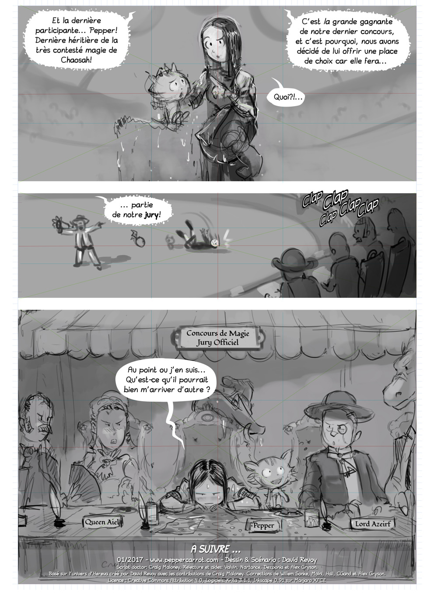

episode 21
==========

Temporary title: The Magic Contest  

* **Author:** David Revoy < info@davidrevoy.com > with inspiration from a collaborative [brainstorming pad](https://annuel.framapad.org/p/peppercarrot-brainstorm) by Seblediacre, Craig Maloney, Valvin, Talime, Quiralta.  
* **License:** [Creative Commons Attribution 4.0 International (CC BY 4.0)](https://creativecommons.org/licenses/by/4.0/)  

This episode is the introduction of the new 'Magic Contest'.  

In this episode I want to show how Pepper can switch to an humoristic anti-heros and make fun of how she can directly take advantages of the situation. She is good at pretending everything was her choice, even failure. I think this behavior is very funny and so "human". It's also a way to setup the  and the future characters for episode 22.  

Ep 22 and 23 might be "between fire and water". Spirulina has to be presented mysterious and from the bad guys.  

## P01

  

Camera is near to the floor, side view on Pepper, looking at herself in the mirror: her clothes are perfect, broomstick in her hand is ready. She even managed to decorate herself a bit better. A ribbon here, a little bag there. She adjusts her shirt colar, looking seriously at the mirror (psyche) in the corner of her bedroom. Carrot is making a little sign with his thumb on the frame of the open door. It's time. Light source come from the door.  

Close-up on the top of a little furniture; on it stands the frame of the previous potion contest with her picture, the first gold medals "1st" Pepper received at the potion contest and the invitation of the new potion contest filling the frame. Description of the invitation:  
Après le concours de potion (After the potion contest)  
La ville de Komona présente le (The city of Komona presents the)  
Concours de Magie! (Contest of Magic!)  
grand prix de 50 000Ko (Grand Prize of 50,000Ko)  
Pour la plus impressionante (For the most impressive)  
démonstration magique! (Magic Demonstration!)  
entrée 150Ko (access 150Ko)  
Dans une la nouvelle arène géante et sécurisé, Komona (In the new giant and secure arena of Komona)  
Azarday, 10 AirMoon (Azarday, 10 AirMoon)  
_Pepper(off): je suis prête, on y va. (I'm ready, let's go)_  

Shot down the stairway, Pepper stoped at half, looking at her right with her hand on the balustrade. She looks downstair. This shot tells a lot about her feeling for the witches.  
_Pepper: Attends... (Wait...)_  

## P02

  

Shot from front, Cayenne is on her armchair in leather, in the living room, continuing to read newspaper, as usual. Pepper can be seen from her position in the background.  
_Pepper: Toujours certaines de ne pas vouloir venir avec moi?(Still certain not to want to come with me?)_  
_Cayenne: Certaines, on fait de la sorcellerie à Chaosah, pas du spectacle! (Sure, we do sorcery in Chaosah, not the show!)_  
_Newspaper title: Le Komonan ( The Komonian )_  
_Newspaper subtitle: Inauguration de la nouvelle Arène (Inauguration of the new Arena)_  

(A) Pepper smiles. She sorts of like and get used to the words of Cayenne. It's familiar to her heart. Cayenne don't clearly prohibe her to go, so she feels warmly encouraged.  

(B) Pepper run in the stairway, close up on her face happy.  
_Pepper: Merci de me laisser participer! ( Thank you for letting me participate)_  
_Pepper: Je gagnerai! promis! ( I'll win! I promise!)_  
_Pepper: A ce soir! ( See you on evening)_  

(C) The door slams in a soundFX 'Vlan' while Cayenne has a little time of thinking or being ditracted.  
_Cayenne: ..._  

Pepper flying on her broomstick in the sky, having fun and getting motivated with Carrot. View on a landscape of cloud, Komona city and the arena flies far away.  

## P03

  

The camera flies over the arena 
_Mayor(off):Je déclare en tant que Maire de Komona, le second grand concours de magie ouvert! (I declare as Mayor of Komona, the second great open magic contest!)_  

We see the inner of the arena and all details, and Mayor talking at center, and on the big crystal sphere.
_Mayor(off):Vous avez été nombreux à vouloir cette nouvelle édition! (You have been many to want this new edition!)_  
_Mayor(off):Merci d'avoir fait le déplacement depuis les quatres coins d'Hereva (Thank you for making the trip from the four corners of Hereva)_  
_Mayor(off):Mais sans plus attendre, commençeons la présentation des sorcières présente! (But without further ado, let's begin the presentation of the witches present!)_  

## P04

> Note: page in refactoring: Presentation of the challenger will happen at the same time as a chasing action of Pepper and Carrot in the Arena. It will be more dynamic and fun. 

(outdated) Panel presentation of Aquah with Spirulina.  
_Mayor(off): Premièrement, c'est notre fierté technique de pouvoir accueillir à Komona pour la première fois une sorcière d'Aquah, la mysterieuse Spirulina! (First, it is our technical pride to be able to welcome to Komona for the first time a witch of Aquah, the mysterious Spirulina!)_  

(outdated) Panel presentation of Hippiah with Camomille.  
_Mayor(off): Nous sommes également ravi de recevoir Camomille, sorcière d'Hippiah pour cette compétition (We are also delighted to welcome Camomille, a Hippiah witch for this competition)_  

(outdated) Panel presentation of Ah with Shichimi.  
_Mayor(off): Notre troisième participante nous vient du pays des lunes couchantes, la sorcière de Ah, Shichimi! (Our third participant come to us from the lands of the setting moons the witch of Ah, Shichimi!)_  

## P05

> Note: page in refactoring. See note on P04.

(outdated) Panel presentation of Zombiah with Coriander.  
_Mayor(off): Venue du grand pays de l'Union des Technologistes, c'est un honneur d'acceuillir la ravissante et ingénieuse sorcière de Zombiah, Coriander! (All the way from the great Technologist union, it's an honor welcome the ravishing and ingenious witch of Zombiah Coriander!)_  

## P06

  

> Note: page in refactoring. See note on P04.

(temp) Pepper is in the water tank chasing Carrot, while him try to eat Durian ( the fish pet of Spirulina ). Spirulina is surprised by the action.  
_Pepper: Carrot! NON!!_  

## P07  

  

Shot of Pepper with Carrot in one hand outside of the tank. She probably was already in process to engage with Carrot, while the "speaker" with voice of the mayor starts to talk about her:
_Mayor(off): Et la dernière participante... Pepper! Dernière héritière de la très contesté magie de Chaosah! (And the last participant ... Pepper! Last heiress of the much disputed Chaosah magic!)_
_Mayor(off): C'est la grande gagnante de notre dernier concours, et c'est pourquoi, nous avons décidé de lui offrir une place de choix car elle fera... (It is the big winner of our last competition, and that is why we decided to offer her a place of choice because she will make ...)_  
_Pepper: Quoi?! (What?!)_  

Large shot on the Mayor pointing with his hand a part of the arena where a group of boring poeple are sitting: the jury. Pepper fall while listening to this:  
_Mayor: ...partie de notre Jury! (... part of our Jury! )_  

Last shot is a point of view from the Jury booth. Pepper is all wet, Carrot too, and it contrast a lot with all the very classy decoration and pricy accessories. Juries are Lord and Queens, Pepper is visibily ashame while Carrot focus his attention to try to make new friend (and get a cookie) . The judge already around are annoyed by the situation.  
_Pepper: Au point ou j'en suis... Qu'est-ce qu'il pourrait bien m'arriver d'autre? (To the point where I am ... What else could happen to me?)_  

**A suivre (To be continued)**
