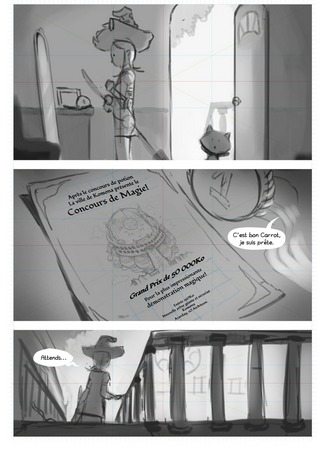
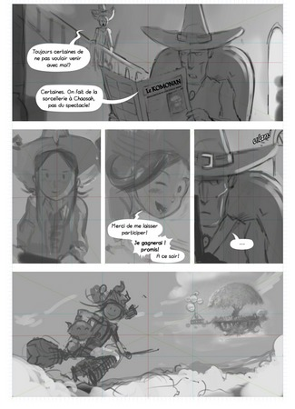
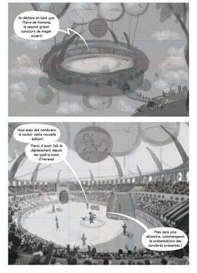

episode 21
==========

Temporary title: The Magic Contest  

* **Author:** David Revoy < info@davidrevoy.com > with inspiration from a collaborative [brainstorming pad](https://annuel.framapad.org/p/peppercarrot-brainstorm) by Seblediacre, Craig Maloney, Valvin, Talime, Quiralta.  
* **License:** [Creative Commons Attribution 4.0 International (CC BY 4.0)](https://creativecommons.org/licenses/by/4.0/)  

This episode is the introduction of the new 'Magic Contest'.  

In this episode I want to show how Pepper can switch to an humoristic anti-heros and make fun of how she can directly take advantages of the situation. She is good at pretending everything was her choice, even failure. I think this behavior is very funny and so "human". It's also a way to setup the  and the future characters for episode 22.  

Ep 22 and 23 might be "between fire and water". Spirulina has to be presented mysterious and from the bad guys.  

## P01

  

Camera is near to the floor, side view on Pepper, looking at herself in the mirror: her clothes are perfect, broomstick in her hand is ready. She even managed to decorate herself a bit better. A ribbon here, a little bag there. She adjusts her shirt colar, looking seriously at the mirror (psyche) in the corner of her bedroom. Carrot is making a little sign with his thumb on the frame of the open door. It's time. Light source come from the door.  

Close-up on the top of a little furniture; on it stands the frame of the previous potion contest with her picture, the first gold medals "1st" Pepper received at the potion contest and the invitation of the new potion contest filling the frame. Description of the invitation:  
Après le concours de potion (After the potion contest)  
La ville de Komona présente le (The city of Komona presents the)  
Concours de Magie! (Contest of Magic!)  
grand prix de 50 000Ko (Grand Prize of 50,000Ko)  
Pour la plus impressionante (For the most impressive)  
démonstration magique! (Magic Demonstration!)  
entrée 150Ko (access 150Ko)  
Dans une la nouvelle arène géante et sécurisé, Komona (In the new giant and secure arena of Komona)  
Azarday, 10 AirMoon (Azarday, 10 AirMoon)  
_Pepper(off): je suis prête, on y va. (I'm ready, let's go)_  

Shot down the stairway, Pepper stoped at half, looking at her right with her hand on the balustrade. She looks downstair. This shot tells a lot about her feeling for the witches.  
_Pepper: Attends... (Wait...)_  

## P02

  

Shot from front, Cayenne is on her armchair in leather, in the living room, continuing to read newspaper, as usual. Pepper can be seen from her position in the background.  
_Pepper: Toujours certaines de ne pas vouloir venir avec moi?(Still certain not to want to come with me?)_  
_Cayenne: Certaines, on fait de la sorcellerie à Chaosah, pas du spectacle! (Sure, we do sorcery in Chaosah, not the show!)_  
_Newspaper title: Le Komonan ( The Komonian )_  
_Newspaper subtitle: Inauguration de la nouvelle Arène (Inauguration of the new Arena)_  

(A) Pepper smiles. She sorts of like and get used to the words of Cayenne. It's familiar to her heart. Cayenne don't clearly prohibe her to go, so she feels warmly encouraged.  

(B) Pepper run in the stairway, close up on her face happy.  
_Pepper: Merci de me laisser participer! ( Thank you for letting me participate)_  
_Pepper: Je gagnerai! promis! ( I'll win! I promise!)_  
_Pepper: A ce soir! ( See you on evening)_  

(C) The door slams in a soundFX 'Vlan' while Cayenne has a little time of thinking or being ditracted.  
_Cayenne: ..._  

Pepper flying on her broomstick in the sky, having fun and getting motivated with Carrot. View on a landscape of cloud, Komona city and the arena flies far away.  

## P03

  

The camera flies over the arena, we see the inner of the arena and all details.  
_Mayor(off):Je déclare en tant que Maire de Komona, le second grand concours de magie ouvert! (I declare as Mayor of Komona, the second great open magic contest!)_  

_Mayor(off):Vous avez été nombreux à vouloir cette nouvelle édition! (You have been many to want this new edition!)_  
_Mayor(off):Merci d'avoir fait le déplacement depuis les quatres coins d'Hereva (Thank you for making the trip from the four corners of Hereva)_  
_Mayor(off):Mais sans plus attendre, commençeons la présentation des sorcières présente! (But without further ado, let's begin the presentation of the witches present!)_  

## P04

Panel presentation of Aquah with Spirulina.  
_Mayor(off): Premièrement, c'est notre fierté technique de pouvoir accueillir à Komona pour la première fois une sorcière d'Aquah, la mysterieuse Spirulina! (First, it is our technical pride to be able to welcome to Komona for the first time a witch of Aquah, the mysterious Spirulina!)_  

Panel presentation of Hippiah with Camomille.  
_Mayor(off): Nous sommes également ravi de recevoir Camomille, sorcière d'Hippiah pour cette compétition (We are also delighted to welcome Camomille, a Hippiah witch for this competition)_  

Panel presentation of Ah with Shichimi.  
_Mayor(off): Notre troisième participante nous vient du pays des lunes couchantes, la sorcière de Ah, Shichimi! (Our third participant come to us from the lands of the setting moons the witch of Ah, Shichimi!) _  

## P05

Panel presentation of Zombiah with Coriander.  
_Mayor(off): Venue du grand pays de l'Union des Technologistes, c'est un honneur d'acceuillir la ravissante et ingénieuse sorcière de Zombiah, Coriander! (All the way from the great Technologist union, it's an honor welcome the ravishing and ingenious witch of Zombiah Coriander!)_  

Panel presentation of Magmah with Saffron, looking at the sky, she don't like this long presentation.  
_Mayor(off): ...sans oublier notre fille du pays, la sorcière de Magmah notre belle ville de Komona , Saffron! (...not to forget our local girl, Komona's very own witch of Magmah, Saffron!_  

View on Pepper, blushing a bit in a cute shy "hello pause", with Carrot next to her while being introduced to the crowd by the mayor.  
_mayor(off): Et la dernière école: Chaosah! (And the last school, Chaosah!)_  
_mayor(off): Pepper est 'la' grande gagnante de notre dernier concours, et c'est pourquoi, nous avons décidez de lui offrir une place de choix! (Pepper is the 'big winner' of our last contest, and that's why we've decided to give her a place of choice!)_

## P06

Zoom on Pepper destabilised/blusing under emotion  
_Pepper: Quoi? quelquechose de special? pour moi? (What? Something special? for me?)_  

Point of view from the back of the Jury in the audience, they look at the global part where you can see the Mayor and Pepper. The mayor shows this place boring with administrative poeple, Pepper has big eyes ; she can't believe it.  
_Mayor: Elle fera partie de notre jurie! (She'll be part of our Jury!)_  
_Crowd: clap!clap!clap!_  

Pepper introspection shot... Her day is ruined like if the sky fall on her shoulder. She realize she'll never be able to compete and all her dream collapse. Little tears at this moment start to appears under her eyes. Background disapears too as a stylisitic effect.  
_Pepper(think): Mon rêve, la victoire... c'est fini... ( my dream, victory, it's over...)_  

Reaction of Saffron, Shichimi and Coriander; they are a bit sad for Pepper.  

## P07  

Pepper is guided by a staff member and walks and discover with surprise the booth of jury, side view. All of them with label of their names. They are certainly some high investor or politics from Komona. They eat three-star cuisine. A seat with Pepper's name labeled on the table is free.  
_restaurant-like waiter: Souhaitez-vous une collation? Un rafraichissement? (Would you like a snack? A beverage?)_  

Shot on Pepper's face: she suddenly in the transition between being puzzled and surprised as on the previous panel and happy.  

Frontal view from the luxuous jury booth, sunny and half shadow, under a decorated awning. Pepper and Carrot are in the center eating three-star cuisine in the manner of non-educated poeple (without manner). Pepper has foot on the table and explain something to the judge on her right in almost a condescending way, Carrot eat directly on the plate while looking at another 'judge' here trying to guess "what's the problem?". The two judges on the left and right side of Pepper&Carrot are shocked by their attitude and are looking at them with big surprised eyes, almost fear. In background, a restaurant-like waiter is waiting for orders. Certainly a staff member from the arena, he is a bit anxious but patiently wait, eye almost closed.  
_Pepper: ...et c'est exactement pour que mes amies puissent gagner, car ont le sait bien, je suis la plus forte, que **j'ai proposé** de faire partie du jurie! (and that's exactly because I wanted my friend to have the possibility to also win , because we all know, I'm the best; that I proposed to be part of the jury)_  

**To be continued**
