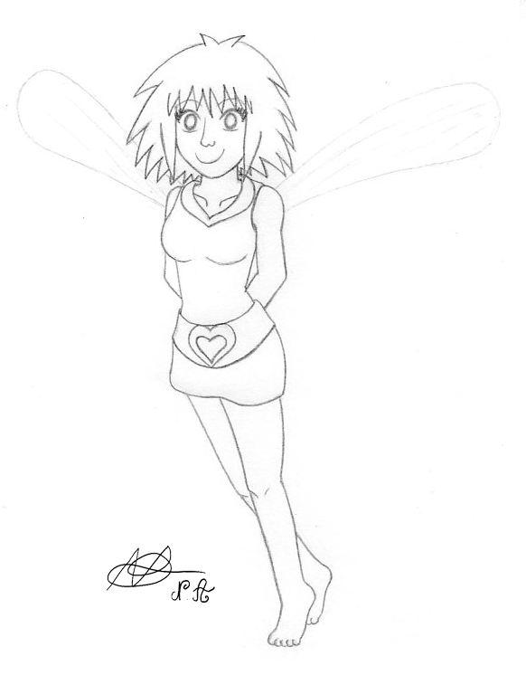

# Pepper et Carrot – Fairy, la visite d’Hereva
_Par Nicolas Artance, d'après l'univers d'Hereva de David Revoy ([http://www.peppercarrot.com/](http://www.peppercarrot.com/))_  

## ACTE 1 – VŒU DE RENCONTRE

### Scène 1 – La Baguette de nulle part

_Forêt de Bout-un-Cureuil, Maison de Pepper.
La jeune sorcière Pepper tente de produire une potion d’évaluation pour ses marraines. Cette évaluation va déterminer si oui ou non, Pepper a progressé en tant que sorcière de Chaosah. Son fidèle chat Carrot l’assiste comme il le peut en lui passant les ingrédients nécessaires._

_**Pepper :**_ "Bon, si j’ai bien suivi, je dois maintenant tourner sept fois dans le sens horaire, ajouter la Fleur de Démuth et tourner trois fois dans le sens antihoraire pour équilibrer la charge…"

_La jeune sorcière touille l’immense potion qui frétille et commence à prendre une teinte rougeâtre en dégageant une immense fumée noire._

_**Pepper :**_ "Vite, Carrot ! La Fleur de Démuth !"

_Carrot lui passe une fleur rouge sang à l’allure peu commode : la bordure de ses pétales donne l’impression que la fleur a été consumée par le feu, et deux des pétales ont une allure de corne, accentuée par l’œil qui semble se dessiner au centre de la fleur.
Pepper la jette dans la potion. Celle-ci semble vouloir hurler : elle se teinte de gris._

_**Pepper** (la mine réjouie) **:**_ "Je le sens bien, Carrot, cette fois-ci !"

_Elle touille deux fois dans le sens antihoraire. Elle n’a pas le temps d’amorcer le troisième tour que le chaudron surchauffe et explose, projetant la mixture sur tous les murs de la pièce. Le pauvre Carrot est recouvert entièrement par une espèce de pâte grisâtre et essaie de la ôter de ses yeux. Seulement, cette pâte semble très "attachante".
Pepper, guère plus chanceuse que son compagnon, exprime sa colère en tapant du poing par terre._

_**Pepper :**_ "C’est pas vrai ! J’ai tout fait comme il fallait, pourtant !"

_Elle se relève, et tente d’aider son chat du mieux qu’elle peut._

_**Pepper :**_ "J’ai touillé leur saleté de potion dans le bon sens, mis la fleur, et… sauf s’il fallait mettre la fleur d’abord et touiller ensuite… ah, ça m’énerve !! Attends."

_Elle cherche parmi ses flacons tombés à la renverse suite à l’explosion de quoi aider son pauvre ami. Elle revient avec un flacon qu’elle ouvre, étalant son contenu sur Carrot._

_**Pepper :**_ "En plus, c’est affreux leur truc ! Ça colle partout, c’est écœurant ! Je me demande bien pourquoi je me donne autant de mal : non mais sérieusement, tu peux m’expliquer l’intérêt d’un Filtre Vengeresque? À part celui de me pourrir l’existence ?!"

_Elle ne parvient pas à enlever la mixture de son ami. Elle renonce, en s’asseyant par terre, la mine basse._

_**Pepper :**_ "Elles vont encore me faire la leçon, j’en ai marre ! Si seulement je pouvais être plus douée, elles seraient contentes et peut-être qu’elles arrêteraient de me harceler !"

_Aussi soudainement qu’un coup de tonnerre, un objet fin, venu de nulle part, tombe sur le sol, faisant sursauter Pepper. Le sursaut permet à Carrot de faire céder la mixture avec ses griffes, créant ainsi deux trous lui permettant de voir. La jeune sorcière et son chat s’échangent un regard interrogateur, avant de ramper avec précaution vers cet objet mystérieux.
Au milieu des extraits de Filtre Vengeresque raté, un bâton d’une vingtaine de centimètres scintille d’une étrange lumière bleutée. Il est impossible de distinguer quoi que ce soit de plus, tant la lumière est aveuglante._

_**Pepper :**_ "Mais qu’est-ce que c’est ? Tu as déjà vu quelque chose comme ça, toi ?"

_Carrot, aussi impressionné que sa maîtresse, n’a qu’un air béat à fournir comme réponse. Fidèle à sa curiosité et audace naturelles, Pepper se saisit de l’objet d’un coup sec, en fermant légèrement les yeux. En les ouvrant de nouveau, elle constate que le bâton a cessé de scintiller. Elle peut ainsi l’inspecter de plus près._

_**Pepper :**_ "Étrange… on dirait une sorte de baguette magique… mais d’où sort-elle ?"

_Rien sur la baguette ne permet d’identifier ni son propriétaire, ni son usage. Délicate au toucher, elle n’est pas du tout bleue comme le laisse suggérer la lumière qu’elle émettait. Elle est dorée, arbore des inscriptions inédites et… semble dégager une aura chaleureuse, pleine de joie. La frustration de Pepper semble s’évaporer._

_**Pepper :**_ "C’est… plutôt agréable… et surprenant aussi. Je me demande si je pourrais m’en servir pour réussir ma Potion…"

_Pepper tente alors de lancer un sort avec la baguette. Seulement, rien ne se passe._

_**Pepper :**_ "Je vois. Alors au moins pour enlever cette horreur… attention Carrot ! Prépare-toi !"

_Pepper amorce un mouvement en direction de son compagnon, qui se protège avec ses pattes. Mais comme l’essai précédent, celui-ci s’avère infructueux. D’un seul coup, la frustration et la colère reviennent au centuple._ 

_**Pepper :**_ "Pourquoi est-ce que je rate tout ce que j’entreprends ?! Je suis maudite ou quoi ?!"

_De colère, elle fait les cent pas. Carrot la regarde faire d’un œil inquiet, en tentant de ronger ce qu’il reste de pâte grise._

_**Pepper :**_ "Tout ça, c’est leur faute ! Je me débrouillais bien avant qu’elles s’installent ici, m’envahissent et n’arrêtent pas de m’apprendre des trucs inutiles, de me dire comment il faut faire les choses, ce qui est bien ou pas ! Résultat : je suis ridicule ! Tout le monde va se moquer de moi, si ça continue… Je ne veux pas ! Plus jamais ! J’en ai assez : je veux qu’elles s’en aillent ! Je veux devenir plus forte par moi-même !"

_Elle jette la baguette dans un mouvement de colère. Carrot tente de la rassurer en se frottant contre elle. Pepper le prend dans ses bras, en essuyant ses yeux larmoyants._

_**Pepper :**_ "Je suis désolée d’avoir crié, Carrot… je suis à bout de nerf, en ce moment. Heureusement que tu es là pour me soutenir malgré tout !"

_Elle veut le caresser, avant de se rappeler qu’il est toujours recouvert de potion._

_**Pepper :**_ "Je vais t’arranger ça… Carrot ?"

_Le chat, ébahi, montre le coin de la pièce où Pepper a jeté la baguette. Une puissante lumière dorée émane de la baguette. Avant que Pepper n’ait pu faire un geste, la lumière s’intensifie, jusqu’à devenir insoutenable et envahir toute la pièce. Une puissante rafale d’énergie oblige Pepper à reculer contre un mur. Instinctivement, elle protège son chat contre elle, les yeux fermés, en attendant que la rafale se calme.
Tout cesse d’un seul coup. Pepper ouvre les yeux très lentement, à la fois secouée par la rafale et impressionnée par la puissance de la baguette. Elle regarde autour d’elle : rien n’a changé, si ce n’est que plus de flacons et d’ouvrages ont été éparpillés au sol. Elle avance lentement vers la baguette, restée au sol, inerte. Malgré les avertissements de son chat, elle se penche avec précaution vers le bâton en apparence inoffensif. Cependant, il semble qu’un léger voile de fumée s’échappe de la baguette. Elle jette un œil à son chat qui lui fait de grands signes pour renoncer._

_**Pepper :**_ "Hum…"

_Elle prend la baguette d’un coup sec, tandis que son ami cache ses yeux. Un poids sur la tête le fait sursauter : ça y est, une autre rafale va le souffler hors de la maison !
Mais ce n’est que Pepper qui lui caresse la tête en lui montrant la baguette._

_**Pepper** (souriant) **:**_ "Ne t’inquiète pas : tout va bien, regarde ! Il n’empêche que cet objet est étrange… et drôlement puissant ! Je me demande à quoi il sert."

_**Une voix :**_ "À part briller et provoquer des rafales, tu veux dire ?"

_**Pepper :**_ "Oui, voilà."

_Pepper sent son sang ne faire qu’un tour. Elle se retourne et pousse un cri en reculant. Car elle n’est plus le seul être humain de la pièce !_

### Scène 2 – Fairy

_Forêt de Bout-un-Cureuil, Maison de Pepper.
Pepper, en position défensive, regarde d’un air méfiant cet intrus qui vient d’apparaître spontanément. 
En apparence, il s’agit d’une [jeune fille](<https://nartance.deviantart.com/gallery/62188964/Fairy-divagations>) arborant un large sourire, les yeux fermés. Elle a des cheveux aussi dorés que la baguette que Pepper tient encore dans ses mains. Elle porte une sorte de tunique bleutée, qui descend jusqu’à ses cuisses. Elle a la particularité d’être pieds nus. Elle semble sortie d’un autre univers. Si c’est le cas, elle voyage léger : elle n’a qu’un tout petit sac rose bonbon sur elle._

()

_**Pepper** (essayant d’être menaçante malgré la peur) **:**_ "Q… Mais qui êtes-vous ?! Comment vous êtes entrée chez moi ?!"

_Carrot s’approche lentement de l’inconnue en la reniflant, comme pour détecter un éventuel danger._

_**L’inconnue** (ouvrant les yeux d’un coup, émerveillée) **:**_ "WAH ! Mais c’est trop beau, ici !"

_L’inconnue se met alors à visiter la pièce renversée par la Potion ratée de Pepper et la rafale provoquée par la baguette, avec entrain et émerveillement, comme si elle visitait un palais royal. Carrot essaie de la suivre, mais c’est difficile : elle s’agite partout, devant une Pepper ahurie, qui se demande si cette fille ne se moque pas d’elle._

_**Pepper** (essayant d’attirer l’attention de l’inconnue) **:**_ "Je… il faudrait peut-être… EH !!"

_Elle tente de la stopper physiquement, mais c’est un véritable électron libre !_

_**L’inconnue** (posant son regard partout) **:**_ "Des fioles charmantes, des plantes trop choupies, des grimoires adorablement menaçants… une substance inconnue toute mimi partout sur les murs ! Mais alors… OH ! Ne me dis pas que…"

_Elle s’immobilise enfin, en se tournant vers Pepper. Cette dernière est perturbée par le regard scintillant de la jeune fille. On dirait un enfant à qui on vient de promettre un Noël anticipé !_

_**L’inconnue :**_ "…tu es une sorcière ?!"

_**Pepper** (prise de court) **:**_ "Euh… oui, c’est bien ça."

_**L’inconnue :**_ "Trop génial !! Mais alors… il y a de la magie, ici ?!"

_Pepper lui lance un regard méfiant. Cette question est bien curieuse._

_**Pepper :**_ "Eh bien… oui, évidemment… mais je…"

_**L’inconnue** (bondissant de joie) **:**_ "SUPER ! J’ai trop de la chance ! En plus, je suis dans la maison d’une vraie sorcière ! J’arrive pas à le croire, c’est trop bien !"

_Excitée par cette nouvelle, la voilà qui prend Pepper par un bras et entame une sorte de danse du bonheur. Carrot semble intéressé par cette danse et suit le mouvement avec entrain._ 

_**Pepper** (tentant de l’arrêter) **:**_ "Mais… arr… je… ÇA SUFFIT !"

_La colère de Pepper stoppe l’inconnue et la projette contre le mur. Cependant, cette dernière parvient à s’arrêter avant de le percuter et effectue une pirouette arrière avant de retomber délicatement sur ses pieds, en riant aux éclats._

_**L’inconnue :**_ "Ha, ha, ha ! T’es vraiment une sorcière ! Tu m’as projetée avec un sort, n’est-ce pas ?"

_**Pepper** (désorientée) **:**_ "Euh… je ne sais pas… si, enfin, ça doit être ça… bref ! J’aimerai bien savoir qui vous êtes et d’où vous venez !"

_Elle reprend une stature menaçante. Mais elle aurait pu aussi bien danser une valse, l’inconnue n’aurait pas réagi différemment !_ 

_**L’inconnue :**_ "T’es trop chou avec ton grand chapeau ! Ma baguette a bien choisi sa destination !"

_**Pepper** (regardant la baguette dorée) **:**_ "Attendez ! Si je comprends bien, vous venez de cette baguette ?"

_**L’inconnue** (haussant les épaules) **:**_ "Peut-être bien ! À vrai dire, je n’en ai aucune idée, mais c’est ce qui est arrivé ! Et elle a très bon goût, n’est-ce pas ?"

_**Pepper :**_ "Bon, admettons ! Quel est votre nom ?"

_**L’inconnue :**_ "Mon nom ?"

_**Pepper :**_ "Oui, votre nom ! Vous devez bien en avoir un !"

_Pour la première fois, la jeune fille semble bien embarrassée._ 

_**Pepper :**_ "Vous… vous n’avez pas de nom ?!"

_**L’inconnue** (faisant comme si de rien était) **:**_ "Bien sûr que si ! Ha, ha ! Tout le monde a un nom, c’est bien connu ! Par conséquent, moi aussi, ha, ha ! Je m’appelle…"

_Pepper remarque un détail qui l’interpelle._

_**Pepper** (étonnée) **:**_ "Oh ! Vous avez des ailes transparentes dans le dos !"

_L’inconnue regarde soudainement son dos et fait bouger ses petites ailes transparentes qui y sont apparues._

_**Pepper :**_ "C’est grâce à elles que vous avez pu éviter le mur, tout à l’heure ! Mais alors… vous êtes une fée !"

_**L’inconnue :**_ "Une fée ? Oh, c’est trop chou !! Merci ! Tiens, une Lovipop en récompense !"

_Elle sort une grosse sucette rouge de son sac, en forme de cœur, et la tend à Pepper. Cette dernière s’en saisit avec méfiance, ne comprenant pas si elle récompense le fait d’avoir deviné ou de l’avoir comparée avec une fée, tandis que son compagnon regarde la sucette avec appétit._ 

_**Pepper** (posant la sucette sur une table) **:**_ "Merci… je la mangerai plus tard. Mais du coup, vous êtes une fée ou pas ?"

_**L’inconnue** (ne l’écoutant pas, tendant la main) **:**_ "Mon nom est Fairy !"

_**Pepper** (étonnée, serrant lentement sa main) **:**_ "Fairy ? Sérieusement ?!"

_**Fairy :**_ "Absolument ! Tu ne trouveras pas plus sérieuse que lorsque j’affirme m’appeler Fairy ! En plus, c’est tout mimi comme nom pour une fée !"

_**Pepper :**_ "Certes, mais ça ne me dit pas si vous en êtes une ou pas !"

_**Fairy :**_ "Et toi ? C’est quoi ton petit nom ?"

_**Pepper :**_ "Euh… moi c’est Pepper, et voici mon chat Carrot."

_Mais le sourire de la dénommée Fairy vient de disparaitre. Son visage vient de passer de rayonnant à effrayant. Elle tourne lentement sa tête de psychopathe vers Pepper, qui commence à prendre peur._

_**Fairy** (avec une voix étrangement calme et grave) **:**_ " Qu’est-ce que tu as dit ?"

_**Pepper** (reculant, en tremblotant) **:**_ " Euh… j’ai juste dit que je m’appelais Pepper, rien de plus !"

_**Fairy :**_ " Non… tu as dit que… tu avais... UN CHAT !!! WAHOU !"

_Pepper est figée par ce nouveau changement de comportement et ce temps de réaction exceptionnellement mauvais. Le pauvre Carrot, jusqu’alors plutôt enjoué et passif, se retrouve prisonnier des bras de Fairy qui le câline dangereusement et l’inonde de baisers… directement appliqués sur la pâte que le pauvre chat a toujours sur lui._

_**Fairy** (explosant de joie) **:**_ "Minou, minou, minou ! Meow ! Petit chat, t’es tout mimi ! Pepper, tu as trop de la chance ! Je rêve d’en avoir un, moi aussi !"

_Elle finit par le poser par terre, au grand soulagement de Carrot qui peut enfin retrouver sa respiration. Il sursaute en voyant que Fairy s’est agenouillée pour l’observer davantage, tout sourire._

_**Fairy :**_ "Par contre, je n’ai jamais vu ce genre de pelage… il est à la fois visqueux et agréable en bouche… et il perd énormément ses poils : il y en a partout dans la maison !"

_**Pepper :**_ "Non, ce ne sont pas ses poils… il a malencontreusement été touché par une potion que j’essayais de faire et… et qui a… plus ou moins foiré… j’ai essayé de l’enlever, mais rien à faire ! J’en ai aussi partout sur moi, regardez !"

_**Fairy** (touchant la pâte grisâtre sur Pepper) **:**_ "Si ce n’est que ça, je peux peut-être vous aider !"

_Elle agite son index et claque des doigts. Aussitôt, la pâte disparait des murs, de Pepper et de Carrot ! Mieux : les cheveux de Pepper et le pelage de Carrot semblent scintiller ! Ce dernier sautille de joie et vient caresser le mollet de Fairy, qui le caresse en retour._

_**Pepper** (impressionnée) **:**_ "Mais comment avez-vous… ?"

_**Fairy** (caressant Carrot, débarrassé de la pâte) **:**_ "Les fées font ce genre de choses, non ? Et j’adore que tout soit mignon ! Tu as un magnifique pelage, petit chat, sans cette substance pâteuse !"

_Reconnaissant, Carrot lui léchouille le visage. Pepper sursaute soudainement._

_**Pepper** (en panique) **:**_ "Zut ! Ma Potion ! Il faut que je la refasse avant qu’elles reviennent !"

_**Fairy :**_ "Ah ? Tu dois faire une potion pour quelqu’un ?"

_**Pepper :**_ "Oui, et ces _"quelqu’unes"_ sont lourdes, envahissantes, et pas très commodes, surtout quand on n’est pas à la hauteur de leurs exigences ! Alors je suis désolée d’écourter cette conversation, mais j’ai du travail !"

_Pepper pousse Fairy vers la sortie._

_**Fairy :**_ "Mais je…"

_**Pepper** (ouvrant la porte) **:**_ "Il y a plein de trucs "mimis" à visiter dans le coin ! Merci pour le nettoyage ! Au revoir !"

_Elle ferme la porte en soupirant. Non, elle n’aura jamais le temps de finir la Potion avant que ses marraines reviennent. Si seulement quelqu’un pouvait l’aider à aller plus vite…_

_**Fairy** (derrière la porte d’entrée) **:**_ "D’accord ! Si tu as besoin d’aide, n’hésite pas à m’appeler !"

_Fairy s‘apprête à partir, lorsque la porte s’ouvre à nouveau lentement._

_**Pepper** (regard malicieux) **:**_ "Tout bien réfléchi, il est possible que vous puissiez m’aider…"

### Scène 3 – Cuisine féerique

_Forêt de Bout-un-Cureuil, Maison de Pepper.
Pepper, avec l’aide de Carrot et de Fairy, ont remis la pièce de conception de potions en ordre. Pepper s’évertue à expliquer à Fairy la tâche qui lui incombe._ 

_**Pepper :**_ "Je dois faire une Potion Vengeresque pour mes marraines, afin de m’évaluer comme sorcière de Chaosah. Et je tiens à ce qu’elle soit parfaite pour leur montrer ce que je vaux !"

_Pepper remarque avec un certain agacement que Fairy écoute à moitié : elle regarde autour d’elle avec un large sourire, certainement en quête d’autres objets à admirer. Pepper tousse pour récupérer son attention._

_**Pepper :**_ "Comme son nom l’indique, une Potion Vengeresque sert à se venger de quelqu’un qui nous a fait du tort. L’effet dépend de la nature du préjudice : plus il est grand, plus l’effet est puissant."

_**Fairy** (regardant ailleurs) **:**_ "Ce n’est pas très gentil ! Tu ne préfèrerais pas un Charme d’Allégresse ou une Potion des Mille Bisous ?"

_**Pepper :**_ "Je crois que tu n’as pas compris ce que je viens de te dire : c’est une évaluation ! Je n’ai pas le choix ! Et en plus, elle est super dure à préparer… et si j’échoue, je vais encore me faire gronder comme une enfant !"

Fairy se contente d’émettre des petits gémissements émerveillés en inspectant la pièce, les mains dans le dos, se balançant sur la pointe des pieds.

_**Pepper :**_ "Est-ce que tu m’écoutes au moins ?!"

_**Fairy :**_ "Bien évidemment ! Et je ne te laisserai pas te faire gronder : je vais te donner un coup de main !"

_**Pepper :**_ "Merci bien ! Allez, nous avons très peu de temps ! Faisons l’inventaire des ingrédients. Carrot !"

Carrot apporte divers flacons au centre de la pièce.

_**Fairy :**_ "Il est vraiment trop mignon, ce chat ! C’est ton assistant ?"

_**Pepper :**_ "Il m’aide dans mon travail… bref ! Voici ce dont nous avons besoin : de l’Extrait de Calculèbre, un soupçon de Méchantement, un fragment de… EH ! On ne touche pas !"

_Pepper arrache un des flacons des mains de Fairy, qui commençait à tripoter les ingrédients en les reniflant par curiosité._

_**Fairy** (émerveillée) **:**_ "Incroyable, ces ingrédients ! Et on en trouve partout, ici ?"

_**Pepper :**_ "Euh… oui, et au marché de Komona aussi… mais ce n’est pas ce qui importe pour le moment ! Je te l’ai dit : nous sommes minutées !"

_**Fairy** (dans les nuages) **:**_ "Je pourrai peut-être en emporter comme souvenirs… il faut absolument que je visite ce marché !"

_**Pepper :**_ "Je t’en prie, concentre-toi ! Si jamais elles te voient, elles vont comprendre que j’ai été aidée, et ça n’aura servi à rien !"

_**Fairy** (attirée par l’étagère) **:**_ "Wah ! Un grimoire sur les être démoniaques !"

_Pepper plonge son visage dans sa main, exaspérée et à bout de nerf. Carrot tente de tirer Fairy vers Pepper, mais il n’a pas de morceau de pantalon ou de chaussure pour s’accrocher et la tirer vers l’arrière._

_**Fairy** (feuilletant le livre) **:**_ "C’est quoi "Chaosah" ? Quel drôle de nom… on prononce "Ka-o-za" ? "Cha-o-ssa" ?"

_**Pepper :**_ "S’il te plait !!"

_**Fairy :**_ "Ils n’ont pas l’air si démoniaques que ça… des petits rubans fantaisies et quelques colliers devraient les rendre super choupis !"

_**Pepper** (renonçant) **:**_ "C’est sans espoir…"

_Elle s’effondre sur les genoux. Carrot, inquiet, vient la rejoindre._ 

_**Pepper :**_ "Quand elles verront que j’ai échoué, elles vont me coller à des tâches dégradantes comme nettoyer les chaudrons ou chercher des ingrédients à l’autre bout du pays… voilà ce que je vais devenir : une bonniche à leur service !"

_Désespérée, elle place sa tête dans ses genoux, devant son compagnon, inquiet. Cependant, elle relève la tête lorsqu’elle entend des bruits de pas s’approcher. Elle constate avec surprise que Fairy s’est penchée vers elle en tendant sa main._

_**Fairy :**_ "Ce n’est pas en faisant grise mine qu’on réalise ses rêves. Tu souhaites vraiment les impressionner ? Alors laisse-moi t’aider !"

_Quelques peu rassurée, Pepper se saisit de sa main et se redresse. Fairy lui tend un mouchoir fantaisie avec un immense sourire dessiné dessus._

_**Pepper** (séchant ses larmes avec le mouchoir) **:**_ "Merci."

_**Fairy :**_ "Par contre, je veux une risette en échange ! Voi-là ! Ne t’en fais pas : après tout, les fées sont faites pour aider ! Tu vas voir : après avoir vu une telle Potion, tes marraines vont retrouver le sourire ! Mais avant toute chose…"

_Fairy se met en position, comme si elle allait s’enfuir. Tout à coup, un véritable tourbillon de couleurs prend sa place. Celui-ci cesse assez rapidement, et Pepper constate avec surprise que les vêtements de Fairy ont changé : elle porte une tenue très semblable à celle de Pepper, avec un chapeau rose bonbon, tout comme son petit sac._

_**Fairy :**_ "Ta-da ! Je suis prête ! T’as vu, on dirait deux sœurs jumelles, maintenant !"

_**Pepper** (étonnée) **:**_ "Euh… oui, je vois ça ! Alors allons-y ! Nous en étions à l’invent… oh non ! La Fleur de Démuth !"

_**Fairy :**_ "La Fleur de Démuth ?"

_**Pepper :**_ "C’est l’ingrédient capital (qui fait tout rater à chaque fois), mais je n’en ai plus ! Le marché est fermé à cette heure-ci, et on n’en trouve qu’à l’autre bout du pays, à trois jours de vol ! C’est sans espoir…"

_**Fairy :**_ "À quoi elle ressemble, cette fleur ?"

_**Pepper :**_ "Teint rougeâtre, les bords de pétales noirs, elle a un sorte d’œil dessiné au centre… mais je ne vois pas en quoi te donner une description va nous aider !"

_**Fairy :**_ "Ah ! Attends !"

_Fairy se saisit de son sac et fouille dedans._

_**Pepper :**_ "C’est une grande fleur, elle ne passe pas dans ton sac minuscule… et puis, si tu viens de débarquer ici, il est impossible que tu aies pu…"

_Fairy plonge alors son bras entier dans le sac… sans qu’il ne réapparaisse dessous ! Comme si le sac avait une contenance bien supérieure à son aspect extérieur ! Au bout d’un moment, elle en retire quelque chose : une Fleur de Démuth !_

_**Pepper** (interloquée) **:**_ "…t’en procurer…"

_**Fairy :**_ "Ta-da ! Maintenant, on va pouvoir attaquer ! Allons-y ! Youpi !"

_Pepper la regarde faire, estomaquée. Son compagnon, tout aussi impressionné, se met toutefois au travail, en chantonnant avec Fairy qui allume le feu sous le chaudron et manipule les ingrédients avec une facilité déconcertante._

_**Pepper** (réagissant) **:**_ "Tu n’utilises pas ta baguette pour faire de la magie ?"

_**Fairy** (jetant des ingrédients dans le chaudron sans s’en soucier) **:**_ "J’aime bien jouer avec les ingrédients : ils sont plus détendus après !"

_**Pepper :**_ "ATTENDS ! Il faut suivre une procédure très str…"

_D’un geste nonchalant, Fairy lance la Fleur de Démuth dans le chaudron, toujours en chantonnant. Par réflexe, Pepper plonge sous un meuble en se bouchant les oreilles. Carrot la rejoint aussitôt, en attendant que l’inévitable se produise.
Une minute plus tard, n’ayant ressenti aucune secousse, les deux amis se risquent à se déboucher les oreilles et à se relever. 
Pas de pâte visqueuse sur les murs, pas de chaudron renversé, pas de bazar par terre : Fairy touille la Potion en continuant sa chansonnette, avec le sourire. La fumée dégagée est devenue claire, et un aspect d’équilibre se dégage de la mixture._

_**Pepper** (impressionnée) **:**_ "Mais… comment…"

_**Fairy :**_ "Il suffit d’être confiante ! Les Potions sentent le stress, ce n’est pas bon pour elles ! Il faut les rassurer, leur donner des signes positifs ! Voilà, c’est prêt ! Enfin, presque !"

_Elle sort un petit flacon de son sac extensible. Il semble contenir une substance multicolore._

_**Fairy** (faisant un clin d’œil) **:**_ "Un petit boost personnel, et ce sera parfait !"

_Elle ajoute son ingrédient. Une fumée aussi multicolore se dégage d’un coup, avant de redevenir blanchâtre. Une bonne odeur de bonbon et de sucre envahit la pièce. Carrot se lèche les babines, et son regard se reporte sur l’énorme sucette donnée par Fairy un peu plus tôt, toujours sur la table. Pepper retrouve le sourire._

_**Pepper :**_ "Je ne sais pas comment tu as fait en si peu de temps, mais elle semble parfaite ! Tu es vraiment une fée ! Merci, vraiment ! Avec ça, elles seront impressionnées !"

_**Fairy :**_ "Je t’en prie, ça m’a fait plaisir ! Ah, je crois qu’elles arrivent !"

_Pepper se dirige vers la fenêtre : trois balais familiers se dirigent vers sa maison._

_**Pepper :**_ "Tu as raison ! Mais comment as-tu… Fairy ?"

_Mais la soi-disant fée a disparu. Il ne reste que le fruit de son travail, au milieu de la pièce, en train de clapoter tranquillement. La seule preuve que tout ceci n’était pas un songe curieux. Carrot hausse les épaules._

_**Pepper :**_ "Voilà une fée bien curieuse, en supposant que c’en soit une ! Mais qu’importe ! Cette fois, Carrot, c’est la bonne ! Je vais enfin réussir à rabattre leur caquet, pour une fois ! Je les attends !"

### Scène 4 – Inspection surprise

_Forêt de Bout-un-Cureuil, Maison de Pepper. 
Pepper arbore un regard de défi et un sourire narquois. Carrot tremblote légèrement contre sa jambe : il n’a jamais vraiment aimé les voir débarquer dans la maison.
Mais la porte ne s’ouvre pas. Pepper lance un regard interrogateur à son chat._

_**Pepper :**_ "Ah ? Se serait-elle trompée ? Pourtant, je les ai bien vues…"

_**Cayenne :**_ "Mais n’étant jamais sur tes gardes, tu ne nous as pas vues entrer."

_Pepper et Carrot sursautent. Ses marraines Cayenne, Thym et Cumin se trouvaient derrière eux, leur balai à la main._

_**Pepper** (désorientée) **:**_ "Mais… mais comment… ?"

_**Cayenne :**_ "Règle numéro une : toujours surveiller sans relâche tous les moyens d’accès de sa maison ! Ça vaut aussi pour les fenêtres !"

_**Thym :**_ "On ne sait jamais qui peut entrer !"

_**Cumin :**_ "Et il existe bons nombres de sortilèges pour piéger les intrus, que nous t’avons appris… mais que visiblement, tu n’as pas mis en place malgré nos avertissements."

_**Pepper** (gênée) **:**_ "Euh… oui, enfin, il faut dire que j’étais bien occupée !"

_**Cayenne** (rangeant son balai) **:**_ "Raison de plus pour redoubler de vigilance ! Enfin, passons. Peut-être que la tâche que nous t’avons confiée avant de partir va rattraper ce manque d’attention."

_Les trois sorcières s’approchent du chaudron avec un œil de juge, et penchent la tête pour en examiner le contenu._ 

_**Pepper** (murmure à Carrot) **:**_ "Je suis méchamment tentée de les faire tomber dedans… ce serait une belle vengeance, non ?"

_**Cayenne** (sans se retourner) **:**_ "Ce n’est pas parce que nous sommes âgées et le dos tourné que nous sommes sourdes, Pepper !"

_**Pepper** (baissant le regard) **:**_ "Désolée."

_**Cayenne :**_ "Cependant, c’est bien là l’objectif de la potion que nous t’avons demandé de préparer."

_**Thym** (lançant une feuille d’une plante inconnue dans le chaudron) **:**_ "Et celle-ci semble…"

_La feuille se consume sans difficulté, et sans dégager la moindre fumée._

_**Thym** (étonnée) **:**_ "…parfaite !"

_**Cumin :**_ "Une seule goutte pourrait enlever tout désir de vengeance au plus redoutable des ennemis !"

_**Cayenne :**_ "En effet. Je n’ai rien de plus à ajouter."

_**Pepper** (enjouée) **:**_ "Alors, ça veut dire que…"

Les trois sorcières se retournent vers elle. Cumin et Thym semblent contentes. Cayenne, en revanche, n’a pas le moindre rictus de satisfaction.

_**Cumin :**_ "En effet. Tu as réussi au-delà de ce que nous espérions !"

_**Thym :**_ "Après des jours d’enseignements, il semble qu’ils portent enfin leur fruit !"

_**Cayenne :**_ "Dans des proportions inespérées…"

_**Pepper** (sautant de joie) **:**_ "Merci ! C’est bien la première fois que vous me complimentez ! Alors, je ne suis pas si mauvaise, n’est-ce pas ? Vous allez pouvoir…"

_**Cayenne** (l’interrompant) **:**_ "Des proportions "disproportionnées", devrait-on dire."

_Pepper perd son sourire. Elle sent un vent de panique se lever en elle. D’autant plus que Thym et Cumin, pourtant rayonnantes, viennent aussi de perdre leur sourire._

_**Pepper :**_ "Que… que voulez-vous dire par là ?"

_**Cayenne :**_ "Tout simplement qu’il est très étonnant qu’une jeune sorcière incapable de préparer un Onguent de Paralysie sans se paralyser elle-même devienne plus habile que des sorcières confirmées en moins d’une heure."

_**Pepper :**_ "Pardon ?! Je ne comprends pas… cette potion ne vous va pas ?"

_**Thym :**_ "Oh, la potion est parfaite, sans aucun doute… bien plus parfaite que ce que nous sommes capables de faire nous-mêmes !"

_**Cumin** (avec un œil déçu) **:**_ "Pepper… qu’est-ce que nous t’avons appris à propos de la triche ?"

_**Pepper** (paniquée) **:**_ "Je… je n’ai pas triché ! Je n’arrive pas à le croire ! Sous prétexte que j’ai fait mieux que vous, vous m’accusez de tricherie ?!"

_**Cayenne :**_ "Hum, tu n’as pas tort. Nous n’avons aucune preuve, et alors il est injuste de t’accuser ainsi."

_**Pepper** (soulagée) **:**_ "Merci !"

_**Cayenne :**_ "Tu ne verras donc aucun inconvénient à refaire cette potion devant nous."

_Thym et Cumin posent un chaudron vide à côté de l’autre. Pepper sent son cœur s’arrêter._ 

_**Pepper :**_ "La… la refaire ? Mais… non, je ne vois pas l’intérêt, enfin…"

_**Cayenne :**_ "Mais ce devrait être une simple formalité, pour toi. Vu à quel point tu es meilleure que nous."

_**Pepper :**_ "Je n’ai jamais dit que…"

_**Thym :**_ "Pourtant, tu as dit toi-même que tu avais fait mieux que nous ! Alors arrête de frimer et prouve-le !"

_**Pepper** (gênée) **:**_ "Euh… je veux bien, mais… je n’ai plus de Fleur de Démuth !"

_**Cayenne** (sortant une Fleur de son sac) **:**_ "Rassure-toi : nous revenons justement du marché et nous avons fait le plein d’ingrédients ! Tu ne manqueras de rien."

_**Thym :**_ "Alors arrête de te défiler avec des excuses et au boulot !"

_**Cumin :**_ "Les paroles sont bien belles, mais rien ne vaut l’expérience pour mesurer la vérité."

_**Pepper** (en panique) **:**_ "Mais… mais… alors ma parole ne vous suffit pas, hein ! Vous ne me croyez pas, n’est-ce pas ?! Vous ne m’avez jamais fait confiance ! J’en ai assez !"

_**Cayenne :**_ "Et que vas-tu faire ? T’enfuir à nouveau ?"

_Cette question stoppe Pepper net. Le pauvre Carrot ne sait pas quoi faire pour sortir Pepper de l’embarras. Il a soudain une idée, et se déplace à petits pas pour ne pas se faire remarquer._

_**Cumin :**_ "Pepper… nous ne sommes pas tes ennemies et nous te faisons confiance, mais… si tu veux progresser, il faut que tu t’en donnes les moyens par toi-même ! Alors sois honnête avec nous : est-ce toi qui as préparé cette potion ?"

_Pepper n’ose pas regarder Cumin dans les yeux et se contente d’observer ses pieds._ 

_**Thym :**_ "Je le savais ! Elle est incorrigible, cette enfant ! De la mauvaise graine ! Nous n’arriverons jamais à en faire quelque chose !"

_**Cumin :**_ "Ne dis pas ça, Thym ! Elle voulait juste nous faire plaisir, elle ne pensait pas à mal, n’est-ce pas, Pepper ?"

_**Thym** (hors d’elle) **:**_ "Mais tricher ouvertement, Cumin ! Même pour une méchante sorcière de Chaosah, c’est un scandale ! Et ce qui m’horripile le plus, c’est qu’elle a cru pouvoir nous berner !"

_Alors qu’elle souhaite disparaitre, Pepper voit que son compagnon lui apporte la sucette donnée par Fairy. Ce geste d’affection lui redonne un petit sourire et elle se saisit de la sucette en le caressant. Mais celle-ci lui est aussitôt arrachée des mains._

_**Thym** (montrant la sucette) **:**_ "On se ruine nos vieux os à lui enseigner la magie de Chaosah, et tout ce qu’elle fait, c’est se goinfrer de sucreries en s’appropriant le travail d’autrui ! Non, nous perdons notre temps !"

_**Cayenne :**_ "Calme-toi, Thym. Il y a plus important à s’occuper. Car cette potion est bien là et elle surpasse nos capacités. Même si Pepper ne l’a pas faite, quelqu’un s’en est chargé à sa place. Quelqu’un… visiblement plus doué que nous."

_Elle s’approche dangereusement de Pepper. Cette dernière recule autant que les murs de sa maison l’y autorisent. Le regard de Cayenne est terrifiant._

_**Cayenne :**_ "Qui a fait cette potion ? Dis-le-moi !"

_**Pepper :**_ "Euh… je… je vous ai déjà dit que c’était moi !"

_**Cayenne :**_ "Vraiment ?"

_Elle se saisit de la sucette et lui met sous le nez._

_**Cayenne :**_ "Et ceci ? Tu vas prétendre que c’est toi qui l’as faite, aussi ?"

_**Pepper** (surprise) **:**_ "De quoi ? Bien sûr que non ! C’est… euh… une friandise que j’ai achetée ! Et puis qu’est-ce que ça peut vous faire ?!"

_**Cayenne :**_ "Tu l’as achetée, hein ? Aucun marché aux alentours ne vend ce genre d’article ! Alors dis-moi la vérité : qui te l’a donnée ? Qui a fait cette maudite potion ? Sois une digne sorcière de Chaosah et réponds-moi !"

_Pepper tente alors le tout pour le tout : elle fait léviter à distance le contenu de la Potion et la jette sur Cayenne, en se baissant pour éviter d’en être recouverte. Cette attaque semble avoir surpris Thym et Cumin également, car elles affichent un visage étonné et choqué. Elles se précipitent sur Cayenne._

_**Cumin :**_ "Cayenne ! Tout va bien ?"

_**Thym :**_ "Sale gosse ! Vois ce que tu as encore fait ! C’est comme ça que tu nous remercies, après tout ce qu’on a fait pour toi ?!"

_Pepper s’est précipitée sur son balai. Il est évident qu’après ce qu’elle vient de faire, ses marraines vont être très en colère. Carrot, apeuré par cette attaque, s’est recroquevillé derrière le chaudron encore bouillonnant. 
Elle est cependant surprise lorsque Thym et Cumin relèvent Cayenne. Elle ne semble pas souffrir des effets de la Potion Vengeresque. Ses deux amies se reculent d’un pas._

_**Cumin :**_ "Mais…"

_**Thym :**_ "Cayenne ! Qu’est-ce qu’il t’arrive ?!"

_Cayenne ne comprend pas ce qui choque ses amies. C’est en regardant sa tenue qu’elle constate de quoi il retourne.
Pepper devine, à la vue de la transformation de la robe sobre de Cayenne en une robe colorée recouvertes de rubans et fanfreluches, que l’ingrédient secret de Fairy était bien plus puissant qu’il n’y parait. Son chapeau a rétréci et est tout aussi coloré. Même les cheveux de la sorcière ont été transformés : comme le pelage de Carrot et les cheveux de Pepper, ceux-ci scintillent et ont été détachés, pour donner à Cayenne un look plus dynamique, plus jeune et surtout plus sympathique. Seul son regard noir rappelle que la personne en face de Pepper, Carrot, Thym et Cumin est une terrible sorcière de Chaosah.
Pepper sent que Cayenne est folle de rage et va lui sauter dessus._ 

_**Pepper :**_ "Carrot !"

_Son chat, en panique, se précipite vers Pepper et bouscule le pied d’une table. Un objet chute au sol, attirant le regard des trois sorcières. Un objet fin et doré qui scintille._

_**Cayenne** (interloquée) **:**_ "Mais… qu’est-ce que… ?"

_**Pepper :**_ "On file !"

_Carrot hésite un instant entre la sucette tombée au sol et la baguette. Sa conscience a raison de son ventre, et il ramasse la baguette de Fairy dans sa gueule avant de s’accrocher à sa maîtresse. Pepper s’envole à toute vitesse par la fenêtre._

_**Thym** (se saisissant de son balai) **:**_ "Si elle croit nous échapper encore une fois !"

_**Cayenne** (la stoppant) **:**_ "Laisse-la. Nous la retrouverons bien assez tôt…"

_**Thym :**_ "Mais…"

_Cayenne se saisit d’une fiole et prélève un échantillon de cette étrange potion, qui visiblement est tout sauf une Potion Vengeresque. Elle ramasse également la sucette. Le regard qu’elle lance vers ces produits étranges est éloquent et réussit à mettre ses amies mal à l’aise._

_**Cayenne :**_ "Nous avons plus urgent à nous occuper."

_**Cumin :**_ "Euh, Cayenne ? Tu ne devrais pas arborer un ton aussi grave… avec une tenue aussi pimpante."

_Cayenne est légèrement perturbée par cette remarque. Elle lance un regard noir à Cumin et Thym, qui commencent à partir dans un fou rire incontrôlable, avant d’agiter les mains pour retrouver son apparence normale._ 

### Scène 5 – Fuite

_Quelque part dans le ciel.
Pepper donne le maximum de vitesse à son balai pour échapper à ses marraines._

_**Pepper :**_ "Carrot ! Est-ce qu’elles sont à nos trousses ?"

_Carrot sort des lunettes Longues-Vues et regarde derrière eux. Il se retourne vers Pepper et lui fait signe qu’il n’y a aucun poursuivant._

_**Pepper** (soulagée) **:**_ "Bon."

_Elle ralentit la cadence et redescend. En fixant le soleil couchant au loin, elle repense à ce qu’il vient d’arriver._

_**Pepper :**_ "Tu sais, Carrot, j’ai l’impression qu’on a dépassé les bornes… même si je n’aime pas l’admettre, elles ont raison : j’ai lamentablement triché. Je n’aurai jamais dû faire confiance à cette maudite fée ! Je me demande même pourquoi je ne l’ai pas dénoncée !"

_Le pauvre Carrot ne peut pas vraiment l’aider. Il se contente de l’écouter, comme à son habitude, en essayant de la rassurer._

_**Pepper :**_ "Il faut absolument que je la retrouve! Après tout, elle n’a pas du tout fait une Potion Vengeresque ! Elle m’a menti, malgré son air angélique et sa soi-disant bonté d’âme ! Et ses origines ne sont pas claires : tu as déjà vu une fée trainer librement dehors, toi ?"

_Carrot hausse les épaules._

_**Pepper :**_ "Je ne sais pas quel but elle poursuit, mais quelque chose me dit que ce n’est pas de bon augure… même mes marraines ont été prises de court ! Seulement, je ne sais pas où la trouver… et le soleil se couche ! Impossible de retourner à la maison pour le moment… je ne sais même pas où je vais dormir ce soir…"

_Carrot fouille dans le sac de Pepper et sort la baguette de Fairy pour la montrer à Pepper._

_**Pepper** (ayant un déclic) **:**_ "Mais oui ! C’est évident !"

Carrot arbore un air satisfait.

_**Pepper :**_ "Elle a dit qu’elle voulait visiter le marché de Komona ! Elle y sera sûrement demain matin ! Pepper, tu es vraiment trop forte ! Vite, direction le marché ! En plus, Safran habite juste à côté, j’en profiterai pour squatter chez elle ce soir !"

_Carrot, frustré d’avoir été ignoré, range la baguette et se met à bouder, tandis que Pepper se dirige vers Komona, tout comme une petite masse sombre éclairée par le soleil qui meurt lentement à l’horizon._

 
## ACTE 2 – SORCIERES ET FEE

### Scène 1 – Le ridicule ne tue pas

_Komona, Chez Safran, chambre d’ami, le lendemain matin.
Pepper pousse un gémissement endormi en se retournant dans les draps de soie de la chambre d’ami de Safran. Carrot semble lui aussi profondément endormi, dans la panière en dentelles dans un coin de la pièce.
Un éclat aveuglant bouleverse le sommeil de Pepper. Cette dernière sursaute, tout comme son compagnon._

_**Pepper** (à moitié endormie) **:**_ "Quoi ?! Qu’est-ce qui se passe ?!"

_En se redressant sur son lit, elle peut sentir une petite brise lui caresser la joue. En jetant un œil vers la fenêtre, elle remarque qu’elle est ouverte, et que les premiers rayons du soleil pénètrent à l’intérieur de la chambre._

_**Pepper :**_ "La fenêtre est ouverte ? Bizarre, je pensais l’avoir…"

_**Une voix :**_ "AAAAHHH !"

_Pepper sursaute à nouveau. Le cri vient de la porte d’entrée : elle remarque que son hôte, Safran, en robe de chambre rose, lance un regard affolé autour de la pièce. Lorsque Pepper regarde à son tour, elle comprend pourquoi une telle réaction.
La chambre est sens dessus-dessous ! Les quelques objets de collection qui la composent sont au sol, dont un miroir brisé. Les placards sont ouverts, les vêtements éparpillés au sol, et le baldaquin du lit est déchiré. Même Truffel, le chat de Safran, est scandalisée._

_**Safran :**_ "Alors toi, il faut avouer que tu es unique ! Tu te pointes chez moi sans t’annoncer à une heure indécente, je t’offre le gîte et le couvert, et c’est ainsi que tu me remercies ?! En lançant des sorts dans ma chambre d’ami ?!"

_**Pepper :**_ "Quoi ?! Je te jure, Safran : ce n’est pas moi qui ai mis ta chambre dans cet état !"

_**Safran :**_ "À chaque fois que je te rends service, ça se retourne contre moi ! Ne compte plus sur moi pour t’aider, désormais ! Ce soir, tu dors chez toi, marraines ou pas ! Allez viens, Truffel !"

_Truffel, occupée à transmettre les mêmes réprimandes à Carrot, retourne vers sa maîtresse avec un dernier regard noir. Avec Pepper, ils s’échangent un regard incompris._

_**Pepper** (scrutant la fenêtre) **:**_ "Peut-être qu’il y a eu une tempête, hier soir…"

_Pepper se lève et se dirige vers la fenêtre pour enquêter sur ce désastre. Ce faisant, elle marche sur un objet d’apparence long et fin. En levant son pied, elle remarque que la baguette de Fairy est au sol. Elle la ramasse d’un coup sec, parfaitement réveillée._

_**Pepper :**_ "La baguette de Fairy ! Elle est donc venue ici… et a semé sa petite pagaille ! Il me suffit de… qu’est-ce que c’est que cette musique ?"

_Le soleil est encore jeune, mais une musique festive et des cris de joie jaillissent déjà dans la rue. Pepper et Carrot se penchent par la fenêtre et sont interloqués par ce qu’ils découvrent.
Le marché est entièrement en fleur, et surtout en fête ! Des musiciens jouent de leurs instruments avec une allégresse rare, plusieurs personnes dansent sur la place de Komona, et les commerçants encouragent la fête en claquant des mains._

_**Pepper :**_ "On fête quelque chose de spécial aujourd’hui, ou tout le monde est devenu fou ?"

_Le chat hausse les épaules._ 

_**Pepper :**_ "En tout cas, ce n’est pas quand je m’y rends pour acheter à manger qu’ils feraient une danse improvisée… OH ! Regarde, Carrot !"

_Carrot suit du regard ce que montre Pepper et tombe à la renverse.
La source de cette ambiance festive n’est nul autre que Fairy, qui entraîne les gens vers le centre de la place pour danser en leur distribuant ce qui semble être des bonbons. Elle sautille d’un bout à l’autre de la place à une vitesse inouïe, en riant aux éclats. Elle porte de nouveau sa tunique, mais celle-ci est devenue rose et rouge et a pris des formes arrondies, ressemblant à des fraises et des cœurs. Elle a un ruban rouge dans les cheveux._

_**Fairy** (entrainant un jeune homme à danser) **:**_ "Allez, venez faire la fête ! Aujourd’hui, c’est que du bonheur !"

_Elle tend une sucette à une petite fille, qui semble ravie._ 

_**Pepper** (d’un air rêveur) **:**_ "J’aimerai bien me joindre à eux… c’est tentant, hein, Carrot ? Carrot ?"

_Carrot a dépassé le stade de l’envie pour sauter au milieu des danseurs ! Le voilà qui danse avec tout le monde, la tête enchantée, tentant de récupérer comme il le peut les friandises que les autres font tomber par terre._

_**Pepper :**_ "Carrot ! Reviens ici !"

_Pepper saute directement par la fenêtre de Safran. Sa chute est amortie par une enseigne temporaire, pour finir dans un étal de fruits._

_**Pepper** (se relevant, au commerçant) **:**_ "Excusez-moi !"

_Elle fonce vers le centre de la place, mais Fairy a initié une étrange danse très rythmée à la queue-leu-leu avec tout le monde, qui a perturbé le contact visuel avec Carrot._

_**Pepper** (essayant de couvrir le bruit) **:**_ "CARROT ! OÙ ES-TU ?"

_Par malchance, Pepper se fait prendre dans la danse par une femme et est contrainte de danser avec tout le monde._ 

_**Pepper** (tentant de s’échapper) **:**_ "Non, je cherche mon chat ! Je ne peux pas…"

_Mais il semblerait qu’elle n’ait pas le choix. Elle se laisse donc prendre au jeu et au rythme de la musique, qui semble hypnotisant. Elle en profite pour manger quelques sucreries et partager un moment de joie avec des gens qu’elle ne connait pas, afin d’oublier ses soucis personnels le temps d’une danse. Fairy chante et lance des chorégraphies inédites suivies par les gens, en faisant une succession de gestes avec ses mains et en se tournant subitement de 45 degrés en sautillant et en chantant des paroles incompréhensibles, telles des formules magiques, répétées par les gens. Cette danse a tout pour être ridicule, mais ce n’est plus important : tout le monde chante, danse et rit. Pepper est impressionnée qu’une inconnue seule ait pu réussir ce tour de force.
Dégustant une étrange friandise sucrée en forme de nuage rose, Pepper finit par tomber sur Fairy, qui tient Carrot dans ses bras. Ce dernier se lèche les babines, rosies par les friandises qu’il a dû avaler._

_**Pepper :**_ "Carrot ! Petit coquin ! Tu es venu t’approvisionner à la source, à ce que je vois !"

_**Fairy** (reconnaissant Pepper) **:**_ "EH ! Pep-Sœur ! Je ne savais pas que tu venais aujourd’hui ! Dès que j’ai trouvé ton petit chat – il adore mes Choco-Lolos et Lovipops ! -, j’ai su que tu n’étais pas loin !"

_**Pepper :**_ "Mais comment tu as réussi à mettre autant d’ambiance ici ?! C’est morne, d’habitude !"

_**Fairy :**_ "C’est ce que j’ai pensé en arrivant : aucune couleur, aucun sourire ! C’était si triste ! Alors j’ai décoré la place et entraîné les gens à danser ! Finalement, ils sont très gentils et dynamiques ! Regarde comme ils s’amusent !"

_Pepper regarde autour d’elle et doit se l’avouer : tout le monde a l’air heureux, alors qu’aucun événement particulier n’a lieu. Ce n’est pas une prérogative pour s’amuser : il suffisait juste de quelqu’un pour les lancer._

_**Pepper :**_ "Ce n’est pas faux… Ils n’ont même plus peur du ridicule !"

_**Fairy :**_ "Le ridicule n’a jamais fait de mal ! Et je suis ravie de voir que tu t’es habillée pour la circonstance ! C’est typique chez vous ? En tout cas, c’est coloré ! J’adore !"

_Pepper ne comprend pas et regarde sa tenue, avant de se souvenir qu’elle était encore en chemise de nuit ! Et tomber dans l’étal de fruits l’a tachée en la rendant ainsi multicolore._

_**Safran :**_ "Et en plus, tu sors en pleine rue en chemise de nuit ? Et tu danses avec ces idiots ? À ton âge ? Tu n’as décidément aucune décence, ma pauvre amie ! Quelle disgrâce ! Et en plus, tu as taché MA chemise de nuit ?!"

_**Pepper :**_ "Je suis déso… mais qu’est-ce que tu fais là, toi ?!"

_Safran, les bras remplis de friandises et de ballons de baudruches fantaisies, a bien du mal à masquer sa gêne et son entrain pour les sucreries. Truffel, un os en sucre entre les dents, se cache derrière sa maîtresse, l’air aussi embarrassé qu’elle, afin que Carrot ne la voit pas._

### Scène 2 – Marché conclu

_Komona, place du marché.
Pepper a enfin retrouvé Fairy et Carrot parmi le tumulte de la fête improvisée par Fairy. Elles sont soudainement interpellées par une voix._

_**Une voix :**_ "Voilà ! C’est elle ! Avec ses vêtements ridicules !"

Pepper, Carrot et Fairy se retournent du côté des cris. Une petite foule de personnes, visiblement des commerçants, menée par un homme sans doute à l’origine des cris, les regarde d’un air menaçant.

_**Le commerçant meneur :**_ "Elle m’a volé toutes mes fleurs !"

_**Une autre :**_ "Elle m’a pris mes friandises sans demander son reste !"

_**Le marchand de fruits :**_ "Et sa copine à côté a sauté dans mes fruits en chemise de nuit !"

_**Pepper** (en panique) **:**_ "QUOI ?! Tu as volé ces pauvres gens ?!"

_**Fairy :**_ "Et toi, tu as sauté dans des fruits ! Ça, c’est rigolo ! Je devrais essayer ! Et même en faire un sport national !"

_**Pepper** (prenant la main de Fairy) **:**_ "Il ne faut pas rester là !"

_Pepper entraine Fairy dans des ruelles, mais elles sont prises en chasse par les commerçants mécontents, qui agitent leurs poings en criant "Arrêtez-les !"._

_**Fairy** (se faisant trainer, lançant des peluches) **:**_ "Vous n’avez pas l’air content ! Tenez, câlinez ces adorables peluches, elles vont vous redonner le sourire !"

_**Pepper :**_ "Mais arrête tes pitreries et cours !"

_Pas de chance : elles se retrouvent dans un cul de sac !_

_**Pepper :**_ "Zut ! Si seulement j’avais mon balai…"

_**Fairy :**_ "Oh ! Tu veux passer par-dessus le mur ?"

_**Pepper** (agacée) **:**_ "Oui, ça me parait évident ! MAIS QU’EST-CE QUE… ?!"

_Fairy se saisit de la main de Pepper, prend Carrot dans l’autre main et déplie ses ailes. Elle s’envole alors au-dessus du mur… et même au-dessus de Komona ! Une pluie de divers bonbons tombe alors sur les commerçants mécontents, qui regardent les deux jeunes filles s’envoler hors de leur portée._

_**Pepper :**_ "Euh… Fairy ? Je pense qu’on est assez loin d’eux, tu peux redescendre !"

_**Fairy** (scrutant le paysage) **:**_ "Quel paysage magnifique ! Tu avais raison : tout est mimi ici ! Et la ville construite sur un arbre flottant, c’est incroyable !"

_**Pepper :**_ "Oui, oui, magnifique, mais il serait temps de redescEEENNNDRE !"

_Fairy amorce une descente en pique dans l’épaisse forêt au-dessous de Komona. Pepper hurle et Carrot se cache les yeux. À quelques mètres du sol, Fairy fait tournoyer Pepper et Carrot, et les jette sur un immense nounours en guimauve, sorti de son sac, qui amortit leur chute. Fairy rebondit ensuite dessus en éclatant de rire._

_**Pepper :**_ "Mais quelle idiote ! Ça va, Carrot ?"

_Carrot a le tournis mais fait signe que tout va bien. Pepper descend de l’ours géant, en colère de voir cette fée en train de rire._

_**Pepper :**_ "Tu as perdu la tête de descendre à cette vitesse ?! Et nous balancer par terre comme des sacs ?! Je n’arrive pas croire que tu sois aussi insouciante !"

_**Fairy** (essuyant ses yeux, mangeant l’ours) **:**_ "Ha, ha… mais c’était marrant, non ? Un peu de guimauve ?"

_**Pepper :**_ "Non ! Ce n’est pas marrant ! Tu ne peux pas faire ce que bon te semble sans te soucier des autres ! Et voler les gens juste pour t’amuser ! Il y a des lois, ici ! Et à cause de toi, ils me poursuivent aussi ! Et je suis toujours en chemise de nuit !"

_**Fairy :**_ "Je peux arranger ça !"

_Fairy prend Pepper par les épaules et la fait tourbillonner sur elle-même avant qu’elle ne puisse réagir. Quand le tourbillon s’arrête, Pepper remarque, interloquée, qu’elle est habillée dans une petite robe rose et blanche, lui donnant des allures de princesse. Elle porte aussi un diadème en forme de cœur._

_**Fairy** (la serrant contre elle) **:**_ "Wah, t’es trop jolie comme ça, ma princesse !"

_**Pepper** (la repoussant) **:**_ "Arrête ça ! Je veux mes vrais vêtements !"

_**Fairy** (un peu déçue) **:**_ "Oh… bon, si c’est ce que tu veux !"

_Elle la fait à nouveau tourbillonner. Pepper se retrouve avec ses habits de la veille, avec une légère différence : un nœud rose bonbon est venu se greffer sur son chapeau._

_**Pepper** (montrant le nœud en plus) **:**_ "T’as pas pu t’en empêcher, hein ?"

_**Fairy** (fouillant son sac) **:**_ "Et voici tes affaires !"

_Elle sort son balai et son sac de voyage de son propre petit sac rose. Elle sort aussi un petit ruban rouge orangé, attaché à une petite pièce en forme de cœur, avec écrit "Carrot" dessus. Elle met le ruban sur Carrot, qui semble ravi._

_**Fairy :**_ "Et voilà pour toi, petit chat ! Han, t’es encore plus mignon qu’avant !"

_**Pepper :**_ "Merci bien ! Mais ça n’excuse pas ce que tu as fait ! Alors la fête était peut-être sympa, mais…"

_**Fairy :**_ "Bon, il est encore tôt ! Je veux visiter le coin, comme tu me l’as conseillé ! Tu me guides ?"

_**Pepper** (s’agitant) **:**_ "NON ! Ça suffit maintenant ! Je ne te connais presque pas, et je me suis frittée avec mon amie Safran à cause de toi, et en plus je suis traquée par les commerçants de Komona ET par mes marraines ! J’ai dû quitter ma maison à cause de tes pitreries !"

_**Fairy :**_ "Ah ? Elles n’ont pas aimé mon Filtre Rigolo ? Bizarre, je pensais qu’il amuserait les gens…"

_**Pepper :**_ "Mais elles ne sont pas "les gens" ! Ce sont de puissantes sorcières qui ne plaisantent pas ! Tu t’es immiscée dans ma vie en prétendant m’aider, et voilà le résultat ! Pourquoi tu as menti en prétendant faire une Potion Vengeresque ?"

_**Fairy :**_ "Je n’ai jamais prétendu faire une potion aussi vilaine ! Je t’ai dit que mon Filtre allait leur faire retrouver le sourire, n’est-ce pas ?"

_En réfléchissant, Pepper se rend compte qu’elle a raison. Mais elle a du mal à l’admettre._

_**Pepper :**_ "Mouais, peut-être, mais…"

_**Fairy :**_ "Je pensais qu’elles retrouveraient le sourire et que tout allait s’arranger pour toi… je suis désolée ! Tiens, un Baiser Sucré pour me faire pardonner !"

_Elle fait un bisou dans le vide. Aussitôt, une bouche rouge recouverte de sucre jaillit de sa propre bouche._

_**Pepper :**_ "Tu crois vraiment que les sucreries peuvent tout arranger ?!"

_**Fairy** (tendant la sucrerie) **:**_ "Oui !"

_**Pepper** (s’asseyant sur une souche) **:**_ "Eh bien ce n’est pas aussi simple, la vie ! Qu’est-ce que je vais faire, maintenant ? Si je rentre chez moi, mes marraines vont me désintégrer !"

_**Fairy** (s’asseyant à côté d’elle, en flottant) **:**_ "Elles ne sont pas si méchantes ! Elles étaient à deux doigts de rire en voyant les effets de mon Filtre ! Je suis sûre que la douceur d’une friandise pourrait faire rejaillir leur gentillesse !"

_**Pepper :**_ "Ça se voit que tu ne les connais pas ! Leur gentillesse est tellement enterrée profond qu’il faudrait des tonnes de pelles faites en sucre pour… mais attends voir, toi !"

_Elle se tourne vers Fairy._

_**Pepper :**_ "Comment peux-tu savoir la réaction de mes marraines à ta potion ? Tu étais partie !"

_**Fairy :**_ "En réalité, pas vraiment…"

_La baguette de Fairy s’échappe soudainement de la poche de Pepper et flotte en scintillant. Pepper se lève brusquement et l’observe, l’air béat, tandis que Carrot est très tenté par essayer de l’attraper._

_**Pepper :**_ "Qu’est-ce que ça veut dire ? Qui es-tu vraiment ?"

_**Fairy** (réfléchissant) **:**_ "Hum… Tu sais quoi ? Je te propose un marché ! Si tu me fais visiter les environs, je te dirais tout ce que tu veux savoir sur moi ! Et je t’aiderai à tout arranger avec tes marraines ! Tu veux ?"

_Elle se stabilise à sa hauteur et tend sa main. Pepper hésite à la serrer._

_**Fairy** (avec un clin d’œil) **:**_ "Je te donnerai des friandises pour toute une vie !"

_Carrot, très intéressé, montre à Pepper son enthousiasme et l’incite à serrer sa main. Après tout, elle ne pensait pas à mal en faisant ce Filtre, et son marché semble juste. Pepper, avec un léger sourire, décide de serrer la main de Fairy._

_**Pepper :**_ "C’est entendu ! Alors, par où veux-tu commencer ?"

Fairy pousse un cri de joie et s’envole à toute vitesse vers le ciel.

_**Pepper** (se saisissant de son balai en hâte) **:**_ "Mais attends-moi !"

_Pepper décolle avec Carrot, en regrettant déjà d’avoir accepté l’offre de Fairy. Il semble qu’un compagnon supplémentaire veuille les accompagner, en prenant soin de rester à distance des deux jeunes filles._

### Scène 3 – Perdues

_Pepper, Fairy et Carrot visitent les alentours. Fairy est intenable : elle laisse complètement son attention la guider, et est capable de faire demi-tour parce qu’elle a vu un papillon ! Pepper, même si elle est agacée de lui courir après, apprécie beaucoup cette petite virée qui se faisait attendre depuis quelques temps. Elle se plaît à penser qu’elle fait une virée avec une amie…
Elles visitent diverses villes, et laissent à chaque fois la marque de leur passage… enfin, surtout Fairy : un petit spectacle avec Carrot en personnage principal pour les enfants, le manège aérien  supplémentaire dans une fête foraine, la kermesse improvisée gratuite où Fairy n’a pas eu peur de chanter en public, la loterie avec des lots exclusifs apportés par Fairy, le concours de danse remporté par Carrot, le concours de beauté remporté par Pepper contre sa volonté grâce à une tenue confectionnée par Fairy… Pepper ne sait plus où donner de la tête et a l’impression d’avoir vécu bien plus qu’une journée ! 
Le soir, elles se posent au sommet d’un arbre. Pepper s’effondre sur la branche._

_**Pepper** (reprenant sa respiration) **:**_ "Ouf ! Je suis lessivée ! Et toi, Carrot ?"

_Le chat, nullement fatigué, arbore fièrement son premier prix de danse en faisant quelques cabrioles._ 

_**Fairy :**_ "Ton monde est extra ! J’ai pu rapporter plein de souvenirs et les gens sont adorables ! On s’est bien amusées aujourd’hui, hein Pepper ?"

_**Pepper :**_ "Bien amusées ? J’ai passé ma journée à te courir après pour éviter les catastrophes ! Tu ne te souviens pas du début d’incendie ? Et des enfants qui ont décollé du manège ? Sans oublier la tentative de corruption du maire ! Et tu appelles ça "bien t’amuser" toi ?!"

_**Fairy :**_ "Oui ! Tout le monde était heureux, même le maire ! En tout cas, ton chat, lui, est ravi de sa journée ! N’est-ce pas, petit danseur ?"

_Elle fait des papouilles à Carrot, qui est ravi. Elle entame une danse avec le chat dans les airs._

_**Pepper :**_ "Mais tu n’es jamais fatiguée, toi ? Avec la journée de fou que tu viens de passer ?! "

_**Fairy :**_ "Y a beaucoup trop de trucs amusants à faire pour avoir le temps d’être fatiguée ! Je veux tout voir, tout visiter !" 

_Carrot approuve en lui léchant le visage. Pepper l’observe un instant. Elle n’a aucune conscience et ne pense qu’à s’amuser sans se soucier des conséquences. Il est vrai que sa journée fut mouvementée, à devoir rattraper les catastrophes de Fairy, mais au fond, elle n’a pas tort : elle s’est amusée malgré tout. Voilà une jeune fille bien curieuse. 
Fairy cesse de danser et s’assoit sur la branche à côté de Pepper. Cette dernière se rappelle soudainement leur contrat._

_**Pepper :**_ "Bon, j’ai supporté tes facéties toute la journée, je pense avoir rempli ma part du marché ! À ton tour maintenant ! Alors dis voir…"

_**Fairy** (dans les nuages, caressant Carrot) **:**_ "Tu serais prête à échanger ton chat contre un vœu ?"

_**Pepper** (se précipitant sur Carrot) **:**_ "Pardon ?! Jamais de ma vie je n’abandonnerais Carrot ! Tu es malade ou quoi ?"

_**Fairy :**_ "C’est beau, une amitié comme la vôtre ! Je vous envie !"

_**Pepper :**_ "Pourquoi ? Tu n’as pas d’amis ?"

_**Fairy** (en réfléchissant) **:**_ "Hum… je ne m’en souviens pas ! Je crois bien que non."

_**Pepper :**_ "Et… comment tu es apparue chez moi ?"

_**Fairy :**_ "Aucune idée ! Je sais juste que je suis venue dans ma baguette, c’est tout. Mais je suis bien contente d’être arrivée ici ! C’est tellement beau…"

_**Pepper :**_ "Donc, tu vis en quelque sorte dans ta baguette… ça explique pourquoi tu es au courant pour la réaction de mes marraines à ton filtre, ainsi que le bazar dans la chambre de Safran à mon réveil. Mais, tu es une fée ou pas ?"

_**Fairy :**_ "Oui. Peut-être ! En fait, je n’en sais rien ! Mais j’aimerai bien être une fée ! Je veux faire plaisir aux gens, leur apporter du bonheur !"

_**Pepper :**_ "Tu ne sais pas ? Pourtant, tu viens de proposer un vœu en échange de Carrot ! Peut-être que c’est le signe que tu es une fée, mais que tu ne t’en souviens pas…"

_**Fairy** (tendant subitement un cornet) **:**_ "Boules de glace ? Tu peux y aller, c’est de la menthe !"

_Pepper la juge du regard. La pauvre fille semble complètement perdue, à la fois au niveau mental et spatial._ 

_**Pepper :**_ "On t’a déjà dit que tu étais complètement folle ?"

_**Fairy** (nullement offusquée) **:**_ "À de nombreuses reprises, oui !"

_**Pepper :**_ "Bon, il se fait tard, et comme je ne survivrai pas à une deuxième journée comme celle-ci, je te souhaite bonne visite ! Et par pitié, essaie de faire attention à ce que tu fais ! Salut !"

_Pepper descend de l’arbre. Carrot ne semble pas si pressé de quitter Fairy. Une fois au sol, Pepper sursaute : Fairy l’attend déjà._

_**Fairy :**_ "Oh, ne pars pas déjà ! On s’amuse bien, ensemble, non ? Et je dois t’aider avec tes marraines !"

_**Pepper :**_ "Jouer les baby-sitters pour t’éviter les catastrophes n’est pas amusant pour moi ! Et je me  débrouillerai seule avec mes marraines, ne t’en fais pas ! Allez, viens Carrot, on rentre !"

_Mais Carrot lui lance un regard attristé. Il n’a pas l’air d’avoir envie de laisser Fairy._

_**Fairy :**_ "Petit chat n’a pas l’air d’avoir envie de partir ! Allez, reste avec moi ! Je suis sûre qu’au fond, tu t’es bien amusée aujourd’hui ! Rappelle-toi le concours de beauté ! Allez ! Tu auras cette Lovipop si tu restes avec moi !"

_Elle lui tend la sucette, bien plus grosse que les autres qu’elle a distribuées. Carrot l’encourage à la prendre. Pepper ne répond pas, car elle ne veut pas avouer qu’elle a raison : malgré les courses pour essayer de faire en sorte que Fairy ne finisse pas en prison, elle s’est bien amusée._

_**Pepper** (perturbée) **:**_ "Euh… je… tu entends ça ?"

_Elle a sauté sur l’occasion pour scruter les environs et changer de conversation. Elles entendent effectivement des pleurs au loin. En tendant l’oreille, Pepper remarque qu’ils viennent de derrière elles. Une silhouette de petite fille se distingue à la lumière des lunes.
Pepper et Fairy se précipitent vers elle. Il s’agit bien d’une petite fille potelet en train de pleurer._

_**Pepper :**_ "Euh… bonsoir, petite f…"

_**Fairy** (effondrée) **:**_ "Oh, pauvre petite fille ! Sèche vite tes larmes avec ça !"

_Elle lui tend un mouchoir rigolo._

_**Fairy** (lui tendant une peluche ronde) **:**_ "Regarde ! C’est une peluche Chouchoudou ! Tu la serres très fort contre toi, et elle aspire ton chagrin ! Essaie, et tu verras !"

_La petite fille tente de sécher ses larmes et prend la peluche qu’elle serre contre elle._

_**Pepper :**_ "Raconte-nous ce qui ne va pas. Tu t’es égarée ?"

_**La petite fille** (avec des hoquets) **:**_ "Je… snif… je voulais rentrer chez moi mais… snif… je me suis perdue…"

_**Pepper :**_ "Ne t’en fais pas : on va t’aider à retrouver ton chemin ! Où habites-tu ?"

_**La petite fille :**_ "À Noiraude-les-Ténébrunes."

_**Pepper :**_ "Je sais exactement où c’est ! Viens avec nous !"

_Fairy éclaire le chemin grâce à une petite boule de lumière, et Pepper guide la petite fille. Pepper remarque au fond que Fairy a bon cœur, et qu’elle veut juste aider les autres à être heureux. Elle fait quelques grimaces pour redonner le sourire à la petite fille. 
Elles finissent par arriver vers une colline éclairée par le clair des lunes._

_**Pepper :**_ "Regarde : c’est ici que les sorcières de Chaosah se réunissent pour… eh bien, de ce que j’ai pu en voir, pour exprimer leur insatisfaction quant à mes piètres résultats… enfin, Noiraude-les-Ténébrunes est juste là ! Tu vois, ce n’était pas utile de… petite fille ?"

_Pepper sent une attaque cardiaque se préparer. La petite fille a disparu pour laisser place à… Cumin._

_**Cumin :**_ "Cette colline est la Colline Sacrée de Chaosah, pas un lieu de réprimande ! Mais encore une fois…"

_**Cayenne** (jaillissant de derrière un rocher) **:**_ "…tu étais trop occupée à te plaindre…"

_**Thym** (jaillissant d’un autre rocher) **:**_ "…pour être attentive à l’histoire de Chaosah !"

_Pepper se met sur ses gardes, mais elle se trouve enfermée dans une prison invisible, résultat du sortilège de Cayenne._

_**Cayenne** (à Fairy) **:**_ "Éloigne-toi de notre élève, démon !"

### Scène 4 – Sorcières contre fée 1

_Pepper et Fairy font face aux trois marraines sur la colline sacrée de Chaosah. Malgré la menace, Fairy ne semble pas inquiète, au contraire : elle est tout sourire ! Carrot s’est caché derrière un rocher depuis bien longtemps, en tentant, en vain, de délivrer Pepper, prisonnière d’une cage invisible._

_**Pepper :**_ "Laissez-la tranquille et relâchez-moi !"

_**Cayenne :**_ "Hors de question ! C’est une créature dangereuse, tu dois t’en tenir éloignée !"

_**Pepper :**_ "Une créature dangereuse ? Mais qu’est-ce que vous racontez ?!"

_**Thym :**_ "Nous avons étudié la Potion qu’elle a faite à ta place, ainsi que ses friandises : aucune trace de Réa ! Elle utilise un ingrédient inconnu et certainement toxique !"

_**Pepper :**_ "Pas de Réa ? Toxique ? Mais vous délirez ! Ce sont juste des friandises !"

_**Cayenne :**_ "C’est bien le problème ! Et depuis qu’elle est avec toi, elle te fait faire des choses indignes d’une sorcière de Chaosah !"

_**Thym :**_ "Des danses, des numéros de magie ridicules…"

_**Cumin :**_ "Et des concours idiots ! Non mais vraiment ! La jeune des Landes Endiablées méritait davantage de gagner : elle avait plus de présence ! Ils sont idiots, ces juges, ou quoi ?!"

_**Pepper :**_ "Vous voulez dire que vous me suivez en douce depuis mon départ ?! J’hallucine ! Et vous m’avez piégée avec un numéro pathétique pour m’attirer ici ! Vous n’avez pas honte ?!"

_**Cumin** (vexée, serrant la peluche contre elle) **:**_ "Pathétique ?! Quand je pense au temps que j’ai passé à peaufiner mon personnage, à devoir repenser à des événements douloureux pour pleurer…"

_**Thym :**_ "Il était hors de question de te laisser sans surveillance avec un être aussi dangereux dont on ne sait rien !"

_**Pepper :**_ "Ce n’est pas parce que vous ne savez rien qu’elle est dangereuse ! C’est n’importe quoi !"

_**Cayenne :**_ "Pourtant, les faits sont là : depuis que tu la suis, tu détruits notre réputation ! Partout où on passe, tout le monde raconte que les sorcières de Chaosah sont gentilles, serviables et, pire que tout, _abordables_ ! C’est un scandale !"

_**Pepper :**_ "Et alors ? Un peu de gentillesse n’a jamais fait de mal ! Ce n’est pas pour ça que vous pouvez déduire qu’elle est dangereuse !"

_**Thym :**_ "Combien de fois faudra-t-il te dire qu’une sorcière de Chaosah doit être crainte et respectée !! Et aussi capable de se défaire d’une simple Prison Fantôme ! Tu te ramollies, c’est pitoyable !"

_**Cumin :**_ "On en a déduit que cette jeune fille t’avait empoisonné l’esprit avec sa magie diabolique afin de te détourner de ta formation et de t’affaiblir !"

_**Pepper :**_ "Quoi ? Vous êtes folles ! Personne ne me contrôle ! Elle est juste un peu vive et enfantine, mais autrement, c’est une jeune fille tout à fait normale !"

_**Fairy** (réagissant soudainement) **:**_ "Alors c’est vous, les marraines "_lourdes, envahissantes, et pas très commodes_" de Pepper !"

_Les trois sorcières se tournent vers Fairy avec surprise, qui les regarde avec un enchantement sans nom. Elle se précipite vers chacune d’entre elles à toute vitesse, en les observant sous tous les angles et leur serrant la main de bon cœur. Elles jettent un regard noir à Pepper, qui est tétanisée._

_**Fairy :**_ "Ça alors, vous êtes de vraies sorcières ! Je ne vous avais vues que de loin, mais vous êtes trop belles en vrai !"

_**Thym** (la menaçant avec un sort) **:**_ "Arrière, démon !"

_**Cayenne** (l’observant davantage) **:**_ "Il est vrai qu’à première vue, Pepper a raison : elle ne semble pas si terrible."

_**Fairy :**_ "Merci ! Je voulais juste vous dire deux-trois mots concernant votre formation avec Pepper. Elle ne veut pas devenir méchante, et c’est très vilain de vouloir que les autres soient méchants ! Alors acceptez sa gentillesse, s’il vous plait ! Et devenez gentilles, vous aussi ! Allez, allons faire la fête ensemble !"

_Elle revêt une robe de soirée scintillante avec un chapeau de fête, et en tend trois autres aux sorcières. Elle souffle dans un sifflet festif en distribuant des paillettes. Pepper lui a fait signe d’arrêter pendant tout son discours, en vain. Les sorcières se regardent, un peu prises de court. Cayenne met une tige de blé dans sa bouche, prend son regard le plus menaçant et s’approche de Fairy._

_**Cayenne :**_ "Écoute-moi bien, petite sotte : j’exècre qu’on perturbe ma formation en empoisonnant l’esprit de mes élèves avec des idées ineptes, et surtout, j’abhorre qu’on me transforme en clown sans mon consentement ! Alors je te conseille d’aller virevolter ailleurs qu’autour de notre élève, petit papillon de nuit venu de nulle part !"

_**Fairy** (rougissant) **:**_ "Oh… petit papillon de nuit… c’est sans doute le surnom le plus mignon qu’on m’ait jamais donné ! Tenez : une Lovipop pour vous ! Et vous, vous étiez très belle avec ces couleurs !"

_Elle donne la sucette à Cayenne._

_**Cayenne** (jetant la sucette) **:**_ "Je te déconseille de jouer à ce petit jeu avec nous, ou tu le regretteras amèrement ! Ce sera mon premier et dernier av…"

_**Fairy** (toute excitée) **:**_ "Oh ! Un jeu ! Trop cool ! Rien de mieux pour sceller une amitié ! À quoi voulez-vous qu’on joue ? À "_un, deux, trois, lunes !_" ? Ha, ha, ha ! C’est de circonstance, vu qu’il y en a trois ! Ha, ha, ha !"

_Pepper est effrayée par l’inconscience de Fairy. Cayenne recule de trois pas lents, et ses amies la rejoignent. Le regard qu’elles lui lancent est éloquent : elles vont attaquer._

_**Pepper :**_ "Attention, Fairy !"

_Mais Fairy, les mains jointes, le sourire éclatant, attend patiemment que les sorcières attaquent. C’est ce qu’elles font, et Pepper ne peut rien faire : elles lancent le même sort de Prison Fantôme. Mais à trois, l’effet est plus puissant : la cage s’élève dans les airs. Curieuse, Fairy touche les bords de la cage._

_**Thym :**_ "Comme ça, elle arrêtera peut-être de courir partout ! Elle réussirait à me donner le tournis !"

_**Cayenne** (à Fairy) **:**_ "Alors, démon ! Révèle-nous tous tes secrets ! Qui es-tu ? Et quel est ton but en détournant Pepper de sa voie ?"

_**Thym :**_ "Tu travailles pour quelqu’un ? Réponds !"

_**Pepper :**_ "Ce n’est pas un démon ! C’est une fée qui a perdu ses souvenirs et qui veut juste être gentille avec les gens ! Inutile de la harceler de questions ! Relâchez-la !"

_**Cayenne :**_ "Pauvre idiote ! Si tu avais suivi nos leçons, tu saurais que les fées ne peuvent pas quitter leur source et perdent leur pouvoir si elles s’en éloignent ! (_à Fairy_) Alors réponds, petit papillon de nuit, avant que je ne me fâche : qui es-tu vraiment ?"

_L’attention de Pepper est détournée par Fairy, qui tout à coup, disparaît de la cage, devant des sorcières surprises ! Pepper est aussi étonnée que ses marraines. Elle réapparait immédiatement devant Cayenne._

_**Cayenne** (légèrement apeurée) **:**_ "Comment as-tu…?!"

_**Fairy :**_ "Je suis l’amie de Pepper ! Et j’ai promis de l’aider ! Et pour cela, je dois vous rendre gentilles !"

[FIGHT!](https://nartance.deviantart.com/art/Chaosah-Vs-Fairy-664741034)

_Fairy tourbillonne de mille couleurs. Lorsqu’elle se stabilise, elle n’a d’humain que la silhouette : tout son corps est doré et brille d’un éclat sans pareil, limite aveuglant ! Même ses ailes sont dorées, et donnent l’impression de n’être qu’une extension de son corps ! Difficile de déterminer les limites entres les membres de son corps. Seuls ses yeux sont distinguables. Aucun doute à présent : ce n’est pas une fée.
Les trois sorcières, étonnées, se ressaisissent et lancent plusieurs sortilèges qu’elle évite sans peine. Les sorts sont de plus en plus impressionnants et violents, et provoquent des cratères sur la colline sacrée de Chaosah. Mais impossible de toucher cet électron libre. Tout à coup, Fairy va si vite qu’elle donne l’impression de se dédoubler. Elle semble attaquer les sorcières, mais…_

_**Thym** (essayant de se débattre) **:**_ "Mais… quelle est cette magie ?!"

_**Cumin** (repoussant les assauts comme elle peut) **:**_ "Je ne suis pas sûre… qu’il s’agisse d’une attaque !"

_**Cayenne** (se débattant aussi) **:**_ "Non, regardez bien ! Elle nous inonde de baisers !"

_Dans d’autres circonstances, Pepper aurait sûrement beaucoup ri de voir ses marraines incapables de repousser les baisers fulgurants de Fairy.
Cette dernière stoppe son "attaque" et adresse un clin d’œil à Pepper. Elle décolle à toute vitesse vers le ciel et se met à tourner, jusqu’à former une boucle dorée._

_**Cayenne** (en position défensive) **:**_ "Préparez-vous !"

_Ses deux amies se préparent à riposter. Mais la tournure que prend la nouvelle attaque de Fairy les perturbe tellement qu’elles baissent leur garde : un immense nuage s’est formé à la place de la boucle. Un nuage rose. En forme de cheval. Fairy redescend avec un grand sourire. Elle fouille dans son sac rose. Les sorcières se préparent à riposter, mais… Fairy sort de son minuscule sac un immense bout de bois, en forme de batte, couvert de bandes de couleur. Fairy se bande les yeux avec un foulard, se saisit de la batte géante, prend son élan pour frapper, et percute le nuage de plein fouet ! Le choc ouvre le nuage au niveau du ventre du cheval. Thym reçoit alors quelque chose sur le nez._

_**Thym** (se frottant le nez, ramassant le projectile) **:**_ "Aïe ! Prenez garde : elle nous bomb… quoi ? Un bonbon ?!"

_Cumin reçoit un autre projectile. Peu à peu, des milliers de friandises tombent du ciel par le ventre fêlé du cheval ! Pepper est stupéfaite par les pouvoirs sucrés de Fairy : c’est une véritable averse ! Elle voit Carrot, sorti de derrière son rocher, sautiller partout en essayant d’attraper un maximum de bonbons.
Fairy enlève son ruban, l’air ravi, et reprend sa forme normale. Elle danse sous l’averse de bonbons._

_**Fairy :**_ "Les sorcières et les bonbons vont de paires ! Ha, ha, ha ! JOYEUX HALLOWEEN À TOUS !!"

_Pepper ignore de quoi elle parle, mais elle ne peut s’empêcher de rire dans sa cage virtuelle, en voyant l’air ahuri de ses marraines devant une telle attaque._

### Scène 5 – Sorcières contre fée 2

_Les bonbons continuent de pleuvoir sur les sorcières de Chaosah, décontenancées en voyant avec quelle facilité leur puissante magie est détournée par cette créature mystérieuse qu’est Fairy. Voir Pepper rire de bon cœur devant un tel spectacle est inacceptable pour leur amour-propre et leur crédibilité devant leur élève. Les trois sorcières lâchent les bonbons qu’elles tenaient et se lancent un nouveau regard plein de sens._

_**Cayenne :**_ "Mesdames, je crois que nous n’avons plus choix !"

_**Thym :**_ "En effet ! Allons-y !"

_**Cumin** (réfractaire) **:**_ "Vous ne pensez pas que c’est un peu…"

_Mais elle s’empresse de suivre le mouvement amorcé par ses amies. Pepper connaît ce mouvement : il permet d’ouvrir un vortex, et le plus puissant de tous : un trou noir. Elle arrête de rire sur-le-champ._

_**Pepper :**_ "FAIS ATTENTION, FAIRY ! ENFUIS-TOI !"

_Mais c’est déjà trop tard : Fairy ne fait pas attention et joue avec la pluie de bonbons. Un immense trou noir apparaît, très puissant, aspirant tout ce qui se trouve à portée. Carrot doit s’accrocher au rocher pour ne pas s’envoler. Les bonbons sont aspirés, et Fairy, croyant qu’il s’agit d’une sorte de manège, se laisse porter en criant de joie. Malgré les cris désespérés de Pepper, Fairy se fait avaler par le trou noir, qui se referme aussitôt. Pepper est tétanisée, tandis que ses marraines sont satisfaites._

_**Thym :**_ "Voilà qui devrait nous débarrasser de ce fléau pour toujours !"

_**Cayenne :**_ "Dommage que nous n’en sachions pas davantage sur elle… mais au moins, notre jeune élève est à l’abri de cette influence démoniaque !"

_Seule Cumin se sent un peu mal à l’aise : elle tripatouille le jouet de Fairy dans ses mains, seul souvenir restant de cette rencontre, avec les quelques bonbons éparpillés par terre._

_**Pepper** (bouillonnant) **:**_ "Vous…"

_Les trois sorcières se tournent vers Pepper, toujours bloquée dans sa Prison Fantôme. Elles sentent une puissante énergie en émaner._

_**Pepper** (explosant) **:**_ "VOUS ÊTES DES MONSTRES !!"

_Dans une puissante explosion, elle parvient à se défaire de sa cage. Ses marraines lui lancent un air surpris. 
Pepper se précipite vers l’endroit où Fairy a été aspirée et tombe à genoux. Carrot la rejoint, tout aussi attristé._

_**Pepper** (en larmes) **:**_ "Elle voulait juste rendre les gens heureux par gentillesse, et vous l’avez fait disparaître sous prétexte qu’elle était dangereuse ! C’est cruel ! Faites-la revenir, vous m’entendez !"

_Mais elle-même sait que tout ce qui passe par le trou noir ne revient jamais. Le visage de Thym s’adoucit en voyant Pepper dans cet état. Cayenne, en revanche, reste impassible._

_**Pepper :**_ "Je veux qu’elle revienne, vous entendez ?! JE VEUX QU’ELLE REVIENNE !"

_La poche de Pepper s’illumine alors. S’accrochant au moindre espoir, Pepper retire le responsable d’autant de lumière : la baguette de Fairy ! Elle serre la baguette dans ses mains et répète :_

_**Pepper** (fermant les yeux) **:**_ "Je veux que tu reviennes."

_Un puissant jet de lumière jaillit de la baguette. Un tourbillon envahit la colline, obligeant tout le monde à fermer les yeux. Le tourbillon cesse bientôt, et Pepper constate avec joie que Fairy est de retour, couchée sur le sol. Elle se relève d’un seul coup en prenant une pose étrange._

_**Fairy :**_ "Fairy, à votre service ! Envie d’une friandise ?"

_**Pepper :**_ "Fairy ! Tu es revenue ! J’ai eu si peur que tu aies disparue pour toujours !"

_Elle se précipite vers elle et la serre dans ses bras. Carrot saute sur Fairy pour la léchouiller._

_**Fairy :**_ "Bien sûr que je suis revenue ! Je tiens à tout visiter !"

_De leur côté, les sorcières doivent lutter pour que leur mâchoire ne tombe pas au sol._

_**Thym :**_ "Mais… mais c’est impossible !! Personne ne peut revenir d’un tel trou noir !"

_**Cumin :**_ "Cette gamine est vraiment stupéfiante ! Et notre Pepper qui a réussi à briser notre prison… est-ce nous qui nous ramollissons, finalement ?"

_**Cayenne :**_ "Voilà qui est intéressant…"

_Les trois sorcières s’approchent de Pepper et Fairy. Pepper se place devant Fairy pour la défendre, tandis que Carrot montre les dents._

_**Fairy** (continuant de discuter tranquillement) **:**_ "…j’étais dans un endroit tout sombre où tout était secoué dans tous les sens, puis…"

_**Pepper :**_ "Si jamais vous osez encore lui faire du mal, je vous garantis que vous le regretterez !"

_**Thym :**_ "Tiens ! Enfin la bonne attitude ! Dommage que ce ne soit pas envers les bonnes personnes…"

_**Cayenne :**_ "Rassure-toi, Pepper : nous ne voulons pas nous battre."

_Elle désigne la baguette que Pepper tient encore en main._

_**Cayenne :**_ "Lorsque j’ai vu cet objet la première fois, je n’avais jamais rien vu de pareil jusqu’alors. Et pourtant, question baguette magique, je m’y connais ! Je pense que même toi, tu as compris que ce n’était pas une baguette ordinaire."

_**Pepper :**_ "Oui, Fairy m’a dit qu’elle l’a guidée jusque chez moi ! Mais elle ignore comment…"

_**Cayenne** (à Fairy) **:**_ "Je ne sais pas ce que tu es, jeune fille, mais cette baguette semble être une sorte de balise que celui qui la trouve peut utiliser pour t’appeler à sa guise. N’est-ce pas ?"

_Mais Fairy joue avec Carrot au milieu des bonbons, ce qui exaspère Cayenne._

_**Cayenne :**_ "Ce n’est pas d’elle que nous obtiendrons des réponses, visiblement…"

_**Pepper :**_ "Une balise ?"

_**Thym :**_ "C’est la seule explication possible ! Personne ne peut s’échapper de notre vortex une fois dedans."

_**Cumin :**_ "Pas même le plus grand magicien du monde !"

_**Cayenne :**_ "D’une manière ou d’une autre, tu sembles avoir le pouvoir de l’invoquer, Pepper. Ce qui veut dire… que tu n’es plus en danger."

_Des bruits d’agitations se font entendre dans le village voisin._

_**Cayenne :**_ "Nous allons faire quelques recherches sur elle. Vous deux, rentrez. Et ne sortez pas de la maison sans notre accord. Votre petite excursion ne sera pas passée inaperçue, et des gens bien plus avides pourraient s’en prendre à elle et convoiter sa baguette."

_**Thym :**_ "Pepper, tu as la responsabilité de protéger ce monstre."

_**Pepper :**_ "Elle s’appelle Fairy !"

_**Thym :**_ "Mouais… enfin, considère cette mission comme ta nouvelle épreuve !"

_**Pepper :**_ "Non mais ! "Un monstre" ! Vous vous êtes… attendez ! Comment ça, ma nouvelle épreuve ? Vous voulez dire que je dois encore jouer les baby-sitters ?! Hors de qu…"

_Mais Fairy lui tombe dans les bras et Carrot saute de joie._

_**Fairy :**_ "Super ! On va rester ensemble ! C’est trop génial, non ?"

_**Pepper** (désespérée) **:**_ "Mais pourquoi je l’ai ramenée…"

_Elle se saisit de son balai et décolle, avec Fairy qui la suit, l’air enjoué._

_**Fairy** (adressant un signe de main) **:**_ "Au revoir, Mesdames les sorcières ! Vous êtes super cools ! Par contre, votre trou noir était un peu morne, alors je l’ai décoré !"

Les sorcières regardent Pepper et Fairy s’envoler, en préférant ne pas imaginer ce que Fairy voulait dire par "décorer" le trou noir.

 
## ACTE 3 – EN ROUTE POUR QUALICITY

### Scène 1 – Menaces dans l’ombre de la lune 

_Plaine des lunes couchantes.
Un mage apparait de nulle part. Il regarde le ciel. Il est très tard. Cependant, la nouvelle qu’il doit annoncer ne peut pas attendre la levée du jour. Il espère juste ne pas l’avoir contrariée dans son sommeil : elle déteste ça.
Il semble s’impatienter. Sauf si c’est la peur qui fait trembler sa jambe : il redoute la personne qu’il doit rencontrer ici même. 
Il sursaute et crie en se retournant : une personne enveloppée dans une cape brumeuse apparait derrière lui._

_**Mage** (se remettant de ses émotions) **:**_ "Ouf ! Vous m’avez fichu une de ces frousses ! J’ai cru que mon cœur s’arrêtait !"

_**Silhouette encapuchonnée :**_ "C’est encore possible, si jamais j’apprends que tu m’as dérangée pour rien alors que je dormais comme un bébé."

_Son ton est la fois menaçant et décontracté. Le mage essaie de reprendre son calme._

_**Silhouette encapuchonnée :**_ "Je pensais avoir expressément demandé à mes Traqueurs de ne pas me déranger la nuit. J’ai besoin de sommeil, moi aussi, mine de rien."

_**Traqueur** (faisant une révérence d’excuse) **:**_ "Je vous prie de m’excuser, Madame. Il n’était pas dans mes intentions de vous déranger, mais ce que j’ai à vous dire est d’une telle urgence que je ne pouvais pas attendre demain !"

_**Silhouette encapuchonnée :**_ "Oui, je le sais, c’est ce qui était écrit dans le message que j’ai reçu, et c’est la seule raison de ma présence ici à une heure pareille. Alors parle vite, je te prie. Et rappelle-toi bien ce qui est arrivé à ce bon vieux Malchard avant de peser tes mots pour me répondre."

_**Traqueur :**_ "Ou… euh… oui, bien entendu ! Hem ! Vous vouliez un rapport immédiat si jamais il… il y avait un… comment ? un mouvement chez les sorcières de Chaosah ?"

_**Silhouette encapuchonnée :**_ "C’est me rappeler un ordre que j’ai donné, ton urgence ? Mon pauvre ami, je crois que tu n’écoutes pas."

_Elle lève le bras. Aussitôt, l’air se rafraîchit davantage. Le Traqueur sent alors une présence, une sorte d’aura qui n’a rien d’humain, ni de vraiment sympathique. Comme si un esprit (voire même plusieurs) venait d’apparaître et aspirait le peu de chaleur qui subsistait à l’extérieur… et ainsi que celle de son propre corps. Il frissonne : il sait ce qui se passe et ce qui va suivre._

_**Traqueur** (en panique) **:**_ "Attendez ! Attendez ! Je n’ai pas fini !"

_La sensation de froid disparaît. Le Traqueur reprend sa respiration, en essayant de réaliser ce à quoi il vient d’échapper._

_**Silhouette encapuchonnée :**_ "Je perds patience et je suis fatiguée. Je t’écoute, mais ça a intérêt d’être limpide et concis. Top départ !"

_**Traqueur** (sortant un parchemin en tremblant de sa poche de veste) **:**_ "Il… il y a eu du grabuge dans certaines villes ! Vols à l’étalage, représentations interdites, distribution de marchandises gratuites sans autorisation entraînant une concurrence injuste, installation d’un manège dont la sécurité n’a pas été officiellement prouvée, et organisation de deux concours non approuvés. Ainsi que diverses tentatives de corruption des autorités locales avec… eh bien, des friandises ! Tout ça dans la même journée !"

_Petit silence. Le mage sait que ce n’est pas de bon augure lorsqu’elle ne répond pas immédiatement. La femme camouflée s’approche de lui d’un pas menaçant et le prend par le col._

_**Silhouette encapuchonnée :**_ "Regarde-moi bien."

_**Traqueur :**_ "Pardon ?"

_**Silhouette encapuchonnée :**_ "Vas-y, observe-moi bien."

_**Traqueur :**_ "Mais... pourquoi ?"

_**Silhouette encapuchonnée :**_ "Eh bien, tu m’énonces une liste de délits comme si c’était MON travail de m’en occuper. Du coup, j’en déduis que j’ai dû te laisser croire que c’était le cas par un petit détail qui m’aurait échappé. Du coup, je te le demande : est-ce qu’à un moment quelconque j’ai donné le moindre signe d’être un garde ?"

_**Traqueur :**_ "Bien sûr que non, Madame ! Je ne sais que trop qui vous êtes et… je vous respecte comme il se doit !" 

_**Silhouette encapuchonnée** (le relâchant) **:**_ "Hum, c’est gentil. Bonne réponse."

_Le Traqueur reprend son souffle. Cette entrevue est décidément très éprouvante, et elle est très irritable lorsqu’elle n’a pas ses heures de sommeil._

_**Traqueur :**_ "Je suis navré de vous avoir…"

_**Silhouette encapuchonnée :**_ "Manqué de respect ? Fait perdre votre temps ? Réveillée en pleine nuit pour des broutilles ? Prends garde, mon ami. Ne t’ai-je pas dit de peser tes mots avant de parler ? Va droit au but, le vent est frais, ce soir. Et un lit douillet m’attend."

_**Traqueur :**_ "B-Bien ! Ces délits ont été commis par deux personnes : deux jeunes filles, dit-on, et vu les témoignages, on parle beaucoup de l’apprentie de Chaosah ! L’autre fille reste inconnue."

_Un silence pesant règne. La femme semble réfléchir. Le mage redoute sa réponse et attend, dans le froid glacial._

_**Silhouette encapuchonnée :**_ "L’apprentie de Chaosah, tu dis ?"

_**Traqueur :**_ "Et ce n’est pas tout ! Des témoins racontent avoir vu un trou noir se former sur leur colline sacrée, ce soir ! Peut-être qu’elles ont puni leur apprentie…"

_**Silhouette encapuchonnée :**_ "Hum... et tu dis qu’elle était avec quelqu’un ?"

_**Traqueur :**_ "Oui ! On raconte qu’à elles-deux, elles ont fait jaillir des… enfin, des douceurs, qu’elles distribuaient à tout le monde, et… qu’elles sont… euh… gentilles ?"

_**Silhouette encapuchonnée :**_ "Des douceurs ? Gentilles ?"

_**Traqueur :**_ "Je… je ne fais que rapporter les témoignages, Madame !"

_Nouveau silence pesant._

_**Silhouette encapuchonnée :**_ "Eh bien, au moins, ça me donnera de quoi réfléchir durant mon sommeil _écourté_. Tu peux te retirer."

_**Traqueur :**_ "D-d’accord. Bonne nuit, Madame ! Et pardon pour le dérangement."

_Il se retourne et veut s’en aller en vitesse. Cependant, il est aspiré au sol par une terrible force ! Il ne peut que hurler, car la lutte est inutile. Bientôt, il disparaît, et le calme revient dans la plaine, seulement troublé par les pas de la femme encapuchonnée._

_**Silhouette encapuchonnée :**_ "Mais avant, dis bonjour à Malchard de ma part. Je déteste perdre mon temps ! (_baille_) Maintenant, si vous le permettez, je vais finir ma nuit. Qu’est-ce qu’ils sont ennuyeux, ces Traqueurs !"

### Scène 2 – La mission

_Forêt de Bout-un-Cureuil, Maison de Pepper, le lendemain.
Une bonne odeur de miel s’empare du nez de Pepper, qui tourne et retourne dans son lit avec un sourire béat et un léger filet de bave qui chute sur son menton depuis un coin de sa bouche._ 

_**Pepper** (dans son sommeil) **:**_ "Non… c’est trop… bon, d’accord… à moi toutes les sucettes…"

_Une pétarade la sort brutalement de son sommeil._

_**Pepper** (à moitié endormie) **:**_ "Mais… mais qu’est-ce qui se passe, bon sang ?! Je n’arriverai jamais à finir mes nuits en douceur, ou quoi ?"

_L’odeur qu’elle sent la met sur la voie. Elle descend vite dans la salle de confection, source de l’odeur, avec son ami Carrot. Ce qu’elle découvre la renverse presque._

_**Pepper** (les yeux ronds) **:**_ "Mais… mais qu’est-ce que…?!"

_Si elle s’était réveillée dans cette pièce, elle aurait cru être chez quelqu’un d’autre : elle a été entièrement redécorée ! Les murs devenus roses donnent l’impression d’être comestibles, diverses peluches à l’allure sympathique sont placées un peu partout, les étagères ne sont plus ornées de fioles mais de gâteaux, des paillettes sont en suspension dans l’air, et l’établi de Pepper ressemble davantage à un parc d’attractions miniature qu’à un établi !
Fairy est déjà à l’œuvre. Elle porte un tablier rose et des lunettes de protection en forme de cœur. Elle s’agite partout en dansant presque, en concoctant visiblement quelques nouvelles potions farceuses._

_**Pepper :**_ "Fairy ! Mais qu’est-ce que tu as fait ici ?"

_Une nouvelle pétarade retentit. Pepper tente de se protéger, mais est aussitôt recouverte de caramel. En enlevant le caramel de ses yeux, elle remarque avec horreur que son établi a explosé, et que Fairy, par terre, éclate de rire, le visage noirci par l’explosion._

_**Fairy** (enlevant ses lunettes de protection) **:**_ "Ha, ha, ha ! Oh, Pep-Sœur ! Tu es devenue une friandise ?"

_**Pepper** (essayant d’enlever le caramel, ainsi que Carrot qui s’est mis à la lécher) **:**_ "Mais… MAIS QU’EST-CE QUE TU AS FAIT ?!!"

_**Fairy :**_ "Oh, ça ? Attends, je vais tout arranger !"

_Elle tourbillonne autour de l’explosion, et l’établi redevient comme il était avant l’explosion._

_**Fairy :**_ "Voilà ! Il est tout beau !" 

_**Pepper :**_ "Alors là, ça ne va pas être possible, Fairy ! Tu ne peux pas faire ce que tu veux sous prétexte que tu peux tout nettoyer ! C’est chez moi, ici, et c’est mon laboratoire ! Alors je t’interdis de faire tes petites expériences persos, et je veux que tu enlèves ta déco pimpante !"

_**Fairy** (n’écoutant pas) **:**_ "Regarde ! J’ai aussi pensé à ton chat !"

_Elle sort de son sac minuscule un immense terrain de jeu pour chat ! Carrot est ébloui et lâche Pepper. Un immense parcours pour lui tout seul, avec des sucreries pendues un peu partout._

_**Fairy :**_ "C’est pour toi, petit chat ! Amuse-toi bien !"

_Carrot ne se fait pas prier pour se jeter dans l’aventure proposée par Fairy. Pepper ressent tellement de sentiments qu’elle ne sait plus quoi dire._

_**Pepper :**_ "Enlève ça immédiatement ! Tu n’as pas du tout écouté ce que…"

_Fairy profite que Pepper parle pour lui enfourner un gâteau verdâtre dans la bouche. Aussitôt, un immense panache de paillettes éclate juste devant son nez, l’aveuglant et la faisant tousser._

_**Pepper** (se reprenant) **:**_ "Mais… mais ça va pas ! Tu veux m’empoisonner ou quoi ?! Qu’est-ce que c’était que ça ?!"

_**Fairy** (riant aux éclats) **:**_ "Hi, hi, hi ! Ma dernière invention ! Je vais l’appeler "_Gâteau-Paillettes_" ! Chaque bouchée vous emporte dans vos rêves !"

_**Pepper :**_ "Ou chez les Soigneurs ! Dois-je te rappeler que nous devons nous faire discrètes ?"

_Pepper n’a pas le temps de faire un geste que la voilà prise dans un tourbillon. Elle se retrouve à peu près dans la même tenue que Fairy, avec "Mignonne assistante" épinglée sur son tablier._

_**Fairy** (attrapant une tasse de thé du plafond) **:**_ "Viens t’amuser avec moi ! T’es trop choupie comme ça ! Une tasse de thé ?"

_**Pepper** (reposant la tasse) **:**_ "Arrête ça ! Je te rappelle que tu ne dois pas… mais qu’est-ce que le thé fait au plafond ?!"

_**Fairy :**_ "Oh, il avait envie d’être à l’envers ! Tiens !"

_Fairy lui passe des ingrédients de sa fabrication pour qu’elle l’assiste. Pepper est exaspérée. Puis elle se souvient ce qu’ont dit ses marraines à propos de sa magie : "Aucune trace de Réa !". Si elle n’utilise pas l’unité magique d’Hereva, qu’utilise-t-elle alors ? En tout cas, cela semble plus puissant que ses marraines, qui ont été dominées durant leur combat d’hier. Pepper ressent alors une certaine envie : si elle était aussi habile…_

_**Thym :**_ "Alors là, on ne pouvait pas tomber plus bas !"

_Pepper sursaute : ses marraines sont apparues d’un seul coup !_

_**Pepper :**_ "Encore ?! Vous êtes passées par la fenêtre ?"

_**Cayenne :**_ "Non, par la porte, mais je constate qu’on peut entrer chez toi comme dans un moulin !"

_**Thym :**_ "Si jamais les gens voient ce que la maison de notre apprentie est devenue…"

_Seule Cumin semble ravie du renouveau de cette pièce. Elle reste silencieuse pour ne pas gêner ses amies. Mais elles sont surprises par Pepper qui, enlevant son tablier, se précipite à leurs genoux._

_**Pepper** (suppliant) **:**_ "Je vous en prie, faites quelque chose ! Elle va me rendre folle, ou même finir par me tuer !"

_Mais Fairy est sur le qui-vive. Elle revêt à présent une tenue de soubrette, le visage rayonnant._

_**Fairy** (prenant trois tasses au plafond) **:**_ "Bonjour, mesdames les sorcières ! Un peu de thé ?"

_Avec hésitation, elles décident de prendre le thé, en se posant des questions sur sa disposition peu commune. Elles se regardent, en attendant que l’une d’entre elles ose boire pour savoir quel effet va lui tomber dessus. Cumin tente l’expérience. Son visage s’éclaire._

_**Cumin :**_ "C’est le meilleur thé que j’ai jamais bu ! Il me rappelle ma lointaine terre natale…"

_Cayenne et Thym tentent leur chance, et leur visage s’éclaircit de la même façon._

_**Thym :**_ "Les embruns glacials d’une nuit lugubre…"

_**Cayenne :**_ "…et l’odeur exquise d’une tourte à la limace… les propriétés magiques de cette créature sont stupéfiantes !"

_**Fairy :**_ "Merci ! Je l’ai appelé le "_Thé Nostalgique_" ! Il rappelle des moments heureux de son enfance !"

_L’attention de Pepper se reporte sur la tasse qu’elle a refusée. Elle s’en approche et constate que les feuilles utilisées pour l’infusion… sont des cheveux !_

_**Pepper :**_ "Des cheveux ?!"

_**Fairy :**_ "Oui ! Chaque thé est personnalisé avec les souvenirs des personnes, et les cheveux les côtoient en permanence et en sont imprégnés ! Alors je leur en ai pris hier soir, pendant qu’on jouait ! Et les tiens pendant que tu dormais ! T’es trop mimi quand tu dors ! Tu fais des bruits bizarres !"

_**Pepper** (à ses marraines) **:**_ "Vous voyez ? C’est une dingo ! Même son thé n’a pas de sens ! Moi, je renonce ! Le soleil n’est même pas levé et je suis déjà épuisée !"

_**Thym** (avec un sourire narquois) **:**_ "Une folle ? Je pensais que c’était une jeune fille normale, seulement un peu vive et enfantine !"

_**Cayenne :**_ "Tu ne veux plus être traitée en véritable sorcière de Chaosah ? Sache que celles-ci n’abandonnent jamais une mission qui leur est confiée, aussi ardue soit-elle !"

_**Pepper :**_ "Mais… vous pourriez peut-être…"

_**Cayenne :**_ "Tatata ! C’est ta mission ! Surtout que nous nous sommes penchées sur le cas de ton amie toute la nuit, et que les nouvelles ne sont pas fameuses."

_**Cumin :**_ "Et nous avons cherché partout dans nos grimoires : rien qui ressemble de près ou de loin à ce que nous avons vu !! Ou ce que nous voyons ici…"

_**Cayenne :**_ "La conclusion, c’est qu’il faut étudier sa baguette pour en savoir plus. Il faut donc aller la confier à quelqu’un qui s’y connaît, et le roi de Qualicity est un ingénieur spécialisé en artéfacts magiques aux pouvoirs hors-normes."

_**Thym :**_ "Mais Qualicity, c’est tellement loin !"

_**Cumin** (mangeant un gâteau) **:**_ "Et nous ne sommes plus toute jeunes !"

_**Cayenne :**_ "Si seulement nous avions une apprentie motivée sous la main…"

_Elles fixent Pepper avec un sourire plein de sens._

_**Pepper :**_ "Quoi, moi ? Vous voulez m’envoyer chez Coriandre ?! En escortant Fairy ?! Vous êtes malades ! C’est à des jours de vol !"

_**Cayenne :**_ "Pepper ! Tu dois assumer d’avoir voulu la ramener, hier soir ! Une vraie sorcière de Chaosah…"

_**Pepper :**_ "C’est hors de question ! Vous avez vu dans quel état elle a mis cette pièce ?! Vous ne croyez tout de même pas que je vais faire des jours et des jours de balai avec ce cyclone ambulant ? Alors je suis désolée, mais sorcière de Chaosah ou pas, il est hors de question que je me farcisse vos corvées ! Et quand je dis non, je vous garantis que c’est NON !"

_Quelques minutes plus tard, en plein ciel._

_**Fairy :**_ "On continue de visiter, alors ? Trop génial ! On va devenir inséparables, hein ?"

_**Pepper** (bouillonnant de rage) **:**_ "C’est sûr ! Je sens qu’on va s’éclater durant ce voyage !"

### Scène 3 – Trahison 

_Agacée, Pepper escorte Fairy dans le but d’amener sa baguette au père de Coriandre, à Qualicity, car ce dernier pourrait avoir des réponses la concernant. Bien entendu, Fairy a une définition bien à elle du "vol en ligne droite"._

_**Pepper :**_ "Tiens-toi tranquille, par pitié !"

_**Fairy :**_ "Oh ! Un oiseau !"

_**Pepper :**_ "Non, ça ne va pas aller !"

_Elles se posent dans la forêt juste devant Komona. Pepper prend Fairy par les épaules._

_**Pepper :**_ "Écoute, on a beaucoup de route à faire, et c’est pour t’aider à savoir qui tu es ! Alors la moindre des choses, c’est que tu m’obéisses et que tu te tiennes tranquille !"

_**Fairy** (en position de garde-à-vous, en robe militaire de camouflage) **:**_ "À vos ordres, Chef Pepper !"

_**Pepper :**_ "Bon ! Je vais devoir retourner à Komona pour faire davantage de provisions que je n’en avais chez moi. Comme nous ne sommes pas les bienvenues, je vais tâcher d’être discrète ! Et comme la discrétion et toi, ça fait trois, je te demande de rester là pour m’attendre !"

_**Fairy :**_ "À vos ordres, Chef Pepper ! Mais…"

_**Pepper :**_ "Non, pas de mais ! Pas de distractions ! Tu m’attends ici avec Carrot ! Surveille-la bien, Carrot !"

_Carrot se met aussi au garde-à-vous._

_**Fairy :**_ "Trop choupi ! Mais je voulais juste…"

_**Pepper** (saisissant son balai) **:**_ "Rien du tout ! Restez ici, je ne serai pas longue !"

_Pepper s’envole vers Komona. Carrot lui fait au revoir avec sa patte d’un air inquiet.
Pepper se stabilise près des remparts et regarde à l’intérieur. Tout semble calme, mais certains gardes patrouillent dans les rues._

_**Pepper :**_ "Hum, impossible d’acheter quoi que ce soit… même si c’est risqué, je dois demander de l’aide à Safran !"

_Habilement, Pepper parvient jusqu’à la maison de Safran sans se faire repérer. Seulement, elle évalue mal comment entrer par la fenêtre et heurte le rebord. Elle se retrouve projetée au sol avec un bruit de verre : la pointe de son balai a cassé un carreau. Elle n’a pas le temps de tenter de réparer sa bêtise qu’un cri retentit dans la pièce._

_**Safran** (scandalisée) **:**_ "Encore toi ?! Mais c’est pas vrai ! Tu as décidé de raser ma maison ou quoi ?!"

_**Pepper :**_ "S’il te plaît, Safran ! Je dois faire un long voyage et j’ai besoin de provisions !"

_**Safran :**_ "Alors pourquoi ne vas-tu pas en chercher au marché ? Je ne suis pas commerçante, moi ! Enfin, si, mais pas de ce genre d’article !"

_**Pepper :**_ "Je… je ne suis pas vraiment la bienvenue au marché…"

_**Safran :**_ "Ah, alors tu es au courant."

_**Pepper :**_ "Au courant de quoi ?"

_Safran montre alors une affiche avec la reproduction du visage de Pepper, annonçant : "Recherchée pour chapardages au marché. Récompense : 1 000 Ko.". Une affiche similaire pour Fairy se trouve à côté, sauf qu’en plus, elle est cherchée pour "atteinte à l’ordre public", et que sa récompense vaut 10 000 Ko !_ 

_**Pepper** (effrayée) **:**_ "Je suis recherchée ?!"

_**Safran :**_ "Et par conséquent indésirable ici !"

_**Pepper :**_ "Il faut que tu m’aides, Safran ! Tu es mon seul espoir ! Tu veux bien me donner assez de provisions pour aller chez Coriandre ? Je te promets de te rembourser !"

_**Safran :**_ "Oui, comme toutes les autres fois ! Seulement, tu ne m’as jamais rien rendu de ce que je t’ai donné ! Donne-moi une seule bonne raison de ne pas te dénoncer !"

_**Pepper :**_ "Parce qu’on est amies ! Et aussi, si tu me dénonces, je dirai à tout le monde que tu es accro aux bonbons !"

_Safran écarquille les yeux et rougit._

_**Safran :**_ "Bon, très bien ! Attends-moi là."

_**Pepper :**_ "Tu es ma sauveuse, Safran !"

_Cette dernière revient avec les provisions dans un sac._

_**Safran :**_ "Voilà ! Avec ça, tu devrais tenir jusque chez Coriandre."

_**Pepper :**_ "Merci du fond du cœur ! Je te fais la promesse de te le rendre bientôt ! C’est juré !"

_**Safran :**_ "C’est ça, je te crois… allez, file vite avant de te faire coincer !"

_Pepper se précipite sur la fenêtre._

_**Pepper :**_ "Merci, Safran ! À bient…"

_**Un garde :**_ "Voilà la criminelle ! Attrapez-la !"

Pepper monte sur son balai et évite le garde. Safran ne semble pas surprise que la garde soit à sa fenêtre.

_**Pepper :**_ "Mais, Safran ! Je croyais que…"

_**Safran :**_ "Désolée, Pepper, mais ce n’est pas dans mes habitudes de couvrir une voleuse !"

_**Pepper :**_ "Je n’ai rien volé ! Comment tu as pu me faire ça ?!"

_Mais plusieurs gardes la traquent. Pepper est contrainte de s’envoler, blessée par la trahison de son amie. Safran essaie de faire bonne figure, mais elle se sent mal à l’aise.
Pepper parvient à se réfugier dans une ruelle sans être vue._

_**Pepper :**_ "OK, je n’ai pas été cool avec elle, mais me vendre ainsi aux gardes ! Enfin, fuyons d’ici en vit…"

_Mais elle voit avec horreur qu’une barrière de protection entoure la ville. Elle est bloquée à l’intérieur !_

### Scène 4 – Mystérieux renfort 

_Pepper est traquée et bloquée dans Komona par une barrière de protection. Elle tente de le défaire : en vain !_

_**Pepper :**_ "Ah, si seulement je savais manipuler les vortex !"

_Elle renonce à ouvrir une brèche._

_**Pepper :**_ "Bon, je ferai mieux d’aller voir les gardes et leur expliquer qu’il s’agit d’un malentendu ! Je suis sûre qu’ils comprendront !"

_**Une voix :**_ "Les gardes ne sont pas fait pour comprendre, mais obéir. Tu vas perdre ton temps."

_Pepper sursaute. Elle regarde d’où vient la voix. Il se trouve que, dans la pénombre de la ruelle, un individu l’épiait ! Il porte une vieille cape grise rapiécée et un capuchon sur la tête._

_**Pepper** (en alerte) **:**_ "Qui êtes-vous ?"

_**Individu suspect :**_ "Rassure-toi : je suis une amie."

Il s’agit effectivement de la voix d’une jeune femme. Pepper ne baisse pas sa garde pour autant.

_**Pepper :**_ "Ça ne me dit pas qui vous êtes !"

_**Jeune femme :**_ "Tu n’as pas besoin de le savoir, Pepper."

_**Pepper :**_ "Comment vous savez mon nom ?!"

_**Jeune femme :**_ "Tu as du mal à être perspicace en situation de crise, n’est-ce pas ?"

Elle montre l’affiche de recherche de Pepper.

_**Pepper :**_ "Ah, oui… pourtant, mon nom n’apparaît pas sur l’affiche !"

_**Jeune femme :**_ "Il suffit de quelques recherches et d’un peu de patience."

_**Pepper :**_ "Vous vous prétendez mon amie, mais j’apprends que vous avez fait des recherches sur moi ! Pourquoi je devrais vous faire confiance ?"

_**Jeune femme :**_ "Parce que je ne te crois pas coupable, et que je sais comment sortir. Mais ça ne dépend que de toi. Si tu veux finir en prison, va voir les gardes et tente de raisonner ces écervelés sur pattes. Mais si tu veux t’en sortir…"

_Elle tend sa main vers Pepper. Cette dernière hésite un instant : c’est une inconnue qui prétend l’aider. Et si c’était un piège ? Ou si elle demandait quelque chose en retour ?
Pepper entend que les gardes approchent de la ruelle._

_**Pepper :**_ "Et puis zut, on verra bien !"

_Elle prend la main de l’inconnue. Cette dernière l’approche de la barrière._

_**Pepper :**_ "Et vous comptez sortir comment ? En faisant un trou dedans ? Désolée de vous décevoir, mais c’est…"

_La jeune femme crée une ouverture dans la barrière avec une seule main !_

_**Pepper** (impressionnée) **:**_ "…impossible…"

_**Jeune femme :**_ "Après toi !"

_Pepper passe dans le trou avec son balai tel un robot, tandis que la jeune femme la suit en utilisant sa cape comme support de vol. Elles reviennent vers Fairy et Carrot, qui chahutent dans l’herbe. Carrot saute sur Pepper pour la léchouiller. Il devient cependant menaçant en voyant l’inconnue se poser sur le sol._

_**Fairy :**_ "Oh, te revoilà ! Tu as ramené une copine, en plus ! Bonjour Madame ! Vous êtes super mignonne !"

_Pepper regarde le visage découvert de sa sauveuse. Elle doit bien admettre que Fairy a raison : il s’agit d’une belle jeune femme, avec un visage charismatique, les cheveux attachés par des barrettes en bois, lui donnant une allure dynamique. Dommage que ses vêtements soient dans un si piteux état._

_**Jeune femme** (avec un sourire) **:**_ "Merci, jeune demoiselle. Vous êtes angéliques, toutes les deux."
 
_**Pepper :**_ "Oui, on est tous très mignons ! Mais ça ne me dit pas comment vous avez fait pour créer une ouverture dans une barrière inviolable !"

_**Jeune femme :**_ "Oh, ce n’était pas sorcier : ce genre de barrière a toujours un mécanisme de sortie en cas de problème, afin que les gens puissent être évacués ! Il suffit de savoir la trouver, c’est tout."

_**Pepper :**_ "Mais qui êtes-vous ? Pourquoi m’avoir aidée à m’échapper ?"

_**Jeune femme :**_ "Parce que c’est mon métier ! Je suis Enchanteresse Errante, je parcours les routes à la recherche de personnes à aider."

_**Pepper :**_ "Sérieusement ?! Enchanteresse Errante ? Ça existe comme métier ?"

_**Enchanteresse :**_ "Tout à fait ! C’est un tel bonheur de pouvoir se rendre utile ! En revanche, si vous le permettez, je préfère conserver l’anonymat. Je veux que les gens se souviennent de moi comme une fonction et non comme une personne…"

_**Pepper :**_ "Euh… d’accord, si vous voulez…"

_**Fairy :**_ "Vous aidez les gens ?! Wah, ça doit être super pour se faire des tas d’amis ! J’aurai bien aimé aider Pepper, moi aussi, mais si je l’avais fait, on ne se serait pas rencontrées !"

_**Pepper** (réalisant soudainement) **:**_ "Quelle idiote ! J’aurai pu t’appeler avec la baguette, Fairy ! Tu peux passer à travers les barrières !"

_**Enchanteresse :**_ "La baguette ?"

_**Pepper :**_ "Écoutez, je vous remercie de m’avoir aidée, mais nous sommes pressées : nous devons nous rendre à Qualicity au plus vite !"

_**Enchanteresse :**_ "Qualicity ? Il se trouve que je dois m’y rendre aussi ! Permettez-moi de vous accompagner : je connais un raccourci !"

_**Pepper :**_ "Euh…"

_**Fairy :**_ "Génial ! On va pouvoir faire connaissance ! Tenez, une Lovipop pour vous !"

_L’Enchanteresse prend la sucette avec curiosité et la goûte. Un sourire apaisé se dessine sur son visage._

_**Enchanteresse :**_ "Mmm ! C’est délicieux !"

_**Fairy :**_ "N’est-ce pas ? Allez, en route pour Qualicity ! Youpi !"

_**Pepper** (prise de court) **:**_ "Mais… attends !"

_Elle est contrainte de suivre Fairy et l’Enchanteresse, qui semble aussi impulsive que cette dernière !_

_**Fairy :**_ "Prenez-en une autre ! J’en ai à volonté !"

_**Enchanteresse :**_ "Génial ! Ça nous fait de précieuses provisions !"

_**Fairy :**_ "Oui, c’est ce que j’ai voulu dire à Pepper avant qu’elle aille en chercher, mais elle est partie trop vite !"

_**Enchanteresse :**_ "Je vois… elle est un peu impulsive, comme fille !"

_Pepper, agacée de les voir discuter sur elle devant, sort la baguette de Fairy et la rappelle près d’elle._

_**Fairy :**_ "Fairy, pour vous servir ! Un chocolat ?"

_**Pepper** (sourire satisfait) **:**_ "Elle fonctionne à merveille, cette baguette !"

### Scène 5 – Le Tertre du Jugement

_Pepper suit la mystérieuse Enchanteresse Errante, volant sur sa cape, avec Fairy qui virevolte autour en ayant aussi revêtu une cape avec de la chantilly comme motif, en direction de Qualicity._

_**Fairy :**_ "Alors, dîtes-nous, Chantilly : qu’est-ce qui vous a poussée à devenir Enchanteresse Errante ?"

_**Enchanteresse** (amusée) **:**_ "Chantilly ?"

_**Fairy :**_ "C’est mimi ! Ça ressemble à Enchanteresse ! Et puis, vous adorez le sucre !"

_**Chantilly :**_ "Pourquoi pas ! À vrai dire, j’étais une apprentie de Ah quand j’étais jeune. Mais les marraines que j’ai eues n’acceptaient pas ma nature serviable et me reprochaient de ne pas être une véritable sorcière de Ah. Alors j’ai décidé de quitter Ah et de devenir indépendante. J’ai suivi ma voie et j’ai décidé d’être une sorte d’aide itinérante."

_Pepper, qui boudait à l’arrière, a tout suivi avec attention. Elle en reste paralysée._

_**Fairy :**_ "Ah, c’est un peu comme Pepper ! Elle ne se plait pas avec ses marraines à Cacaoza !"

_**Chantilly :**_ "Chaosah, tu veux dire ?"

_**Fairy :**_ "Voilà ! Eh, Pep-Sœur ! Ça te dirait pas de devenir Aideuse Errante comme Chantilly ?"

_Pepper reste silencieuse. Elle ignorait que ce genre de personne existait, et cela semble la solution idéale à son problème. Cependant, est-elle prête à abandonner tout ce qu’elle a appris avec ses marraines ?_

_**Chantilly :**_ "Bien que ça me ferait très plaisir que quelqu’un marche sur mes traces, Pepper, c’est à toi seule de décider ce que tu veux être."

_Pepper réfléchit durant le voyage. Elle put se faire une idée plus précise du métier d’Enchanteresse Errante au travers des récits de Chantilly sur ses exploits. En effet, elle parvint à sauver un animal d’une chute mortelle, à réveiller un petit garçon qui était tombé dans un sommeil provoqué par un esprit farceur, à guérir une blessure mortelle avec une plante médicinale, à forger une attelle à même la lave pour un boiteux… Fairy, enthousiaste, ne cessa d’émettre des exclamations adaptées à la circonstance durant ses récits. Pepper fut impressionnée de voir tous les talents que possède Chantilly, qui ne se limitent pas à la magie enseignée à Ah, mais aussi à Hippiah et Magmah. Pepper l’admire de plus en plus._

_La nuit tombe. Le vent se lève. Elles survolent une zone assombrie par les nuages. Chantilly termine son dernier récit._

_**Pepper :**_ "Vous êtes extraordinaire ! C’est tout à fait le genre de vie que je veux mener plus tard !"

_**Chantilly ** (rougissant) **:**_ "Oh, tu sais, ce n’est pas grand-chose…"

_**Fairy** (déployant des ailes de papillon avec de la chantilly en motif) **:**_ "Pep-Sœur a raison ! Vos histoires m’ont motivée encore plus pour distribuer de la joie et devenir une fée !"

_**Chantilly :**_ "J’en suis heureuse ! Tout est une histoire de motivation. Mon métier côtoie le danger et gère des vies, il n’est pas si facile ! Il est bien plus aisé de suivre les enseignements de mentors…"

_**Pepper :**_ "Peut-être, mais…"

_**Chantilly** (la repoussant) **:**_ "ATTENTION !"

_Le vent s’intensifie. Pepper a du mal à rester sur son balai et à couvrir Carrot pour le protéger du vent. Chantilly essaie de les protéger, tandis que Fairy se laisse souffler en criant de joie. Elle passe à proximité d’une forêt en forme de boule qui flotte sans être perturbée par le vent. La forêt est sombre et inquiétante : l’aura qu’elle dégage semble maléfique._

_**Chantilly** (à Fairy) **:**_ "FAIS ATTENTION ! C’EST LE TERTRE DU JUGEMENT ! SI TU Y RENTRES, TU N’ES PAS SÛRE DE…"

_**Pepper** (soufflée) **:**_ "AAAAHH !!"

_Elle perd connaissance. Elle se réveille en sursaut dans le noir complet. La tempête a cessé. Elle ne voit même pas ses propres pieds ! Elle ignore totalement où elle se trouve, mais elle ressent un terrible malaise._

_**Pepper :**_ "Carrot ! CARROT ! Tu m’entends, où es-tu ?!"

_Pas de réponse. Elle tente d’avancer à l’aveuglette, mais au bout d’un long moment, elle n’arrive nulle part._

_**Pepper :**_ "Carrot ! Chantilly ! Fairy ! Les amis !! Mais où je suis tombée, encore ?"

_**Voix rauque :**_ "Sorcière de Chaosah…"

_Pepper sursaute. La source de la voix rauque s’élève devant elle : une sorte de spectre, sans aucun visage, dégageant une aura irrespirable de désespoir lui servant d’habit, se matérialise. Il semble tenir une sorte de balance dans la main._

_**Pepper :**_ "Qui… qui êtes-vous ? Comment savez-vous que…"

_**Le spectre :**_ "Le poids du passé…"

_Une image apparaît à gauche de Pepper. Elle montre son enfance, à Hippiah, alors que ses camarades se moquent d’elle._

_**Le spectre :**_ "L’incertitude du futur…"

_Une image bien plus floue apparaît à droite de Pepper, tétanisée. Elle pense y voir ses marraines, ainsi qu’une autre personne en face d’elle. Mais aussitôt, l’image semble exploser ! L’image du passé de Pepper est soufflée. Pepper se protège avec ses bras, effrayée._

_**Pepper :**_ "Q… qu’est-ce que ça veut dire ? Qui êtes-vous ?"

_**Le spectre :**_ "Le destin est la seule clé… échapperas-tu à mon terrible Jugement ?"

_Le spectre pointe sa balance vers Pepper. Aussitôt, tout s’embrouille dans son esprit : elle a l’impression de ressentir mille sentiments en même temps. Cette épreuve la fait tomber sur les genoux. Des milliers d’images se bousculent dans sa tête, à toute allure : elle n’a pas le temps de les voir avec précision. Elle ne veut qu’une seule chose : que ce tourbillon cesse enfin !
Il finit par s’arrêter après un long moment. Essoufflée, Pepper tente de se relever. Le spectre est toujours là. Il manipule sa balance d’une main tandis qu’il pose dessus une sorte de boule d’énergie lumineuse, passant d’une couleur à l’autre comme ce que Pepper vient de subir. Tétanisée et épuisée, Pepper le regarde faire sans un mot.
La balance brille. Elle semble exploser, mais elle se stabilise. Elle devient alors rouge, et balance du côté gauche. Le spectre l’observe sans réagir. Pepper en profite._

_**Pepper :**_ "Je ne sais pas qui tu es, mais tu as dépassé les bornes !"

_Elle tente un sortilège, mais rien ne se produit ! Même après plusieurs essais !_

_**Pepper** (en panique, regardant ses mains) **:**_ "Mais… pourquoi…?"

_**Le spectre** (sans se retourner) **:**_ "Nul n’échappe à son destin, héritière de Chaosah ! Ton Jugement… a échoué. Ton âme est condamnée à rester avec moi !"

_**Pepper :**_ "Quoi ?! Qu’est-ce que c’est que ces sornettes ?!"

_Le spectre s’enroule autour d’elle. Elle ne peut plus bouger._

_**Pepper :**_ "Lâchez-moi ! Vous ne prendrez pas mon âme !"

_**Le spectre :**_ "Trop tard ! 14 ans… trop tard !"

_Le spectre devient violet et Pepper peut sentir le dégoût de son aura, qui lui donne envie de vomir. Il semble ouvrir une sorte de bouche. Pepper ferme les yeux.
Cependant, une puissante lumière dorée envahit l’espace. Pepper sent que le spectre lâche prise. Elle tombe à genoux pour reprendre son souffle, et relève la tête pour voir ce qui fait hurler une plainte aussi terrible à ce terrifiant spectre.
Un être entièrement doré le repousse. Pepper la reconnaît._

_**Pepper** (à moitié consciente) **:**_ "Fairy…"

_**Fairy** (avec une voix terrifiante) **:**_ "Ne fais aucun mal à mon amie !"

_Pepper s’évanouit de nouveau, enveloppée d’une puissante lumière dorée et apaisante.
Elle est réveillée par l’odeur caractéristique de l’herbe mouillée. Elle constate qu’elle est allongée au sol, dans une vaste clairière. Les nuages semblent se dégager, et la lumière lunaire montre timidement le bout de son nez. Contrairement à Carrot, qui saute sur Pepper, rassuré de la voir en vie._

_**Pepper :**_ "Mon vieux Carrot, j’ai cru ne jamais te revoir !"

_**Chantilly :**_ "Pepper ! Tout va bien ? Nous aussi, on a cru te perdre !"

_**Pepper :**_ "J’ai la tête qui tourne, mais ça devrait aller !"

_Une grande masse lui saute dessus. Pepper craint que ce soit une nouvelle tentative du spectre, mais ce n’est que Fairy._

_**Fairy :**_ "Pep-Sœur ! Tu vas bien ! J’ai vraiment été inquiète !"

_**Pepper :**_ "Fairy ! C’est toi qui m’as sauvée ? Comment ?"

_**Fairy :**_ "C’est Chantilly qui m’a prévenue ! Ce vilain spectre allait avaler la bonté de mon amie ! Je ne pouvais pas le laisser faire !"

_**Pepper :**_ "Espèce d’inconsciente ! Il n’y avait aucune magie là-bas ! Tu aurais pu te faire piéger !"

_**Chantilly :**_ "Erreur : c’est de Réa qu’il manque. Le spectre l’aspire pour l’utiliser. Mais notre jeune amie semble utiliser une magie ne nécessitant pas de Réa. Quand je lui ai révélé que le spectre détestait la lumière, elle n’a pas hésité un seul instant !"

_**Pepper :**_ "C’est pour ça qu’il a lâché prise ! Merci Fairy, de tout cœur !"

_Elle serre Fairy dans ses bras. Quand elle la relâche, Carrot lui saute dessus pour la remercier en la câlinant. Fairy tend une tablette de chocolat à Pepper._

_**Fairy :**_ "Tiens, mange ! Il régénère ton énergie, et en plus, il est fondant !"

_**Pepper :**_ "Merci !"

_Elle croque dans le chocolat. Elle sent ses forces revenir. Elle regarde ensuite au loin la forêt lugubre qu’est le Tertre du Jugement._

_**Pepper** (le regard grave) :_ "Qu’est-ce que c’était, ce spectre, au juste ?"

_**Chantilly :**_ "Le seul habitant du Tertre du Jugement. Il piège les visiteurs égarés afin de dévorer leur âme si son Jugement le lui accorde."

_**Pepper :**_ "Mais qu’est-ce que c’était, ce Jugement ? Il a parlé du passé, du futur et du destin ! Et il savait qui j’étais !"

_**Chantilly :**_ "Il évalue le poids de tes actions passés et à venir pour voir si tu "mérites" de continuer à vivre. Mais ce n’est qu’un prétexte pour avaler des âmes !"

_**Pepper :**_ "Il… il peut voir le futur ?"

_**Chantilly :**_ "En théorie ! Mais ce ne sont que des suppositions, Pepper. Il ne faut pas te laisser perturber par ce qu’il a pu dire. Bon, nous allons faire une escale au pays des lunes couchantes pour la nuit, c’est tout près."

_Fairy et Chantilly escortent Pepper afin qu’elle récupère. Bien qu’elle reste perturbée par ce qu’a pu lui dire ce spectre à propos de son destin, elle est heureuse d’avoir des amies aussi merveilleuses. Leur prochaine destination est le pays des lunes couchantes, là où habite son amie Shichimi._

 
## ACTE 4 – ATTAQUES EN SERIE

### Scène 1 – La Caverne aux Pièges 

_Pepper ouvre un œil timide. Les rayons du soleil l’ont réveillée. Elle constate avec bonheur que c’est son premier réveil paisible depuis qu’elle connaît Fairy.
Elle remarque qu’elle est allongée dans une tente._

_**Pepper :**_ "Hum ? Je ne me souviens pas m’être endormie dans une tente… j’ai dû m’assoupir pendant le voyage !"

_Elle essaie de se rappeler où l’Enchanteresse voulait la conduire après l’épreuve du Tertre du Jugement, mais un visage familier vient répondre à sa place._

_**Pepper :**_ "Shichimi !"

_**Shichimi** (étreignant Pepper) **:**_ "Pepper ! Alors, tu vas mieux ? Tu as repris des couleurs, on dirait ! Ce spectre t’avait bien amochée !"

_**Pepper :**_ "Oui, je sens que j’ai repris des forces ! Mais comment sais-tu que…?"

_**Shichimi :**_ "Tes adorables amies m’ont tout raconté !"

_Shichimi guide Pepper à l’extérieur de la tente. Elle retrouve Chantilly et Fairy, assises autour d’un feu de camp éteint, en train de discuter avec dynamisme._

_**Fairy :**_ "Pep-Sœur ! T’as fait un gros dodo ?"

_**Chantilly :**_ "Comment te sens-tu ?"

_**Pepper :**_ "En pleine forme ! Prête à repartir pour Qualicity ! Merci de nous avoir hébergées, Shichimi !"

_Shichimi lui lance un sourire nerveux._

_**Pepper :**_ "Tu es sûre que tout va bien ?"

_**Fairy :**_ "En fait, elle vient de nous dire que son adorable Yuzu n’était pas rentré hier soir de sa chasse !"

_**Pepper :**_ "C’est vrai ?"

_**Shichimi :**_ "Oui, mais je vais bien finir par le retrouver toute seule, ne vous inquiétez pas…"

_**Pepper :**_ "Hors de question ! Tu m’as hébergée par deux fois, il est temps que je te rende l’ascenseur ! Où va-t-il chasser ?"

_**Shichimi :**_ "Dans une caverne verdoyante, dans cette direction. Mais franchement, ne vous embêtez pas pour moi, je ne voudrais pas vous ralentir…"

_**Pepper :**_ "Tatata ! On ne laisse pas tomber ses amies ! Je vais le retrouver !"

_**Chantilly :**_ "Laisse-moi y aller, Pepper : tu es convalescente !"

_**Pepper :**_ "Convalescente mon œil ! Je vais très bien ! Restez-là pour tenir compagnie à Shichimi ! Et puis, il pourrait revenir ! Allez, à toute à l’heure !"

_**Fairy :**_ "Youpi ! Partons à l’aventure ! Attends !"

_Elle sort une grosse peluche de Yuzu et la tend à Shichimi._

_**Fairy :**_ "En attendant le vrai ! Il est tout aussi doux !"

_**Shichimi :**_ "Merci ! Tes amies sont incroyables, Pepper ! Bon courage !"

_Pepper, Carrot et Fairy partent ainsi en direction de la caverne verdoyante. Celle-ci se situe au milieu d’une plaine désertique, et possède la seule végétation à des kilomètres à la ronde._

_**Pepper :**_ "Hum… qui dit végétation dit vie ! Tiens-toi sur tes gardes, Fairy !"

_**Fairy** (revêtant un déguisement d’animal sauvage) **:**_ "Prête pour la mission d‘infiltration !"

_Elles entrent prudemment. Un immense arbre traverse le sol, comme si la caverne avait été construite dessus._

_**Pepper** (murmurant) **:**_ "Fais attention à ne pas t…"

_**Fairy :**_ "Infiltration animale !"

_Elle se met à pousser de puissants cris d’animaux. Pepper met sa main devant sa bouche._

_**Pepper :**_ "Tais-toi, tu vas attirer les animaux !"

_**Fairy** (se dégageant dans un tourbillon) **:**_ "Y compris Yuzu ! Et puis je veux voir les animaux qui habitent ici !"

_Elle recommence. Carrot met ses pattes sur ses oreilles. Pepper est contrainte de sortir sa baguette._

_**Pepper :**_ "C’était peut-être une erreur de te laisser venir ! Rentre dans ta baguette et attends sagement que je retrouve Yuzu."

_Fairy disparaît dans un éclat de lumière. Mais le mal est déjà fait : Pepper sent le sol trembler. Une masse sombre émerge soudainement, et son poids fissure le sol, faisant chuter Pepper. Elle échappe la baguette de Fairy. Elle tente malgré tout de ralentir sa chute en s’accrochant à l’immense tronc. Elle tombe sans trop de mal au sol. Carrot, agrippé au tronc, rejoint Pepper._

_**Pepper :**_ "Ça va, Carrot ? Je n’ai rien de cassé. Mais j’ai perdu la baguette de Fairy…"

_Elle n’a pas le loisir de la chercher : Carrot désigne avec horreur quelque chose dans le dos de Pepper. Elle se retourne d’un coup : une immense statue derrière elle lance une sorte de laser avec ses yeux en direction de Pepper, qui se couche au sol pour l’éviter. Malheureusement, elle n’a pas le temps d’avoir du répit : elle remarque avec effroi que quatre statues identiques, placées autour de la pièce, lui tirent dessus._

_**Pepper** (évitant les rayons) **:**_ "Mais c’est pas vrai ! Qu’est-ce que c’est que ce terrain de chasse ?!"

_Au bout d’un moment, elle en a assez de fuir._

_**Pepper :**_ "Ce n’est pas l’attitude d’une vraie sorcière ! Il est temps de montrer de quoi je suis capable !"

_Elle lance un sort en direction d’une des statues, mais celui-ci est renvoyé en direction de Pepper, qui a bien du mal à l’éviter._

_**Pepper :**_ "Zut ! La magie ne fonctionne pas non plus sur eux ! Que faire ? Oh, mais, j’ai une idée !"

_Elle essaie de grimper à l’arbre, et se donne de l’élan avec une liane qui pend. Elle calcule bien son élan, son timing, évite les lasers… et au bon moment, elle s’élance le plus haut possible ! En atterrissant, les explosions qui retentissent autour de la salle lui indiquent qu’elle a réussi : les statues se sont neutralisées elles-mêmes !_

_**Pepper** (bondissant de joie) **:**_ "Ouais ! Qui a dit qu’on avait besoin d’une fée pour se débrouiller, hein, Carrot ?"

_Carrot dansotte joyeusement. Mais ils n’ont pas le temps de célébrer leur victoire : le sol s’affaisse à nouveau et ils s’enfoncent un peu plus dans la caverne. Ils sont confrontés ainsi à plusieurs épreuves qu’ils réussissent à passer, non sans efforts : un labyrinthe explosif, une salle amovible à remettre dans l’ordre avec la magie pour passer, un jeu de force magique avec une plaque écrasante…_

_**Pepper :**_ "Mais qu’est-ce que c’est que cette caverne ? Il y a vraiment du gibier à chasser ici ?!"

_Ils arrivent dans une salle sombre et vide._

_**Pepper :**_ "Encore une épreuve d’agilité ? Ou de force peut-être…"

_Aussitôt, un troupeau de phandas court vers Pepper en hâte._

_**Pepper :**_ "Encore vous ? Parfait, je vais pouvoir… mais…"

_Elle remarque qu’ils ne l’attaquent pas : ils ont l’air effrayé et fuient quelque chose._

_**Pepper :**_ "Oulà… tu sais, Carrot, quand un troupeau d’animaux court vers toi avec un air effrayé, ce n’est jamais bon de rester planté au milieu ! Cours !"

_Carrot suit tant bien que mal sa maîtresse et voit avec frayeur ce qui faisait fuir les phandas. Il s’agit d’un phanda immense, remplissant la hauteur de la pièce, translucide, avec des yeux révulsés, comme un mort-vivant._

_**Pepper :**_ "Il est immense ! Tu crois que c’est un fantôme ?"

_Elle tente de lui lancer un sortilège, mais il lui passe à travers. Cependant, le fantôme commet des dégâts physiques : ses pas font trembler la caverne, et ses défenses provoquent des éboulements !_

_**Pepper :**_ "Voilà qui est problématique, Carrot ! Qu’est-ce que c’est que ce truc ?!"

_Pepper constate avec horreur qu’elle se rapproche des phandas apeurés : ils sont dans un cul de sac ! Pepper se retourne et fait face à son assaillant. Elle sait qu’elle est perdue lorsque le phanda géant charge, car la magie ne fonctionne pas et l’intimidation ne lui sera d’aucune utilité._

_**Une voix :**_ "Il est… TROP CHOUPI ! Viens me faire un gros câlin !!"

_Pepper a bien du mal à réaliser ce qu’elle vient d’entendre. Pourtant, c’est bien Fairy qui fonce sur le phanda fantôme, qui se retrouve avec un air ahuri devant cette fée qui tente de l’étreindre, mais qui passe à travers._

_**Fairy :**_ "T’es un petit malin, toi ! Allez, arrête d’être translucide et viens te faire câliner !"

_Le phanda géant a un mouvement de recul et finit par s’enfuir. Carrot tombe par terre de soulagement._

_**Pepper :**_ "Mais… comment es-tu apparue ?"

_Fairy désigne la main de Pepper avant de se jeter sur le troupeau de phandas pour les câliner. Pepper remarque avec stupeur qu’elle tient la baguette de Fairy dans sa propre main, alors qu’elle ne l’avait même pas remarquée !_

_De leur côté, Shichimi et Chantilly attendent le retour de Pepper. Contrairement à ce qu’elles pensaient, c’est un troupeau de phandas qui revient vers elles, portant Pepper et Fairy sur leur dos. Une fois leur office accompli, ils repartent chez eux._

_**Fairy :**_ "Au revoir, les amis ! Je reviendrai jouer avec vous, c’est promis !"

_**Chantilly :**_ "Alors ? Que s’est-il passé ?"

_**Pepper** (pas encore remise) :_ "Pour être honnête… j’en ai aucune idée ! Mais nous n’avons pas trouvé Yuzu, désolée !"

_Shichimi et Chantilly se lancent un regard coupable._

_**Pepper :**_ "Quoi ?"
 
_**Shichimi** (montrant Yuzu) **:**_ "En fait… il s’était glissé dans mon lit sans que je m’en aperçoive ! Désolée…"

_Seule Fairy éclate de joie en découvrant l’animal. Pepper lutte de toutes ses forces pour ne pas faire une attaque cérébrale, avec l’aide de Carrot._

### Scène 2 – Chute

_Après l’épreuve de la caverne, Chantilly, Pepper et Fairy repartent pour Qualicity avec quelques provisions supplémentaires données par Shichimi en remerciements (ou excuses !). En chemin, Pepper repense à ce que Shichimi lui a dit avant de partir :_

_**Shichimi :**_ "Ton amie m’a raconté que tu voulais devenir comme elle. Tu sais, si ton entrainement avec tes marraines ne te plait pas, il ne faut pas hésiter à arrêter ! La… la vie est trop courte pour avoir des regrets…"

_Pepper ne peut pas s’empêcher de repenser à ces paroles étranges._

_**Pepper** (à elle-même) **:**_ "Elle qui m’a poussée vers mes marraines la dernière fois, c’est étrange… mais le plus étrange, c’est que j’ai l’impression qu’elle était aussi mal à l’aise qu’à notre arrivée, même si elle a retrouvé Yuzu…"

_**Chantilly :**_ "Nous arrivons !"

_Pepper laisse ses pensées de côté et admire ce qui se trouve devant elle.
Un immense tourbillon de vent passe dans une sorte de tuyau translucide. Elles se trouvent dans ce qui semble être une station. Il est écrit sur un panneau en évidence : "Courant Express – Station Pays des Lunes Couchantes." avec en-dessous : "Indiquez votre destination à haute voix et laissez-vous porter par le Courant Express !"_

_**Fairy :**_ "Waaah ! C’est immense !"

_**Pepper :**_ "Mais qu’est-ce que c’est ?"

_**Chantilly :**_ "Un moyen de transport qui vient d’ouvrir, fruit des efforts de sorciers de Ah et Aquah ! Shichimi m’a dit qu’elle avait participé à son élaboration ! Il dessert pas mal d’endroits reculés, ce qui est pratique pour les personnes qui ne supportent pas les longs voyages en plein air ! Allez, suivez-moi ! Il y a un arrêt vers Qualicity."

_Pepper est étonnée : elle n’a jamais entendu parler de ce moyen de transport. Sans doute que Bout-un-Cureuil n’est pas assez "reculé" comme endroit… mais elle n’arrive pas à croire que Shichimi ait aidé à construire un tel moyen de transport. Fairy, comme d’habitude, est surexcitée, et se déguise en une sorte de cerf-volant avec des ailes d’oiseau. Pepper se saisit de la baguette, au cas où.
Chantilly se présente à l’entrée, et annonce à haute voix :_

_**Chantilly :**_ "Union des Technologistes !"

_Une petite voix s’active alors :_

_**Petite voix :**_ "Destination : Union des Technologistes, enregistrée ! Veuillez entrer dans le courant. L’équipe du Courant Express vous souhaite un agréable voyage !"

_**Fairy :**_ "Merci ! C’est trop mignon ! Tenez, un biscuit pour vous !"

_**Pepper :**_ "Je ne crois pas qu’il y ait quelqu’un ici, Fairy…"

_**Chantilly :**_ "Allez, venez avec moi !"

_Pepper suit Chantilly dans le courant. Contrairement à ce qu’on pourrait penser, le courant n’est pas si violent : elles peuvent simplement se laisser porter à toute vitesse, en restant stables, ce qui est plutôt agréable. Comme il fallait le prévoir, Fairy s’amuse avec Carrot dans le courant comme une petite fille. Pepper ne peut s’empêcher de sourire._

_**Pepper :**_ "Fairy ?"

_**Fairy :**_ "C’est trop rigolo ! Youpi ! Allez, viens jouer avec nous !"

_**Pepper :**_ "Attends, je voulais juste te remercier pour la caverne. Sans toi, j’étais perdue."

_**Fairy :**_ "Oh, c’est normal ! Ces éléphants étaient trop mignons ! Et tout doux !"

_**Pepper :**_ "Non, attends. C’est la deuxième fois que tu me sauves. Jamais personne ne m’avait aidée comme ça… et… enfin, ce que j’essaie de te dire, c’est que si tu veux, on pourrait… devenir amies ?"

_Fairy s’arrête. Elle lui lance un regard brillant._

_**Fairy :**_ "C’est vrai ? Tu veux bien ?!"

_**Pepper :**_ "Oui. T’es une fille bien, je le vois, et… je t’ai mal jugée. Je sais qu’on a entrepris ce voyage pour découvrir qui tu es, mais… je m’en fiche. Pour moi, t’es une amie formidable… peut-être un peu trop axée sur les friandises, mais une amie géniale quand même."

_**Fairy** (serrant Pepper dans ses bras) **:**_ "Ah, grande bêta ! Mais on est déjà amies, Pep-Sœur !"

_Carrot fait une cabriole de joie. Chantilly, qui observe la scène de dos pour ne pas déranger, a un petit sourire._

_**Fairy :**_ "Attends !"

_Elle fait jaillir un petit cœur où est écrit "P&F" et le casse en deux. Elle arrache deux de ses cheveux dorés, les épaissit et s’en sert pour porter chaque morceau du cœur. Elle confie le collier portant la partie "F" du cœur à Pepper, tandis qu’elle garde la partie "P"._

_**Fairy :**_ "Pour sceller notre amitié !"

_**Pepper** (émue) **:**_ "Wah… je… je sais pas… THYM ?!"

_**Fairy :**_ ""Patin" ? Où ça ?"

_Mais Pepper regarde avec horreur sa marraine Thym voler au-dessus d’elle. Cette dernière lance un sort en direction de Chantilly._

_**Pepper :**_ "CHANTILLY ! ATTENTION !"

_Mais cette dernière a bien vu l’attaque et l’évite de justesse. Elle tente de contrer Thym avec un sortilège verdoyant pour l’immobiliser, mais elle doit éviter l’attaque de Cayenne, apparue à contre sens du courant._

_**Pepper :**_ "Cayenne ?! Mais qu’est-ce que vous faites ?! Arrêtez !!"

_**Fairy :**_ "Mesdames les sorcières ! Je pense qu’on devrait arrêter de lancer de vilains sorts et se poser tranquillement devant une bonne glace ! Ce ne serait pas génial ?"

_Mais les sorcières l’ignorent et continuent de s’en prendre à Chantilly, qui se débrouille plutôt bien à deux contre un. Et bientôt trois contre un : Cumin apparaît sous Pepper et lance une perturbation gravitationnelle qui dévie le sens de courant. Pepper se sent prise dans une véritable tornade._

_**Pepper :**_ "CHANTILLY ! Fairy, je t’en prie, sauve-la !"

_Mais elle remarque que la baguette de Fairy a encore disparu ! Elle parvient à se saisir de Carrot, qui est terrorisé. Elle le serre contre elle._

_**Pepper :**_ "Ne t’en fais pas, Carrot ! Tout va s’arranger ! Je vais les stopper !"

_Mais le courant est trop fort. Elle se sent ballottée de toute part. Elle peut juste entrevoir Chantilly qui fait face aux trois sorcières de Chaosah._

_**Pepper :**_ "LAISSEZ-LA TRANQUILLE !"

_Elle tente un sortilège pour les arrêter, mais c’est trop tard : elles ont ouvert un trou noir. Le courant est trop fort, et Chantilly est aspirée à l’intérieur._

_**Pepper :**_ "NOOON !!"

_Le contrecoup du trou noir provoque une onde de choc qui la souffle davantage. La protection du courant saute, et Pepper passe à travers. Elle chute, les yeux fermés, ne réalisant pas ce qu’elle vient de voir.
Cependant, elle ne s’écrase pas au sol. Elle semble avoir atterri sur une sorte de balai géant. En ouvrant les yeux, elle constate qu’elle est sur le cou d’un immense oiseau mécanique, piloté par…_

_**Pepper :**_ "CORIANDRE !"

_**Coriandre :**_ "Ça va, Pepper ? Pas trop secouée ?"

_**Pepper :**_ "Mais… comment as-tu su… ?"

_**Coriandre :**_ "J’étais en train de tester ma dernière création, quand j’ai vu de l’agitation près du Courant. Puis, ton amie m’a dit que vous étiez en difficulté…"

_**Pepper :**_ "Mon amie ?"

_Coriandre dévoile Fairy, qui attend derrière elle, inquiète. Son visage s’illumine en voyant Pepper._

_**Fairy :**_ "Pepper ! Mon amie ! Tu n’as rien ! Quel soulagement ! Et Chantilly ?"

_Pepper arbore une mine déconfite._

_**Pepper :**_ "Chantilly… a disparu pour toujours. Et je n’ai rien pu faire pour la sauver !"

### Scène 3 – Ahrachnerre

_Pepper et Fairy sont tombées sur Coriandre après l’incident du Courant Express. Cependant, elles n’ont pas le loisir de fêter ces retrouvailles : Pepper a perdu la baguette de Fairy, et les sorcières de Chaosah, sans aucune raison, ont aspiré Chantilly dans un trou noir. Le reste du voyage vers Qualicity se déroule dans une ambiance plutôt morne. Jamais Pepper n’avait vu Fairy aussi abattue. Elle semble avoir perdu toute sa joie de vivre et toute son aura brillante ! Carrot tente de l’approcher, mais il ne parvient pas à se faire remarquer.
Afin de ne pas laisser Coriandre dans l’ignorance, Pepper en a profité pour lui résumer leur aventure._

_**Coriandre :**_ "Quelle histoire ! Tout ça pour voir mon père ?"

_**Pepper :**_ "Et dire que ce sont elles qui m’ont demandé de venir ! Et elles font disparaître Chantilly sans aucune raison !"

_**Coriandre :**_ "Elles ont peut-être eu peur que tu te détournes d’elles et suivent ses traces…"

_**Pepper :**_ "Et ça justifie ce qu’elles ont fait ?!"

_**Coriandre :**_ "Ce n’est pas ce que j’ai dit, mais…"

_**Pepper :**_ "Alors c’est ça, une sorcière de Chaosah ? Quelqu’un qui se débarrasse des gens qui la gênent ?! Il est hors de question que je suive cette voie !"

_Coriandre la regarde avec un œil attristé._

_**Pepper :**_ "C’est dit : à partir de maintenant, je ne suis plus l’apprentie sorcière de Chaosah ! Je vais devenir Enchanteresse Errante, et je vais tout faire pour venger Chantilly ! Sorcières de Chaosah, vous venez de vous faire une mortelle ennemie ! Gare à vous !"

_Coriandre et Carrot s’échangent un regard inquiet. Fairy est trop abattue pour réagir.
Elles finissent par arriver à Qualicity. Le château semble entièrement mécanique et vivant : il ne cesse de bouger, que ce soient les tourelles ou l’emplacement des portes. Fairy aurait pu s’émerveiller si elle n’était pas aussi attristée par la disparition de Chantilly.
Coriandre les guide jusque dans la salle principale, où siège un homme portant une sorte de blouse blanche avec d’énormes lunettes de protection. Seul l’écusson royal indique qu’il s’agit du roi. Celui-ci se dirige vers le groupe avec un large sourire._

_**Père de Coriandre :**_ "Ah, Coriandre ! Voici donc Pepper et sa mystérieuse amie ! Soyez les bienvenues à Qualicity ! Asseyez-vous donc, je vous attendais !"

_Il tape des mains. Aussitôt, des serviteurs robots à la démarche de zombi apportent des sièges où Pepper, Fairy et Cariandre peuvent s’asseoir. Ils apportent même une panière pour Carrot._

_**Pepper :**_ "Comment saviez-vous que nous viendrions ?"

_**Coriandre :**_ "J’ai équipé mon invention d’un Communicateur Longue-Portée. J’ai pu ainsi prévenir mon père et lui faire part de la situation."

_**Père de Coriandre :**_ "Oui, il parait que vous avez un artéfact à me faire voir ?"

_**Pepper :**_ "Malheureusement, je l’ai perdu en chemin, tout comme une amie chère… tout ça à cause de ces maudites sorcières !"

_Carrot tente de nouveau de faire caresser par Fairy, mais elle ne le remarque même pas ! Carrot tire une tête surprise. Il va vers Pepper et tente d’attirer son attention._

_**Père de Coriandre :**_ "Je suis navré de l’apprendre. Cependant, j’avoue que mon âme de scientifique est très intéressée par vous, jeune demoiselle !"

_**Fairy** (réagissant) **:**_ "Par moi ?"

_**Père de Coriandre :**_ "Bien sûr ! Après tout, c’est votre baguette que je dois étudier ! Et puis, je dois trouver vos origines… une jeune fille, contrôlée par un objet, capable d’utiliser la magie sans Réa, il y a de quoi être excité, non ?"

_Pepper s’attend à voir des friandises jaillir et des paroles chaleureuses. Mais Fairy reste silencieuse et ne lui donne qu’un très pâle sourire en retour. Carrot continue de solliciter sa maîtresse._

_**Pepper :**_ "Pas maintenant, Carrot !"

_Le chat laisse tomber. Soudain, quelque chose percute dans la tête de Pepper._

_**Pepper :**_ "Oh non ! La baguette ! Elles vont vouloir s’en emparer !"

_Pepper se lève d’un coup et court vers la sortie, sous le regard médusé des autres convives. Carrot la suit sans comprendre.
Pepper se saisit d’un des balais mécaniques posés vers l’entrée et décolle avec Carrot sur l’épaule. Elle revient près du Courant Express, qui a été réparé à une vitesse ahurissante. Elle se pose au sol._

_**Pepper :**_ "J’ai dû la perdre dans le coin ! Carrot, cherche la baguette de Fairy ! Il est hors de question qu’elles s’en emparent !"

_Carrot utilise son flair pour chercher. Le souci, c’est que le sol est marécageux : difficile de sentir la moindre odeur et de progresser facilement.
Tout à coup, le marécage s’affaisse et Pepper tombe en-dessous. Elle s’empêtre dans une sorte de toile luisante, gélatineuse, collante et solide à la fois. Elle est de nouveau piégée._

_**Pepper :**_ "Saleté ! Tu es là, Carrot ?"

_Mais ce n’est pas Carrot qui approche. Avec horreur, Pepper voit arriver des araignées géantes, brillantes sur l’intégralité de leur corps, l’air menaçant. Elle reconnaît ces araignées en verre gélatineux._

_**Pepper :**_ "Oh non ! Des Ahrachnerres !"

_Ce qui semble être le chef s’approche d’elle. Elle est plus grosse et son éclat aveugle Pepper._

_**Chef Ahrachnerre :**_ "Tu ne devrais pas être ici, sorcière !"

_**Pepper :**_ "Vous croyez que j’ai eu le choix ? Attendez, vous aussi vous savez que je suis une sorcière ?! Ma parole, je ne pensais pas être aussi connue dans des contrées aussi lointaines !"

_**Chef Ahrachnerre :**_ "Notre antre est interdit aux humains ! Et nous dévorons tous ceux qui osent pénétrer notre sainte terre !"

_Les autres Ahrachnerres font cliqueter leurs crochets._

_**Pepper :**_ "Puisque je vous dis que je suis tombée sans le faire exprès !"

_**Chef Ahrachnerre :**_ "Adieu, sorcière !"

_Les Ahrachnerres se jettent sur Pepper. Cette dernière ressent une rage terrible, certainement issue des conséquences de la perte de Chantilly. Cette rage libère alors une magie explosive qui balaie les Ahrachnerres._

_**Pepper :**_ "Je n’ai pas de temps à perdre avec vous !! ALORS LAISSEZ-MOI TRANQUILLE !"

_Elle ne sent plus sa force : elle provoque quelques perturbations spatiales puissantes qui détruisent presque l’antre ! Pepper parvient à calmer son débordement de magie et s’approche du chef avec un regard rempli de rage, qui s’est replié dans un coin, apeuré : en effet, les explosions ont provoqué un début d’incendie, et les Ahrachnerres détestent le feu._

_**Chef Ahrachnerre** (implorant) **:**_ "Je t’en prie : arrête ce feu ! Il peut nous faire fondre !"

_**Pepper :**_ "Les Ahrachnerres sont réputées pour se nourrir exclusivement de minéraux ! Elles ne sont pas cannibales ! Alors vous allez tout de suite me dire la vérité : qui vous a demandé de me piéger ?!"

_**Chef Ahrachnerre :**_ "Elles… elle sont venues, et… elles ont menacé d’incendier notre territoire si on ne t’attaquait pas !"

_**Pepper :**_ "Qui ça ?"

_**Chef Ahrachnerre :**_ "Les… les sorcières de Chaosah ! Par pitié : éteins ce feu !"

_Pepper lève la main en direction du chef. Il se recroqueville : c’est la fin ! Mais Pepper lance un sort pour éteindre le feu. Le chef est soulagé._

_**Chef Ahrachenerre :**_ "Merci ! Tu nous as sauvées !"

_**Pepper :**_ "Maudites sorcières ! Rassurez-vous : je me charge personnellement d’aller leur donner une leçon !"

_**Chef Ahrachnerre :**_ "Merci, jeune sorcière ! Et pardon de vous avoir attaquée…"

_**Pepper :**_ "Ça ira pour cette fois."

_Après un moment de silence gênant :_

_**Pepper** (rougissant) **:**_ "Euh… vous pouvez me faire remonter à la surface, s’il vous plaît ?"

### Scène 4 – Traquenard

_Pepper a raconté sa mésaventure avec les Ahrachnerres à Coriandre et Fairy. Elle est très remontée._

_**Coriandre :**_ "Ne t’inquiète pas : mon père a envoyé ses serviteurs patrouiller dans la zone, et je peux te dire qu’ils sont très vifs !"

_**Pepper :**_ "Maintenant, c’est clair : elles veulent la baguette ! Et elles sont prêtes à me mettre hors-jeu pour ça ! "

_**Coriandre :**_ "Hum… quelque chose ne va pas. Si elles voulaient vraiment la baguette, pourquoi t’avoir envoyé jusqu’ici avec ? Elles pouvaient simplement te la prendre dès le début !"

_**Pepper :**_ "Elles en avaient peur au début ! Elles ont sûrement découvert quelque chose, et veulent me la reprendre !"

_Carrot continue d’essayer d’attirer l’attention de Pepper. Ce qu’il a à dire semble urgent._

_**Coriandre :**_ "Peut-être, mais pourquoi te tendre un tel piège dans ce cas ? Pourquoi ne pas venir te voir pour la réclamer ?"

_**Pepper :**_ "Elles ne m’ont jamais appréciée, comme élève ! Elles voient peut-être là un moyen de se débarrasser de moi en prenant une élève "plus qualifiée" ! Ça expliquerait tous les pièges qu’elles m’ont tendus : le Courant Express, le Tertre du Jugement, la caverne verdoy…"

_**Coriandre :**_ "Le Tertre du Jugement ? Jamais entendu parler."

_**Pepper :**_ "C’est un endroit terrible où un spectre te vide la cervelle pour savoir si ton âme doit être avalée ou pas ! Mais elles n’ont pas réussi à m’avoir, et elles ne m’auront pas !"

_Elle se tourne vers Fairy._

_**Pepper :**_ "Je te promets que je ne les laisserai pas te faire de mal !"

_Mais elle n’a droit qu’à un pâle sourire. Carrot devient de plus en plus insistant._

_**Pepper :**_ "Mais vas-tu rester tranquille ? Qu’est-ce qui te prend ?!"

_Il désigne Fairy avec sa patte. En l’observant, Pepper remarque un détail troublant._

_**Pepper :**_ "Mais… où est passé ton collier ?"

_Fairy regarde à son cou et remarque l’absence de sa moitié de collier._

_**Fairy :**_ "Ah, il a dû tomber…"

_**Pepper :**_ "Je le retrouverai ! Avec ta baguette ! Il est temps de contrattaquer !"

_**Fairy :**_ "Oui. Il faut venger Chantilly !"

_**Coriandre :**_ "Mais… tu ne peux pas les attaquer sans preuve !"

_**Pepper :**_ "Alors je m’engage à prouver leur culpabilité !"

_**Fairy :**_ "Bonne idée !"

_**Coriandre :**_ "Et comment comptes-tu t’y prendre ?"

_**Pepper :**_ "Ne t’inquiète pas : j’ai ma petite idée."

_Carrot met sa tête dans sa patte.
Le soir venu, Pepper va se coucher dans la cabane mécanique construite par Coriandre, avec Carrot pour seule compagnie. Elle a refusé que Fairy l’accompagne : elle a besoin d‘être seule pour réfléchir.
Dans la pénombre de la nuit, une silhouette sombre approche à petits pas. Elle escalade tranquillement la cabane sans faire de bruit et regarde par la fenêtre : Pepper est profondément endormie, avec son ami Carrot. La silhouette ouvre la fenêtre avec sa magie, et entre à l’intérieur. Soudainement, des cordes l’assaillent et l’immobilisent. Neutralisé, le coupable est éclairé par la torche que tient Pepper, qui arbore un sourire de victoire._

_**Pepper :**_ "Règle numéro une de Chaosah : toujours surveiller sans relâche tous les moyens d’accès de sa maison ! Et ça vaut aussi pour les fenêtres, n’est-ce pas ? On ne sait jamais qui peut entrer, et il existe bons nombres de sortilèges pour piéger les intrus ! Mais ce n’est pas à vous que je vais l’apprendre ! Alors dîtes-moi…"

_Mais Pepper est estomaquée de découvrir l’identité du coupable. Empêtrée dans les cordes, le sourire gêné, Fairy montre un objet doré dans ses mains._

_**Fairy :**_ "Euh… salut, Pepper ! Je voulais juste te dire que… j’ai retrouvé ma baguette dans mon sac ! Hé, hé, hé… marrant, le coup des cordes…"

_Pepper plaque sa main sur son front : son piège vient d’échouer lamentablement._

### Scène 5 – Le maître de Ah

_Pepper a fait amener la baguette au père de Coriandre pour que son équipe d’ingénieurs planche dessus. Elle patiente avec Fairy dans la salle du trône, ayant bien du mal à croire que son piège ait échoué._

_**Pepper :**_ "Je vais avoir bien du mal à prouver ce qu’elles ont fait…"

_**Fairy :**_ "Patience ! De toute façon, c’est nous qui avons la baguette ! Ça devrait les attirer à nous ! Et avec les réponses qu’on va obtenir, on trouvera sûrement un moyen de les arrêter définitivement !"

_Pepper est étonnée du ton qu’elle a pris._

_**Pepper :**_ "Tu… tu es sûre que ça va ?"

_**Fairy :**_ "Bien sûr ! Pourquoi ?"

_**Pepper :**_ "Je ne sais pas, mais depuis la disparition de Chantilly, tu n’as offert aucune friandise, ni fait de pitrerie, ni changé de tenue !" 

_**Fairy :**_ "Il n’y a pas que les friandises et les pitreries, dans la vie ! On parle de choses graves !"

_**Pepper :**_ "Justement, tu me parles d’arrêter définitivement mes marraines, alors que tu les admirais et pensais qu’elles n’étaient pas si méchantes…"

_**Fairy :**_ "Pas si méchantes ? Elles ont tué Chantilly ! Écoute, Pepper ! Il n’y a rien de bon chez tes marraines et elles veulent ta perte ! Alors on doit les arrêter ! Tu es avec moi ou pas ?"

_Elle tend la main. Pepper hésite, mais finit par approcher la sienne : elle a raison. Elles doivent payer._

_**Cayenne :**_ "Ne lui sers pas la main !"

_Pepper sursaute. Ses marraines viennent de débarquer dans la pièce._

_**Pepper :**_ "Vous ! Vous vous montrez enfin, espèces de lâches ! Vous allez payer !"

 _**Fairy :**_ "Oui ! Vas-y, Pepper !"

_Pepper prépare un sortilège._

_**Cayenne :**_ "Avant de montrer des signes d’hostilité, tu devrais parler à la personne qui nous a appelées à l’aide."

_Derrière ses marraines, Coriandre se dévoile._

_**Pepper :**_ "Coriandre ! Tu as osé les avertir ? Comment tu as pu me faire ça ?!"

_**Coriandre :**_ "Désolée, Pepper, mais il le fallait ! C’est ton chat qui est venu me trouver, et grâce au Casque De Communication Animale de mon père, j’ai pu comprendre ses inquiétudes envers l’identité de Fairy ! Il m’a demandé d’avertir tes marraines."

_**Pepper :**_ "L’identité de Fairy ? Carrot, enfin ! Tu n’aurais pas osé me trahir, quand même ?! "

_Carrot fait une mine basse._

_**Cayenne :**_ "Même ton chat a tout compris."

_**Thym :**_ "Heureusement qu’il a du flair, lui ! Tu te prétends notre apprentie et tu n’as rien vu ?!"

_**Pepper :**_ "Si, j’ai vu ce que vous avez fait et qui vous étiez vraiment ! Et hors de question que je sois encore votre apprentie ! Je vais quitter Chaosah ! Et vous faire payer ce que vous avez fait à Chantilly et à moi !"

_Cette décision prend de court les sorcières, mais elles essaient de ne pas le laisser paraître._

_**Cayenne :**_ "Pepper, ouvre les yeux, bon sang ! Tu vois bien que Fairy a changé d’attitude !"

_**Cumin :**_ "Pas de gâteau, pas de farce, pas de sourire !"

_**Fairy :**_ "Ne les écoute pas ! Venge-toi !"

_**Thym :**_ "Idiote ! Penses-tu vraiment que ce ramassis de niaiseries te pousserait à te venger ?"

_Pepper se retourne vers Fairy._

_**Fairy :**_ "Ne me regarde pas comme ça ! Attaque-les !"

_**Pepper** (se tournant vers ses marraines, troublée) **:**_ "C’est… c’est normal après ce que vous avez fait à Chantilly !"

_**Cayenne :**_ "Bon, je vois que la raisonner est une perte de temps, passons aux preuves !"

_Cayenne sort de sa robe… la baguette de Fairy !_

_**Fairy :**_ "Ma baguette ! Tu vois, on avait raison ! Attaque-les avant qu’elles ne s’en servent contre toi !"

_**Cayenne :**_ "Il s’avère que le père de Mademoiselle a pu décrypter les inscriptions de cette baguette. Il s’agit d’une entité qui réalise des vœux sous contrat."

_**Pepper :**_ "Des vœux sous contrat ?!"

_**Thym :**_ "Oui ! Elle peut réaliser n’importe quel souhait, à condition qu’elle obtienne ce qu’elle souhaite elle aussi en échange. C’est ainsi que la magie fonctionne."

_**Cayenne :**_ "Celui qui s’empare de sa baguette a le contrôle sur elle jusqu’à ce qu’un contrat soit rempli. Comme ceci !"

_Elle agite la baguette._

_**Cayenne :**_ "Apparais, papillon de nuit !"

_Une puissante lumière tourbillonnante envahit la pièce. Pepper est sonnée de voir une autre Fairy juste à côté de Cayenne._

_**Fairy :**_ "Fairy, à votre service ! Un peu de thé ? Oh, Pepper ! Ça fait un bail !"

_**Pepper :**_ "Un bail ?! Mais…"

_**Cayenne** (lançant la baguette à Fairy) **:**_ "Attrape !"

_Fairy tente d’attraper la baguette. Mais aussitôt qu’elle l’approche, cette dernière est repoussée violemment sur le côté dans un éclat doré, et tombe dans les mains de l’autre Fairy._

_**Fairy** (à son double) **:**_ "Bien attrapé ! Oh, c’est qui, ça ? Un cosplay de moi ? Trop choupie !"

_**Cayenne :**_ "Tu vois ? La vraie Fairy est incapable de prendre sa baguette des mains, car elle ne peut conclure de contrat avec elle-même. Tandis que l’autre peut s’en saisir, comme tout à l’heure, dans le piège !"

_**Cumin :**_ "De plus, elle a été incapable de se défaire de simples cordes, alors qu’elle est capable de s’échapper d’une prison magique !"

_Pepper s’écarte de la Fairy qui était avec elle jusqu’alors. Elle se tourne vers Carrot._

_**Pepper :**_ "C’est pour ça que tu me sollicitais ? Tu avais senti que son odeur avait changé, n’est-ce pas ?"

Carrot approuve avec soulagement.

_**Pepper** (prenant Carrot dans ses bras) **:**_ "Ça explique son attitude étrange ! Je suis désolée, Carrot ! J’aurai dû comprendre ! (_à la fausse Fairy_) Mais alors… qui es-tu ?"

_**Cayenne :**_ "Ça me parait évident. Le Tertre du Jugement n’existe pas. Le Courant Express a été bâti par des sorciers de Ah, et les Ahrachnerres obéissent aux sorciers de Ah. Je pense qu’on a assez plaisanté. Révèle ton identité !"

_**Fausse Fairy** (sourire narquois) **:**_ "Hum. Ta colère t’a aveuglée, Pepper."

_Aussitôt, de la fumée grisonnante s’échappe de la fausse Fairy. La fumée finit par se dissiper, révélant ainsi un visage familier._

_**Pepper** (interloquée) **:**_ "Chantilly ?!"

_**Thym :**_ "Pas tout à fait. Le métier d’Enchanteresse Errante n’existe pas."

_**Cayenne :**_ "Je suis navrée de te revoir dans de telles conditions."

_Chantilly leur adresse un sourire terrifiant. Une nouvelle fumée grisonnante s’échappe d’elle. Ses vêtements ont changé : elle porte une robe bien plus soyeuse que sa vieille cape déchirée. Elle juge toutes les personnes présentes d’un regard bien trop sérieux._

_**Cayenne :**_ "Wasabi, Maître de Ah."

 
## ACTE 5 – PEPPER DE CHAOSAH

### Scène 1 – Ah contre Chaosah 

_Pepper a bien du mal à croire que la jeune femme souriante qui les a accompagnées et aidées soit la même qui se tient devant elle, avec son regard si froid. Coriandre a mis sa main devant sa bouche. Les sorcières de Chaosah la défient du regard.
Une seule personne ne semble pas perturbée._

_**Fairy :**_ "Wah ! Chantilly ! Vous êtes encore plus mignonne comme ça !"

_Elle exaspère tout le monde. Même Wasabi semble gênée._

_**Wasabi :**_ "Je te remercie, miss, mais même si "Chantilly" est très sympathique comme nom, je préfère qu’on m’appelle par mon vrai nom : Wasabi."

_**Fairy :**_ "Wasabi ? Hum, je préfère Chantilly ! C’est plus sucré !"

_**Pepper :**_ "Wasabi ? Le Maître de Ah ?! Mais qu’est-ce que ça signifie ?"

_**Thym :**_ "Que tout ce que tu nous as reproché était à mettre sur son compte !"

_**Wasabi :**_ "En effet. Tu te demandes sûrement pourquoi je me suis évertuée à te causer du tort ? En réalité, je voulais voir de mes propres yeux de quoi l’apprentie de mes chères vieilles amies était capable."

_**Pepper :**_ "Je n’arrive pas à le croire ! Vous avez abusé de ma confiance, fait croire que mes marraines vous avaient tuée et usurpé l’identité de mon amie juste pour me tester ?!"

_**Wasabi :**_ "En effet. Tu es très intéressante à observer."

_**Cayenne :**_ "Ce genre de fourberies ne m’étonne pas de toi, Wasabi ! Tu ne changeras donc jamais !"

_**Wasabi :**_ "Quelle ingratitude ! Vous oubliez certainement que sans moi, vous ne seriez même pas là pour me faire des reproches !"

_**Thym :**_ "Insolente ! N’est-ce pas Ah qui a réduit Chaosah en cendres, il n’y a pas si longtemps ?!"

_**Wasabi :**_ "Laissons ces tristes événements où ils se trouvent. Ce n’est pas le sujet."

_**Thym :**_ "Bien sûr que si ! Pourquoi tenais-tu tant à ce que Pepper nous croit coupables, si ce n’est pas pour de vieilles histoires ?"

_**Cumin :**_ "Si tu tenais tant à l’observer, autant garder ta couverture d’Enchanteresse Errante, plutôt que mettre en scène ton propre meurtre !"

_**Wasabi :**_ "Je vous l’ai dit, mais vous n’écoutez que ce que vous voulez : je souhaitais la tester. Et mes esprits ont bien fait leur travail."

_**Pepper :**_ "Esprits ? Quels esprits ?"

_**Wasabi :**_ "Excellente question. Profitons pour faire les présentations !"

_Un panache de fumée blanche éclate derrière Wasabi. Elle est bientôt entourée de quatre formes vaporeuses._

_**Wasabi :**_ "Je te présente ceux qui t’ont barré la route : l’Esprit du Destin, Fatum, que tu connais sous le nom de Spectre du Jugement ! L’Esprit du Bouclier, Scutum, qui a contribué à sécuriser le Courant Express et Komona ! L’Esprit frappeur de la Métamorphose, Morphum, qui a su imiter avec brio un phanda, tes chères marraines et ton amie fée ! Et enfin, l’Esprit des Épreuves, Probum, qui a su trouver les défis adéquats dans la caverne verdoyante !"

_**Pepper :**_ "C’est pour ça que Shichimi me paraissait si nerveuse ! Vous l’avez obligée à me conduire dans cette caverne pour que j’affronte vos esprits !"

_**Wasabi :**_ "En effet, et je lui ai demandé de te détourner de tes marraines. Je voulais voir à quel point tu leur étais dévouée… il faut croire que la disparition d’une personne que tu admirais aura eu raison de ta loyauté, Pepper. J’ai ensuite pris la place de Fairy pour voir vraiment jusqu’où tu étais prête à aller par vengeance. Heureusement que tu as un fidèle compagnon qui veille sur toi."

_Carrot est surpris que cette mystérieuse femme parle de lui._

_**Wasabi :**_ "Sans lui, tu aurais laissé ta colère prendre le dessus sur ta raison, jeune fille. Même si elle fait ta force, elle est ce que tu dois t’efforcer de contrôler si tu veux devenir plus puissante. Tu as encore beaucoup à apprendre."

_**Pepper :**_ "De quel droit vous me faites la morale ?! Vous croyez que c’est digne d’un Maître de piéger une jeune sorcière ?! Vous n’êtes qu’une…"

_**Cayenne** (un brin de blé dans la bouche) **:**_ "Laisse-nous régler ça, Pepper."

_Pepper s’écarte. Ses trois marraines semblent vraiment remontées contre Wasabi._

_**Thym :**_ "Wasabi ! En défiant et malmenant notre élève, tu t’attaques directement à nous."

_**Cayenne :**_ "Alors nous allons te rendre la pareille."

_**Cumin :**_ "Pour l’affront fait à notre jeune élève !"

_**Pepper :**_ "Marraines…"

_**Wasabi :**_ "Vous êtes adorables, toutes les trois. Cependant…"

_Elle secoue la baguette de Fairy. Cette dernière jaillit aussitôt dans sa forme originelle, entièrement dorée, et tourbillonne autour des sorcières. Elles se retrouvent piégées dans une sorte de cube gélatineux, d’où elles ne peuvent sortir malgré leurs efforts._

_**Thym :**_ "Lâche ! Affronte-nous en face, pour une fois ! Sans te réfugier derrière des sbires !"

_**Wasabi :**_ "Ce n’est pas vous que je veux voir à l’œuvre."

_**Pepper :**_ "Dans ce cas, ce sera moi, votre adversaire !"

_**Wasabi :**_ "Ce serait avec plaisir, et c’est ce que j’avais prévu. Cependant, je viens d’avoir une meilleure idée. "

_Elle fait un signe à Scutum. Ce dernier dresse aussitôt une barrière infranchissable autour de Pepper. La voilà prise au piège ! Carrot essaie de mordre la barrière pour délivrer Pepper, mais il est projeté en arrière, un peu sonné._

_**Coriandre :**_ "Pepper !"

_**Pepper :**_ "Qu’est-ce que ça veut dire ?! Relâchez-moi !"

_**Wasabi :**_ "Si tu veux sortir, il va falloir le mériter et gagner ton duel."

_**Pepper :**_ "Mon duel ? Contre qui ?"

_Wasabi se tourne vers Fairy. Elle fend l’air avec sa baguette et annonce d’une voix ferme :_

_**Wasabi :**_ "Combats-la."

### Scène 2 – Pepper contre la féerie 1 

_Pepper n’est pas sûre d’avoir bien entendu l’ordre de Wasabi. Mais Fairy, toujours sous sa véritable forme, apparaît dans un tourbillon à l’intérieur de la barrière provoquée par l’esprit de Wasabi. Coriandre tente de sortir de la salle du trône pour chercher de l’aide, mais un véritable dragon transparent apparaît devant elle pour garder l’entrée : c’est sûrement Morphum qui s’est changé en dragon._

_**Wasabi :**_ "C’est inutile, jeune sorcière de Zombiah. Personne ne peut venir à bout de la barrière de Scutum."

_Coriandre est bien embêtée de ne pouvoir chercher du secours. Carrot, lui, tente de mordre Wasabi pour lui faire lâcher la baguette. Mais Probum, l’Esprit des Épreuves, l’emporte dans un jeu pour chat géant.
À l’intérieur de la barrière, Pepper est inquiète et déboussolée. Fairy, sous cette forme, n’a plus rien d’humain, ni de vraiment sympathique._

_**Pepper :**_ "Fairy, enfin ! Tu sais qu’on est amies ! Tu ne vas pas lui obéir, n’est-ce pas ?"

_Mais Fairy la projette sur quelques mètres. Pepper se relève avec mal._

_**Fairy :**_ "Désolée, Pepper. Je n’ai pas le choix."

_**Wasabi :**_ "Effectivement, inutile de la raisonner, jeune sorcière. Je contrôle ses moindres faits et gestes. Concentre-toi sur ton combat."

_**Pepper :**_ "Espèce de monstre ! Vous n’avez aucun droit sur elle !"

_**Wasabi :**_ "Et pourtant ! Tant que je n’ai formulé aucun contrat et que je tiens la baguette, elle me devra obéissance. Quel gâchis de perdre ce privilège en formulant un souhait…"

_Pepper n’a pas le temps de parler : Fairy a sorti une canne à sucre de son sac pour la projeter contre la barrière invisible._

_**Thym :**_ "Espèce de détraquée ! Qu’essaies-tu de prouver, encore, avec cette mascarade ?!"

_**Cumin :**_ "Laisse notre apprentie tranquille ! Tu l’as suffisamment éprouvée !"

_**Wasabi :**_ "Qu’elles sont agaçantes !"

_Elle effectue un geste de la main. Plus aucun son ne sort des cubes gélatineux retenant les sorcières prisonnières. Mais leur agitation et leur visage colérique donnent quelques indices sur la nature de leurs propos.
Pepper se relève à nouveau avec mal._

_**Fairy :**_ "Je ne veux pas te blesser, je te jure ! Affronte-moi et gagne ! Tu pourras sortir !"

_**Pepper :**_ "Non… je ne te ferai jamais de mal ! Hors de question que je rentre dans son jeu, c’est exactement ce qu’elle veut ! Tu es mon amie ! Regarde : tu ne te rappelles pas ?"

_Elle montre son collier. Fairy regarde le sien avec tristesse et regret, mais elle ne peut pas lutter : elle continue d’attaquer. Elle sort quelques ours en chocolat de son sac. Mais ceux-ci sont hostiles et tentent de s’en prendre à Pepper. Cette dernière utilise quelques sortilèges destructeurs pour s’en débarrasser. Wasabi s’est assise sur le trône royal. Carrot est toujours piégé dans les épreuves de Probum, et Coriandre regarde le terrible combat des deux amies, sans pouvoir rien faire.
Après avoir détruit les ours, Pepper reste sur une attitude défensive, tandis que Fairy attaque de plus en plus fort. Elle la frappe à toute vitesse comme elle avait fait avec ses marraines, sauf qu’au lieu de baisers, ce sont de vrais coups de poing ; elle sort de son sac des peluches filantes qui s’écrasent au sol comme des météorites, des arcs tirant des flèches en réglisse, des cœurs enflammés comme des boomerangs… Pepper se contente d’encaisser : elle refuse d’attaquer. Elle se trouve dans un piteux état._

_**Fairy :**_ "Pepper ! Je t’en prie : attaque ! Je ne supporte pas de te faire du mal !"

_**Pepper** (se relevant avec difficultés) **:**_ "Non… je refuse… de me battre !"

_Wasabi lui lance un regard grave._

_**Wasabi :**_ "Alors c’est tout ce qu’elles t’ont appris ? Tu m’as davantage impressionnée face aux Ahrachnerres… quel gâchis. Et quelle perte de temps. Mais bon, tout le monde fait des erreurs. Cette comédie a assez duré. Petite fée !"

_Fairy se tourne vers Wasabi, le regard rempli d’espoir. Elle va enfin cesser le combat ! Elle fend l’air avec la baguette et ordonne :_

_**Wasabi :**_ "Défoule-toi sur elle. Je veux la voir souffrir comme l’être insignifiant qu’elle est."

_Fairy lui lance un regard horrifié._

_**Coriandre :**_ "Quoi ?! Non !! Hors de question que je vous laisse faire !"

_Elle veut lui lancer un sort, mais le dragon la menace._

_**Coriandre :**_ "Pousse-toi de là, toi !"

_Elle dégaine une épée miniature, qu’elle agrandit avec sa magie, et se lance à l’assaut du dragon. Malheureusement, ses coups ne font pas mouches et passent à travers le corps de l’esprit. En revanche, les coups de l’esprit sont bien réels. Coriandre est en difficulté. Tout comme Carrot : il ne parvient pas à sortir des épreuves de Probum.
Pepper regarde Fairy. Elle ne semble pas apeurée, au contraire : elle lui lance un petit sourire malgré ses douleurs._

_**Pepper :**_ "Je sais que tu ne vas pas me faire autant de mal, Fairy. Tu ne peux pas obéir à une telle cruauté, même contrôlée par une baguette. Ce n’est pas dans ta nature. Je te fais entièrement confiance."

_Fairy lui lance un regard attristé. Elle plonge sa main dans son sac malgré sa lutte évidente pour ne pas le faire._

_**Fairy** (abattue, les yeux plissés) **:**_ "Je… je suis désolée, Pepper. Je… je ne voulais pas que ça se termine comme ça… je suis désolée…"

_Elle ferme les yeux. Des centaines de milliers de sucreries et de peluches en tout genre foncent sur Pepper à une vitesse supersonique, la heurtant de plein fouet. Elle ne peut pas lutter contre une telle force qui l’écrase contre la paroi de la barrière. Elle essaie de se débarrasser des friandises et des peluches, mais il y en a trop. Elle est recouverte de plus en plus, jusqu’à être noyée à l’intérieur, dans le noir total, étouffée sous leur poids._

### Scène 3 – Pepper contre la féerie 2 

_Pepper n’arrive plus à respirer. Elle sent la fin arriver. Elle se sent partir en vrille. 
Elle n’aurait jamais imaginé qu’une telle cruauté vienne de son amie…_

_**Pepper :**_ "Non…"

_Cette petite fée qui ne voulait que distribuer du bonheur autour d’elle…_

_**Pepper :**_ "Non !"

_Et qui est tombée entre des mains aussi démoniaques !_

_**Pepper :**_ "NON !"

_Elle sent une autre force jaillir en elle. D’un seul coup, elle fait éjecter les friandises et peluches qui la recouvraient. Ceux-ci volent autour de la barrière et s’éparpillent un peu partout. Fairy est surprise. L’œil de Wasabi se remplit d’un intérêt soudain. Les marraines et Coriandre sont soulagées, mais aussi apeurées de voir une telle puissance émaner de Pepper._

_**Pepper :**_ "Vous…"

_Elle s’adresse à Wasabi. Elle la regarde sans ciller._

_**Pepper :**_ "Je vais vous FAIRE PAYER !!"

_Une nouvelle décharge d’énergie noire souffle dans la barrière. Fairy la regarde avec inquiétude._

_**Fairy :**_ "Pepper…"

_**Pepper :**_ "Vous avez pris un véritable ange, la plus gentille et serviable des personnes de cette planète, et vous l’avez dépouillée de sa bonté ! Vous avez réussi à EN FAIRE UN MONSTRE !!"

_Nouvelle vague d’énergie. Wasabi ne cille pas._

_**Wasabi :**_ "Petite fée ! Finis ton travail."

_Fairy est affolée. Pepper semble avoir perdu son self-control. La voici prête à se battre.
Elle lance des sorts explosifs sans vraiment viser, en hurlant de rage. Fairy se contente de les éviter. La barrière semble trembler devant autant de puissance. Ses marraines semblent inquiètes.
Pepper poursuit avec des distorsions spatiales de plus en plus graves. Fairy a bien du mal à les éviter, malgré sa grande vitesse. Pepper profite de sa désorientation pour s’approcher d’elle et la surprendre._

_**Fairy :**_ "Pepper !"

_Pepper lui lance un terrible sort explosif à bout portant. La violence du choc la projette violemment contre la barrière. Tout le monde est interloqué par une telle puissance, qui se ressent même à l’extérieur de la barrière. Les marraines de Pepper sont abasourdies : elles-mêmes ne sont jamais parvenues à la toucher ! 
Tout le monde regarde avec effroi Pepper s’approcher du corps de Fairy, au sol. Son collier a été projeté plus loin sous la violence du choc. Les yeux de Pepper sont remplis d’une telle colère qu’elle semble aveugle. Elle prépare un puissant trou noir pour achever son adversaire. Celui-ci absorbe l’air à l’intérieur de la barrière._

_**Fairy** (se retournant lentement vers Pepper) **:**_ "Pep-Sœur…"

_Elle lui lance un sourire. Pepper revoit aussitôt tous les souvenirs qu’elles ont pu partager ensemble, ce qui lui permet de reprendre ses esprits. Le trou noir se referme, et les yeux de Pepper redeviennent normaux._

_**Pepper** (tremblante) **:**_ "Je… je… mais qu’est-ce que j’ai fait ?! Ça va aller, Fairy ? Je suis tellement désolée !"

_Elle serre Fairy dans ses bras. Wasabi lance un regard intéressé._

_**Coriandre :**_ "Vous voyez ! Vous ne pouvez pas briser une véritable amitié !"

_**Wasabi :**_ "Certes. Sauf de cette façon-là : petite fée !"

_Fairy lève les yeux vers Wasabi._

_**Wasabi :**_ "Tue-la."

_Coriandre lui lance un regard horrifié. Mais le dragon la projette contre le mur. Les marraines, les yeux écarquillés et le teint livide, hurlent et tentent de sortir de leur cube gélatineux._

_**Pepper :**_ "Peuh, vous êtes tellement ridicule ! Acceptez votre défaite, quoi ! Comme si Fairy était capable de…"

_Mais Fairy serre davantage Pepper dans ses bras et la fait décoller à toute vitesse vers le ciel. Scutum étend sa barrière à la verticale tandis que Wasabi fait un trou dans le plafond. Elle s’est levée, le regard intéressé.
Pepper et Fairy continuent leur ascension. Pepper est piégée et ne peut rien faire : elles vont si vite qu’elle a l’impression que le vent l’assomme._

_**Pepper :**_ "Fairy… tu ne vas quand même pas…"

_Elles arrivent à une hauteur où les lunes semblent atteignables en tendant le bras. Il fait froid. L’air commence à se raréfier._

_**Pepper :**_ "Fairy ! Il faut lutter ! Tu ne peux pas la laisser faire de toi ce qu’elle veut !"

_Mais Fairy ne répond pas. Elle amorce une descente vers le sol à une vitesse exceptionnelle ! Pepper ferme les yeux et prie pour que Fairy se réveille avant qu’il ne soit trop tard._

_**Pepper :**_ "FAIRY ! JE T’EN PRIE : RESSAISIS-TOI !!"

_Mais le sol est déjà là. Pepper se sent projetée au sol avec une force phénoménale. Elle hurle de toutes ses forces._

### Scène 4 – La véritable force

_Fairy, qui semble zombifiée, continue sa chute vers le sol, en entraînant Pepper avec elle. À quelques mètres du sol, Fairy la lance vers le bas avec une force inouïe._

_**Coriandre :**_ "NON !!"

_Les marraines hurlent aussi dans leur prison gélatineuse. Pepper également, en fermant les yeux et attendant le contact au sol. Il est bien trop tard pour lancer un sort pour ralentir sa chute.
Elle est surprise de sentir quelque chose de mou entrer en contact avec son dos. Elle effectue ainsi plusieurs rebonds avant de comprendre qu’elle se trouve sur un nounours en guimauve géant, sur lequel elle rebondit plusieurs fois avant de se stabiliser. Tout le monde, surtout Wasabi, semble surpris._

_**Wasabi :**_ "Mais qu’est-ce que…"

_Fairy apparaît soudainement devant elle, avec un large sourire : elle a repris sa forme humaine._

_**Fairy :**_ "Désolée ! Mais ma magie m’interdit de tuer ! Ouvrez grand !"

_**Wasabi :**_ "Quoi ?! Mais…"

_Fairy lui enfourne un gâteau verdâtre dans la bouche. Aussitôt, un panache de paillettes éclate autour de sa tête et celle-ci se retrouve à tousser. Le choc lui fait lâcher la baguette. Fairy éclate de rire._

_**Fairy :**_ "Hi, hi, hi ! Mes Gâteaux-Paillettes sont vraiment rigolos !"

_**Thym :**_ "C’est vrai…"

_Les trois marraines ont été libérées de leur prison. Elles se tiennent devant Wasabi, avec un sourire vengeur._

_**Thym :**_ "Mais il manque quelque chose pour que tout soit parfait, n’est-ce pas, Mesdames ?"

_**Cumin :**_ "Oui, juste une petite touche… de vengeance !"

_Cayenne sort l’échantillon de Filtre Rigolo de Fairy qu’elle avait prélevé, et lance son contenu sur Wasabi. Dans un éclat multicolore, Wasabi se retrouve avec une tenue pimpante, les cheveux détachés et soyeux. Les marraines se moquent d’elle, avec Fairy et Coriandre qui ne peuvent s’empêcher de rire._

_**Cayenne :**_ "Je te préfère comme ça, mon cher Maître de Ah !"

_Une brutale explosion les fait se retourner. Elles savent ce que c’est : Pepper vient de détruire la barrière de Scutum ! Ce dernier lui lance un regard médusé. 
Pepper s’avance vers Wasabi, avec un large sourire effrayant._

_**Thym :**_ "Que dirais-tu de donner une petite leçon à Wasabi, chère apprentie ?"

_**Pepper :**_ "Avec plaisir, marraines !"

_Pepper canalise son énergie et lance une puissante rafale vers Wasabi. Un large cratère se dévoile dès que la fumée se dissipe, mais Wasabi n’est plus là._

_**Pepper** (tournant la tête partout) **:**_ "Mais…"

_**Wasabi :**_ "Apprentie de Chaosah !"

_Tout le monde se retourne. Wasabi est dans les airs, entourées de ses esprits._

_**Wasabi :**_ "Tu as une force incroyable en toi. Travaille dur pour la maîtriser. Je te laisse aux bons soins des seules personnes capables de la réveiller. Nous nous reverrons !"

_Elle disparaît dans une brume argentée. Le piège de Carrot disparaît aussi, ce qui lui permet d’accourir vers Pepper et de lui sauter dans les bras._

_**Pepper :**_ "Mon cher Carrot ! J’ai bien cru que j’étais perdue pour de bon !"

_**Fairy :**_ "Pepper ! Je suis tellement désolée !"

_Elle se jette si fort dans ses bras que Pepper tombe à la renverse._

_**Pepper :**_ "Fairy…"

_**Fairy** (en pleurs) **:**_ "Je n’ai jamais voulu te faire du mal ! Tu dois me détester maintenant…"

_La voir pleurer est un vrai déchirement. Pepper lui adresse un sourire éclatant. Elle remarque le collier de Fairy au sol et le ramasse._

_**Pepper :**_ "Fairy… comment pourrais-je détester une amie aussi précieuse que toi ? Tiens, tu as fait tomber ça !"

_Elle attache le collier autour de Fairy, qui cesse de pleurer._

_**Pepper :**_ "Au contraire : tu as été formidable ! Tu as attendu le moment où elle abuserait de ton pouvoir pour agir ! C’est drôlement ingénieux !"

_**Fairy :**_ "Tu… tu trouves ?"

_**Pepper :**_ "Bien sûr ! Et je tiens à te dire que tes attaques… enfin, t’es juste complètement givrée !"

_Fairy se met à rire en rougissant. Elle remarque soudainement que les vêtements de Pepper sont en lambeaux._

_**Fairy :**_ "Je vais t’arranger ça !"

_Elle la fait tournoyer. Aussitôt, Pepper se retrouve avec la même tunique bleue que Fairy._

_**Pepper :**_ "Fairy !"

_**Fairy :**_ "Bon, d’accord !"

_Un tourbillon plus tard, Pepper se retrouve avec une nouvelle tenue de sorcière, sobre et dynamique à la fois, avec un nouveau chapeau… orné de l’éternel ruban fantaisie._

_**Pepper** (admirant sa nouvelle tenue) **:**_ "Wah, j’adore !"

_Fairy sort une friandise en forme de seringue à la fraise de son sac et lui tend. Elle en donne une aussi à Coriandre, dont elle répare les habits également._

_**Fairy :**_ "Tenez ! Elle devrait soigner vos bobos !"

_**Coriandre :**_ "Merci !"

_**Pepper :**_ "Merci ! Tu vois, au final, tu avais raison : les sucreries sont vraiment la solution à tous les problèmes !"

_Tout le monde se met à rire. Sauf Coriandre._

_**Coriandre :**_ "Je suis très heureuse que personne n’ait rien, mais… vous ne comptez pas me laisser réparer les dégâts toute seule, quand même ?"

_Pepper et Fairy regardent l’énorme trou dans le plafond, la quantité innombrable de bonbons et peluches au sol, l’énorme cratère là où se tenait Wasabi et les divers autres dégâts causés par la bataille. Elles se lancent un regard gêné._

### Scène 5 – Les adieux

_Tout le monde aide à réparer les dégâts causés par la bataille contre Wasabi. Les marraines réparent le toit, Pepper essaie de faire disparaitre le cratère, Fairy ramasse (et mange) ses friandises tombées au sol et Carrot aide Coriandre à masquer les quelques dégâts collatéraux provoqués par son combat contre le dragon. En quelques minutes, les dégâts sont réparés, et la pièce royale scintille davantage qu’avant. Fairy a même offert un trône en forme de zombi mécanique pour se faire pardonner._

_**Coriandre :**_ "Ouf ! Merci bien, les amies ! Mon père aurait fait une syncope en voyant dans quel état on a mis sa salle royale !"

_**Thym :**_ "Oui, si on mettait un tel bazar dans mes affaires, il est vrai que je serai surement très en colère…"

_Les trois marraines se retournent vers Pepper. Cette dernière, gênée, regarde ses pieds._

_**Pepper :**_ "Je… je voulais m’excuser de vous avoir accusées à tort…"

_**Cayenne :**_ "Et insultées…"

_**Thym :**_ "Sans la moindre preuve…"

_**Cumin :**_ "En faisant plus confiance à un imposteur qu’à nous…"

_**Pepper :**_ "Oui, bon ! Je sais que j’ai pas assuré, et… je comprendrai tout à fait que vous ne vouliez plus de moi comme apprentie…"

_Les trois sorcières se regardent. Avec un sourire inédit, elles déclarent :_

_**Thym :**_ "Mais quelle idiote, cette gamine ! On sait très bien que tu as été manipulée !"

_**Cayenne :**_ "De plus, une sorcière de Chaosah n’abandonne jamais une mission ! En l’occurrence, la nôtre, c’est de faire de toi une véritable sorcière de Chaosah !"

_**Cumin :**_ "Et puis, tu as entendu l’autre dégénérée : nous sommes les seules à pouvoir réveiller ta force !"

_**Pepper :**_ "Merci ! Vous êtes super !"

_Elle les serre dans ses bras. Elle repense soudainement à quelque chose._

_**Pepper :**_ "Vous… vous avez bien dit que Ah avait détruit Chaosah par le passé, non ? Comment vous avez connu Wasabi ?"

_**Cayenne :**_ "Cette histoire, ma jeune élève, nous te la raconterons le moment opportun."

_**Fairy** (explosant de joie, dansant avec Carrot) **:**_ "Youpi ! Tout le monde est ami ! Sirop personnalisé pour tout le monde !"

_Elle distribue des boissons sucrées à tout le monde, dans un récipient représentant la personne qui doit la boire. Même Carrot a le droit à un bol en forme de chat !_

_**Thym :**_ "Qu’est-ce que c’est que ce nez ? Il n’est pas si volumineux !"

_**Cumin :**_ "Pourquoi ce flacon est aussi gros ?"

_**Cayenne :**_ "Tais-toi et profite d’en avoir plus que les autres !"

_**Fairy :**_ "Le sirop de fraise, c’est la santé !"

_Tout le monde déguste son sirop, en profitant de l’heureux dénouement. Pepper marche alors sur la baguette de Fairy par inadvertance. Elle la ramasse._

_**Fairy :**_ "Tu sais, pour me faire pardonner le mal que j’ai pu te faire, et en signe de notre amitié, je peux exaucer un de tes vœux, si tu veux !"

_**Pepper :**_ "Vraiment ? Mais… ça fonctionne par contrat, si je me souviens bien, donc il te faut quelque chose en échange ! Et…"

_Elle pose son regard sur son chat et se souvient qu’elle le convoitait. Elle le prend aussitôt dans ses bras, en panique._

_**Pepper :**_ "Il est hors de question que je te donne Carrot ! C’est mon ami !"

_**Fairy :**_ "Non, non, rassure-toi ! Je sais à quel point votre amitié est précieuse ! En fait, j’ai déjà ce que je voulais : une amie comme toi !"

_**Pepper :**_ "Oh… euh… eh bien..."

_Elle regarde ses marraines et sourit._

_**Pepper :**_ "Tu sais, tu avais promis de m’aider à me réconcilier avec mes marraines, et c’est fait ! Et puis, j’ai assez compté sur les autres : je vais me débrouiller par moi-même pour devenir plus forte. Donc même si c’est très gentil de ta part… je choisis de renoncer à ce vœu."

_**Fairy :**_ "Comme tu voudras. Donc, je pense que je n’ai plus rien à faire ici."

_La baguette s’illumine dans les mains de Pepper. Surprise, elle la lâche : la baguette lévite et se met à briller d’une lueur bleutée. Fairy brille du même éclat._

_**Pepper** (inquiète) **:**_ "Fairy ! Que se passe-t-il ?"

_**Fairy :**_ "Pepper, je n’ai pas été très honnête avec toi : en réalité, je sais qui je suis depuis le début."

_**Pepper :**_ "Comment ?!"

_**Fairy :**_ "Mais si je te l’avais dit, je n’aurai pas pu visiter les merveilles de ce monde, et je te remercie du fond du cœur de me l’avoir fait découvrir ! J’ai beaucoup appris à vos côtés, et… Pepper, je suis désolée de tout le tort que j’ai pu te causer."

_**Cayenne :**_ "Hum… ça explique comment elle savait qu’elle ne pouvait pas donner la mort."

_**Fairy :**_ "Maintenant que tu as renoncé à ton souhait, je dois rentrer chez moi. J’ai un ami qui m’attend ! Prends ceci, en souvenir !"

_Elle lance une fiole à Pepper. Il est écrit "Thé Nostalgique" dessus._

_**Fairy :**_ "J’ai mis un cheveu de Chantilly dedans. Les souvenirs sont précieux : il faut les chérir ! Au revoir, Pep-Sœur ! Au revoir, petit chat ! Au revoir, mesdames les sorcières, jeune chevalière ! Vous êtes tous formidables ! Je n’oublierai jamais les bons moments que j’ai passés ici !"

_**Pepper :**_ "Non ! Ne pars pas !"

_Carrot la regarde en tendant les pattes pour qu’elle reste. Mais Fairy commence à disparaître._

_**Fairy** (montrant son collier) **:**_ "Je ne t’oublierai jamais, Pep-Sœur !"

_Elle finit par disparaître complètement. Pepper ne peut s’empêcher de laisser s’exprimer sa tristesse, tout comme son chat._

_**Cayenne** (mettant sa main sur son épaule) **:**_ "La peine fait partie intégrante de la vie, Pepper. Elle a raison : chéris les souvenirs que tu as eus avec elle, et ne sois pas triste d’avoir vécu tous ces moments en sa compagnie."

_**Pepper** (essuyant ses larmes) **:**_ "Oui… snif… vous avez raison. Et puis, j’ai plein d’amis ici ! Et des marraines formidables ! Mais je sens qu’elle va terriblement me manquer…"

_**Cumin :**_ "À nous aussi, tu sais !"

_**Thym :**_ "Mais tu as beaucoup appris avec elle. Et renoncer à ton vœu est une preuve de grande sagesse ! Nous sommes fières de toi, Pepper ! Même si ce n’était qu’une écervelée complètement folle distribuant des tonnes de friandises à tire-larigot !"

_**Pepper :**_ "Ça, c’est une certitude !"

_Elle repense à tous les moments de rire et de joie qu’elle a partagés avec son amie. Soudain, elle repense à une chose._

_**Pepper :**_ "Oh, zut ! Elle m’avait promis de me donner des friandises pour toute une vie !"

_**Cayenne :**_ "Pardon ?! Et tu l’as laissé filer ?! Quelle idiote !"

_**Cumin :**_ "Des friandises pour toute une vie ! Tu es complètement folle ou quoi ?!"

_**Thym :**_ "Une véritable sorcière de Chaosah réclame toujours son dû ! Et s’arrange pour en obtenir davantage ! On s’est évertuées à te le crier sur tous les tons, stupide gamine !"

_**Pepper :**_ "Dis-donc, vous : vous ne seriez pas devenues accros aux bonbons, par hasard ?"

_Coriandre les regarde se chamailler avec un petit sourire, heureuse que cette histoire ait pris une telle tournure. Pepper, certaine qu’elle reverra un jour sa mystérieuse amie venue d’ailleurs, est prête pour devenir une puissante sorcière de Chaosah. Même si la découverte d’un nouvel ennemi aux intentions nébuleuses n’est pas de bon augure…_

### Scène Épilogue – Le destin d’Hereva

_Château de Wasabi.
Wasabi, dans sa tenue normale, entre dans une salle en sous-sol. C’est ici que repose une sphère étrange, entourée d’un arc avec des milliers d’inscriptions venant de langues différentes.
Elle active la sphère. Celle-ci se met à luire. Elle agite la main, et une baguette dorée apparaît. Elle l’agite, et une jeune fille en tunique bleue et au sourire angélique en jaillit. Wasabi lui lance un petit sourire satisfait._

_**Wasabi :**_ "Tu as magnifiquement rempli ta part du contrat. Bravo. Tiens !"
 
_Elle se rend dans un coin de la pièce et lui confie une fiole remplie d’un liquide qui semble vouloir s’enfuir du contenant._

_**Wasabi :**_ "Comme convenu, voici ma plus puissante potion pour briser les malédictions. Elle devrait aider ton ami."

_**Fairy :**_ "Vous êtes trop chou ! Merci ! Tenez : une Lovipop pour vous !"

_Elle range la fiole dans son sac et sort sa sucette fétiche. Wasabi la prend avec plaisir._

_**Wasabi :**_ "Ça ne se refuse pas ! Merci pour tout, Contracteur de Vœux. Les informations que tu as révélées sur l’apprentie de Chaosah vont m’être très utiles. Tiens, voici le portail pour rentrer chez toi !"

_Wasabi effectue quelques mouvements sur la sphère. Celle-ci se met à tourner, révélant en fait que plusieurs sphères et arcs sont contenus dans le même objet. Ceux-ci prennent une position bien précise. Aussitôt, une ouverture bleue entourée d’éclats dorés s’ouvre juste au-dessus de la sphère. Elle provoque une petite rafale de vent._

_**Fairy :**_ "Merci ! À bientôt, Chantilly ! Et surtout… écoutez votre bon cœur : Pepper, c’est une chouette fille ! Et une amie précieuse. Et… désolée pour le Gâteau-Paillettes et la tenue !"

_**Wasabi :**_ "Pour tout te dire… je l’ai trouvée très jolie, cette tenue colorée. Tu as bon goût pour égayer une personne. Allez, va. Ton ami t’attend."

_Fairy lui adresse un signe de main et disparaît dans un éclat bleuté. Sa baguette s’illumine et entre dans le vortex, qui disparaît aussitôt. La sphère redevient inerte. Wasabi, dégustant sa sucette, se dirige vers la fenêtre. L’éclat des lunes est sans pareil : il annonce des événements jusqu’alors jamais vus. Un sourire se dessine sur son visage : un terrible sourire._

_**Wasabi :**_ "Pepper de Chaosah… j’ai hâte de voir où ton destin va te mener."
